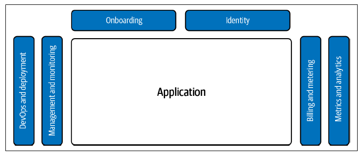
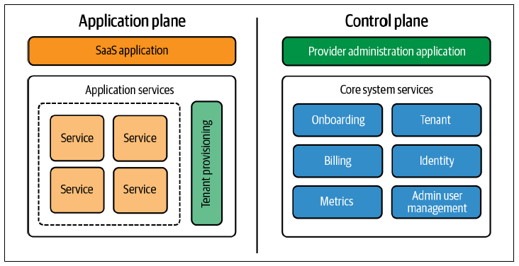
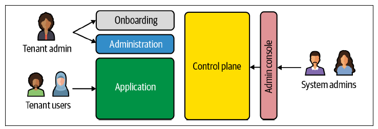
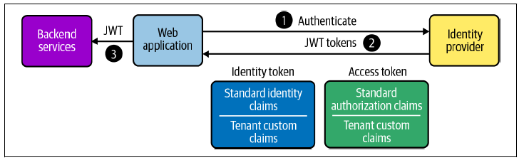

In this blog, I’m summarizing key concepts and ideas from book “Building Multi-Tenant SaaS Architectures” by Tod Golding, which I started reading while working on Tenant Management System at Money Forward.
<!--more--> 
To be honest this book provides a structured view of SaaS and multi-tenancy, it clearly connects business requirements with technical architecture decisions. It broadened my understanding of SaaS ecosystem, especially the non-obvious challenges engineers face when designing, scaling, and evolving multi-tenant systems.

This blog focuses on those architectural concepts from developer’s POV.

---

# Getting into SaaS
### Classic Software Model vs SaaS
In the classic software model, applications were deployed on customer owned infrastructure. Each customer environment was independently configured, deployed, and operated. Vendors shipped versions; customers ran them.

This led to per-customer system administration, slow and risky upgrades, version fragmentation, and limited runtime visibility for vendors. Operational effort scaled linearly with the number of customers. The model optimized for delivery and sales, not for scalability or continuous operation.

### SaaS Changes the Model: it's Tenants now, Not Customers

SaaS moves applications to vendor-managed infrastructure and replaces customers with tenants. The platform owns deployment, upgrades, monitoring, and reliability.

This enables centralized control, shared infrastructure, continuous delivery, faster feature rollout, and flexible pricing models. At the same time, complexity shifts into the platform. Every request must be tenant-aware. Isolation, noisy-neighbor prevention, tenant context resolution, and non-disruptive deployments become core engineering concerns.

SaaS complexity is runtime and architectural, not deployment-time.

### SaaS Is More Than Shared Infrastructure
SaaS is not just applications running on shared infrastructure.

A SaaS platform includes control-plane systems such as onboarding, tenant management, identity, billing, metering, and observability. All of these must be designed for multi-tenancy, even if the application itself is simple.

**SaaS is platform-driven business model.** which enables continuous delivery, operational efficiency, and frictionless tenant lifecycle management. The defining property of SaaS is not “software delivered online,” but the ability to operate, evolve, and scale a single system safely across many tenants. Also Hybrid models such as MSPs still exist. They combine SaaS-style centralized operations with customer-installed or tenant-specific deployments, usually due to legacy or regulatory constraints.

---

# Breaking SaaS Multi Tenant Architecture

Multi-tenant SaaS architectures are typically divided into two major planes:
- Control plane
- Application plane

If you see below image, I think you can easily get to know the diff.

### Control Plane Responsibilities

The control plane handles cross-tenant and operational concerns. It owns tenant lifecycle and platform-wide policies but does not implement tenant-specific business logic.

Typical responsibilities include tenant onboarding and lifecycle management, identity and access management, billing and metering, entitlement and tier management, system-wide metrics, and governance. The control plane is tenant-aware but intentionally generic, allowing it to operate uniformly across all tenants.

### Application Plane Responsibilities

The application plane delivers product functionality while enforcing tenant boundaries. This is where most multi-tenancy complexity surfaces at runtime.

Key concerns include tenant context propagation, isolation guarantees, data partitioning, tenant-aware routing (especially in siloed or hybrid deployments), and context-aware business logic. In siloed models, the application plane may also manage tenant-specific deployments or routing to isolated stacks.

The primary challenge in this plane is maintaining correctness and isolation without degrading performance or developer velocity.

### User Roles and Access Boundaries

SaaS platforms typically define three distinct user categories: 
- **tenant users** who consume the product
- **tenant admins** who manage users and configuration within a tenant, and 
- **system admins** who operate the platform across all tenants.

System admins usually require a dedicated admin interface to troubleshoot issues, manage tenants, and handle escalations. Tenant admins often use a separate admin console to manage users and settings across one or more SaaS applications. Depending on coupling and ownership, these admin interfaces may live in the control plane or the application plane.

>note: There is no single correct multi-tenant architecture. Most SaaS systems evolve over time, shifting responsibilities between planes as scale, compliance, and operational constraints change.

---

# SaaS Deployement models

SaaS deployment models define how tenants are isolated and how infrastructure is shared. Most platforms evolve toward hybrids rather than using a single model. At a high level, deployments fall into siloed (isolated) and pooled (shared) categories.

### Full-Stack Siloed Deployment

Each tenant runs in a fully isolated application stack, typically including separate deployments and databases. This provides strong isolation, a clear blast radius, and simple cost attribution. The downside is higher infrastructure cost, slower onboarding, and increased operational complexity. This model is usually reserved for regulated or high-value enterprise tenants.

### Full-Stack Pooled Deployment

All tenants share the same application stack, with isolation enforced at the application and data layers using tenant context. This model optimizes for cost and scalability but requires strict tenant-scoped authorization, data isolation, rate limiting, and protection against noisy-neighbor issues. Failures have a larger blast radius.

### Hybrid Deployment

Most tenants run on pooled infrastructure, while selected tenants are fully siloed due to compliance, performance, or contractual requirements. This model balances cost and isolation but introduces complexity in onboarding, routing, and operations.

### Mixed-Mode Deployment

Only specific components are isolated, such as databases or compute-heavy services, while the rest of the stack remains pooled. This reduces cost compared to full siloing but requires well-defined service boundaries to avoid isolation leaks.

### Pod-Based Deployment

Tenants are grouped into pods, each running a shared stack with fixed capacity. New pods are added as the system scales. This limits blast radius while preserving many benefits of pooled deployments and aligns well with Kubernetes clusters or cloud account boundaries.

---

# Onboarding and Identity

Onboarding and identity belong to the SaaS control plane. Before application features, the platform must reliably create tenants, provision required resources, and establish tenant boundaries.

Onboarding is workflow, not a single operation. It is typically triggered either from an internal admin console or via self-service signup. The flow creates tenant metadata, assigns a plan or tier, provisions infrastructure depending on the deployment model (silo or pooled), initializes identity and access, and configures quotas or billing. Because onboarding is distributed and failure-prone, each step must be idempotent and tracked using explicit states.

**Identity in SaaS must be tenant-aware,** Most platforms use OIDC and issue JWTs that include both user identity and tenant context through custom claims. This allows services to enforce tenant-scoped authorization without additional lookups.

In more flexible setups, tenant context is resolved separately from authentication. The IdP authenticates the user, while a tenant service resolves tenant membership and roles. This approach simplifies multi-tenant users and multi-IdP support.

For enterprise customers, SaaS platforms often support federated identity using SAML or OIDC. Since external IdPs rarely include tenant identifiers, tenant context must be inferred from IdP configuration, issuer, or domain mappings. SCIM is commonly used alongside federation for user and group provisioning but does not handle authentication or tenant resolution.

Some platforms derive tenant context from request metadata, such as subdomain-based tenancy. While simple, this model is limited when users belong to multiple tenants or when federation is required.

---

# Tenant Management

tenant management is core of part of control plane and it invloves lot of things like onboarding, offboarding, billing, Tenant attributes, Tenent identity configs, routing configs (based on silo and pool) and tenant user.

### Core Constructs
- **Tenant Identifier**
  - A globally unique, immutable Tenant GUID should be the primary identifier.
  - Avoid business identifiers (domain, org name) as keys — they change, GUIDs don’t.
  - All downstream systems should reference tenants via this GUID.

- **Infrastructure Configuration**
  - Stores tenant-specific infra state:
  - Deployment model (silo / pooled / hybrid)
  - Region, environment, cluster mapping
  - Dedicated resources (DB, cache, queues) if applicable
  - This data drives routing, provisioning, and isolation logic.

- **Lifecycle Management**
  - Explicit lifecycle states: provisioning → active → suspended → deactivated → decommissioned
  - State transitions must be idempotent and auditable.
  - Decommissioning is destructive:
    - so it must be delayed, reversible (grace period), and compliant with retention policies

- **Tier / Plan Changes**
  - Tier changes are effectively infra + policy migrations, not just billing updates.
  - Common challenges:
    - Provisioning new resources (or moving to shared ones)
    - Updating routing rules and
    - Migrating existing tenant state safely
  - Feature flags help decouple rollout from deployment, but:
    - Data shape compatibility must be guaranteed
    - Backward compatibility matters during gradual migrations
  - Complexity increases significantly in hybrid or siloed models.

---

TODO...