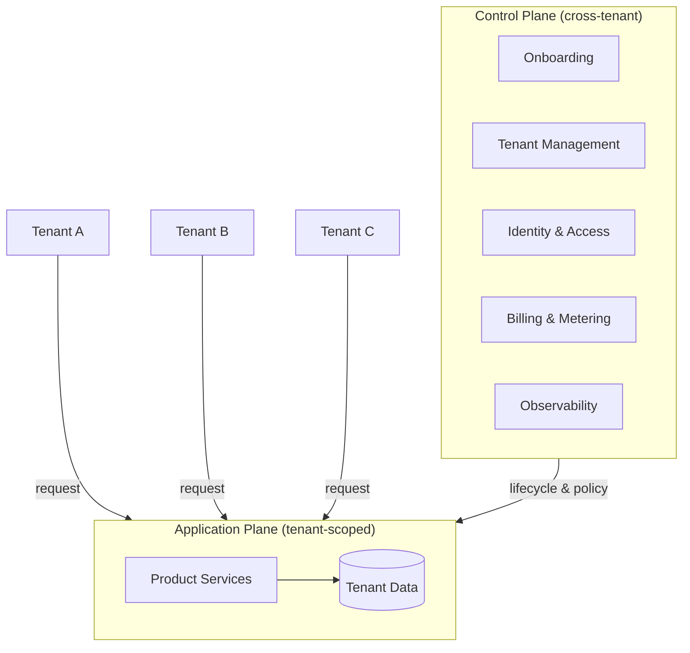
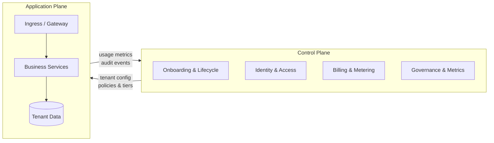
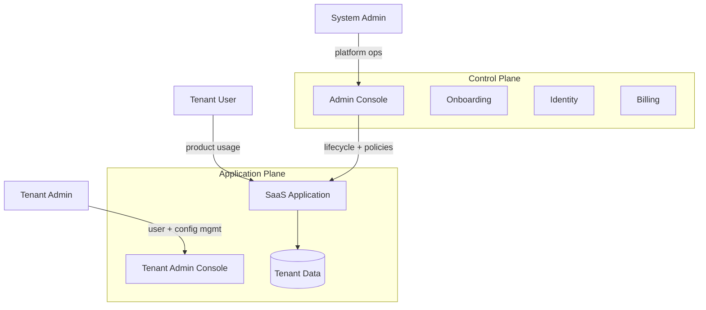
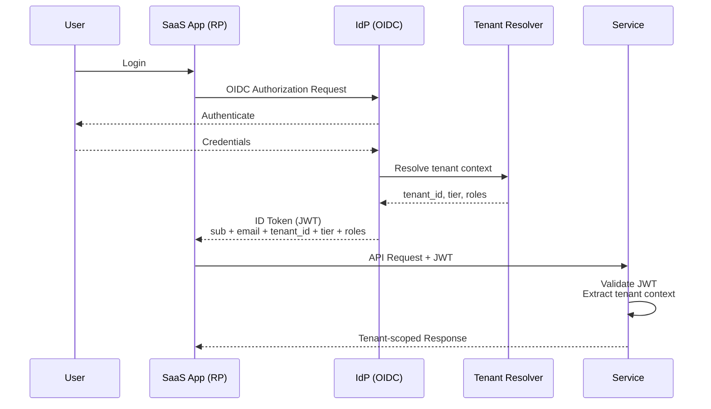

In this blog, I’m summarizing key concepts and ideas i take way from book “Building Multi-Tenant SaaS Architectures” by Tod Golding, which I started reading while working on Tenant Management System at Money Forward.
<!--more--> 
To be honest this book provides structured view of SaaS and multi-tenancy, it clearly connects business requirements with technical architecture decisions and broadened my understanding of SaaS ecosystem, especially the non-obvious challenges engineers face when designing, scaling, and evolving multi-tenant systems.

This blog focuses on those architectural concepts from developer’s POV.

---

# Getting into SaaS
### Classic Software Model vs SaaS
In the classic software model, applications were deployed on customer owned infrastructure. Each customer environment was independently configured, deployed, and operated. Vendors shipped versions; customers ran them.

This led to per-customer system administration, slow and risky upgrades, version fragmentation, and limited runtime visibility for vendors. Operational effort scaled linearly with the number of customers. The model optimized for delivery and sales, not for scalability or continuous operation.

### SaaS Changes the Model: it's Tenants now, Not Customers

SaaS moves applications to vendor-managed infrastructure and replaces customers with tenants. The platform owns deployment, upgrades, monitoring, and reliability.

This enables centralized control, shared infrastructure, continuous delivery, faster feature rollout, and flexible pricing models. At the same time, complexity shifts into the platform. Every request must be tenant-aware. Isolation, noisy-neighbor prevention, tenant context resolution, and non-disruptive deployments become core engineering concerns.

SaaS complexity is runtime and architectural, not deployment-time.

### SaaS Is More Than Shared Infrastructure
SaaS is not just applications running on shared infrastructure.

A SaaS platform includes control-plane systems such as onboarding, tenant management, identity, billing, metering, and observability. All of these must be designed for multi-tenancy, even if the application itself is simple.

**SaaS is platform-driven business model.** which enables continuous delivery, operational efficiency, and frictionless tenant lifecycle management. The defining property of SaaS is not “software delivered online,” but the ability to operate, evolve, and scale a single system safely across many tenants. Also Hybrid models such as MSPs still exist. They combine SaaS-style centralized operations with customer-installed or tenant-specific deployments, usually due to legacy or regulatory constraints.

---

# Breaking SaaS Multi Tenant Architecture

Multi-tenant SaaS architectures are typically divided into two major planes:
- Control plane
- Application plane

If you see below image, I think you can easily get to know the diff.

### Control Plane

The control plane handles cross-tenant and operational concerns. It owns tenant lifecycle and platform-wide policies but does not implement tenant-specific business logic.

Typical responsibilities include tenant onboarding and lifecycle management, identity and access management, billing and metering, entitlement and tier management, system-wide metrics, and governance. The control plane is tenant-aware but intentionally generic, allowing it to operate uniformly across all tenants.

### Application Plane

The application plane delivers product functionality while enforcing tenant boundaries. This is where most multi-tenancy complexity surfaces at runtime.

Key concerns include tenant context propagation, isolation guarantees, data partitioning, tenant-aware routing (especially in siloed or hybrid deployments), and context-aware business logic. In siloed models, the application plane may also manage tenant-specific deployments or routing to isolated stacks.

The primary challenge in this plane is maintaining correctness and isolation without degrading performance or developer velocity.

### User Roles

SaaS platforms typically define three distinct user categories: 
- **tenant users** who consume the product
- **tenant admins** who manage users and configuration within a tenant, and 
- **system admins** who operate the platform across all tenants.

System admins usually require a dedicated admin interface to troubleshoot issues, manage tenants, and handle escalations. Tenant admins often use a separate admin console to manage users and settings across one or more SaaS applications. Depending on coupling and ownership, these admin interfaces may live in the control plane or the application plane.

>note: There is no single correct multi-tenant architecture. Most SaaS systems evolve over time, shifting responsibilities between planes as scale, compliance, and operational constraints change.

---

# Deployment Models

SaaS deployment models define how tenants are isolated and how infrastructure is shared. Most platforms evolve toward hybrids rather than using a single model. At a high level, deployments fall into siloed (isolated) and pooled (shared) categories.

### Full-Stack Siloed

Each tenant runs in a fully isolated application stack, typically including separate deployments and databases. This provides strong isolation, a clear blast radius, and simple cost attribution. The downside is higher infrastructure cost, slower onboarding, and increased operational complexity. This model is usually reserved for regulated or high-value enterprise tenants.

### Full-Stack Pooled

All tenants share the same application stack, with isolation enforced at the application and data layers using tenant context. This model optimizes for cost and scalability but requires strict tenant-scoped authorization, data isolation, rate limiting, and protection against noisy-neighbor issues. Failures have a larger blast radius.

### Hybrid

Most tenants run on pooled infrastructure, while selected tenants are fully siloed due to compliance, performance, or contractual requirements. This model balances cost and isolation but introduces complexity in onboarding, routing, and operations.

### Mixed-Mode

Only specific components are isolated, such as databases or compute-heavy services, while the rest of the stack remains pooled. This reduces cost compared to full siloing but requires well-defined service boundaries to avoid isolation leaks.

### Pod-Based

Tenants are grouped into pods, each running a shared stack with fixed capacity. New pods are added as the system scales. This limits blast radius while preserving many benefits of pooled deployments and aligns well with Kubernetes clusters or cloud account boundaries.

---

# Onboarding and Identity

Onboarding and identity belong to the control plane. Before the application goes into production, the platform must reliably create tenants, provision required resources, and establish tenant boundaries.

### Onboarding as a Workflow

Onboarding is not a single operation. It is typically triggered by an internal admin console or via self-service signup. The flow creates tenant metadata, assigns plan and tier, provisions infrastructure (depending on silo or pooled model), initializes identity and access, and configures quotas or billing.

Because onboarding is distributed and failure-prone, each step must be idempotent and tracked using explicit states. A tenant moves through: `provisioning → active → suspended → deactivated → decommissioned`. Invalid transitions (jumping from provisioning to deactivated, for example) should be rejected. Each transition must be logged with who triggered it and why.

State transitions must be idempotent and auditable. Decommissioning must comply with data retention policies, which usually means a grace period before actual deletion.

### Tenant-Aware Identity

Identity in SaaS must carry tenant context. Most platforms use OIDC and issue JWTs that include both user identity and tenant context via custom claims: `tenant_id`, `tenant_tier`, `roles`, and `permissions` alongside the standard `sub` and `email`. This lets services enforce tenant-scoped authorization without additional lookups on every request.

In more flexible setups, tenant context is resolved separately from authentication. The IdP authenticates the user; a dedicated service resolves tenant membership and roles. This simplifies multi-tenant users and multi-IdP support.

For enterprise customers, SaaS platforms typically support federated identity using SAML or OIDC. Since external IdPs rarely include tenant identifiers, tenant context must be resolved from IdP configuration, issuer, or domain mappings. SCIM is commonly used alongside federation for user and group provisioning but handles neither authentication nor tenant resolution.

---

# Tenant Management

tenant management is core of part of control plane and it invloves lot of things like onboarding, offboarding, billing, Tenant attributes, Tenent identity configs, routing configs (based on silo and pool) and tenant user.

### Tenant identifiers

Tenant identifiers should be globally unique and immutable (UUID). Avoid business identifiers like domain or org name, which may change.

### Lifecycle

State transitions must be idempotent and auditable. Decommissioning requires compliance with data retention policies, which usually means a grace period before actual deletion.

### Tier and Plan Changes

Tier changes are effectively infrastructure and policy migrations, not just billing updates. Common challenges:

- Provisioning new resources (or moving from dedicated to shared)
- Updating routing rules
- Migrating existing tenant state safely

Feature flags help decouple rollout from deployment, but data shape and backward compatibility must be guaranteed. Complexity increases significantly in hybrid or siloed models, where a tier upgrade might mean spinning up a new isolated stack and migrating data.

---

# Tenant Authentication and Routing

Tenant authentication and routing constructs are generally at front door of the system. As this decides tenant context and downstream authentication, authorization, and shape routing decisions.

Most SaaS platforms covers one of the following domain patters along with fully owned domain:

**The subdomain per tenant model**

Each tenant is mapped to a platform-managed subdomain (e.g, tenant-a.app.com).
This suited for Simplifies certificate management, easy tenant resolution and for pooled architectures (with centralized routing).
But this restricts the tenants brand ownership and stricter tenant isolations.

**The vanity domain-per-tenant model**

Here tenants bring their own custom domain (e.g., login.tenant-a.com).
This requires DNS ownership verification, dynamic host-based routing, runtime lookup for tenant context etc.

Also note that domain based tenant onboarding should be relatively lightweight and doesn't generally requires application redeploys/static routing rules.

**tenant resolution**
Some platforms tries tenant resolution via user identifiers (e.g., email domain → tenant). but this approach breaks when consultants or external users span multiple tenants, so generally production systems typically resolve tenant context before authentication. When tenant context cannot be derived deterministically (shared domains, cross-tenant users), the system must explicitly introduce tenant selection. 

>note: Federated IdPs introduce additional constraints like Custom claim injection, Tenant-specific authorization logic may need to live outside the IdP.

---

### Routing Authenticated Tenants

Once tenant context is established, routing becomes a function of deployment model.

**Serverless (API Gateway / Lambda):** resolve tenant at the edge, enable per-tenant throttling and auth policies, and isolate execution paths. Per-tenant infrastructure is possible but increases provisioning complexity.

**Container-based (Kubernetes):** the Ingress layer resolves domain and injects tenant context as a header. For pooled tenants, a single Ingress routes all traffic and services extract `X-Tenant-ID` downstream. For siloed tenants, each tenant gets its own namespace with a NetworkPolicy that restricts ingress and egress to that namespace and shared services only. Envoy or Istio handles L7 routing, mTLS, and policy enforcement across both models.

The invariant across all models: tenant context must be resolved early, propagated consistently, and enforced everywhere.

---

# Building Multi-Tenant Services

Start from the domain. SaaS systems align well with business subdomains, DDD, and event-driven patterns. Early decisions around compute (containers, serverless, dedicated) and storage (shared DB, schema-per-tenant, DB-per-tenant) directly define service architecture, scalability, and isolation guarantees.

Inside each service, tenant context is everywhere: request handling, logging, metrics, auth, and data access. Keep tenant resolution out of business logic. Centralize it using interception patterns: gateway, middleware, sidecar, or Lambda layer. The middleware extracts the JWT, validates it, and puts the resolved tenant context (tenant ID, tier, roles) into the request context. Business logic reads from that context and never parses tokens or headers directly.

If your metrics are not broken down per tenant, your multi-tenancy design is incomplete. Emit `tenant_id` as a label on every service metric.

The noisy-neighbor problem is inevitable unless you explicitly identify services that need stronger isolation and design or deploy them separately from the start.

---

# Data Partitioning

Data partitioning directly impacts SLAs, tenant experience, blast radius, and operational complexity. Default to the pooled model and progressively move toward siloed isolation only when workloads, compliance, or performance demand it.

Over-isolating early leads to management overhead and poor storage utilization. Under-isolating increases noisy-neighbor risk. Throughput limits and throttling must be enforced per tenant regardless of model.

### Relational Databases

There are three main strategies, ordered by isolation strength:

**Pooled schema with `tenant_id` column** is the simplest. Every tenant shares the same tables, rows are tagged with `tenant_id`, and queries always filter by it. You must index `tenant_id` on every high-traffic table, or queries will degrade as the table grows. The blast radius of a bug is the entire database.

**Row-level security (RLS)** in PostgreSQL adds a database-enforced isolation layer on top of the pooled schema. The application sets a session variable (`app.current_tenant_id`) at connection time, and a policy on each table ensures queries only return rows matching that tenant. This is a strong defense-in-depth measure: even if application-level authorization has a bug, the database will not return rows from another tenant.

**Schema-per-tenant** gives each tenant their own PostgreSQL schema. Migrations can be applied per-tenant independently, and backup and restore at tenant granularity is straightforward. The tradeoff is that schema management complexity scales linearly with tenant count.

**Database-per-tenant** is the siloed extreme, reserved for enterprise tiers or regulated workloads. Enables dedicated connection pools, separate backup schedules, and independent scaling.

### NoSQL

For systems like DynamoDB, the partition key must include `tenant_id` to prevent hot partitions and enable per-tenant throttling. A composite key like `TENANT#<tenant_id>#ORDER` with a sort key of `ORDER#<order_id>` works well. Avoid using `tenant_id` as the sole partition key for large tenants, since all their traffic hits the same partition. Adding entity type to the key distributes load more evenly.

### Mixed-Mode in Practice

Most systems evolve into mixed-mode: pooled for standard tenants, siloed for enterprise tiers. The tier boundary is the migration boundary. Plan the data migration path before the first enterprise customer asks for it.

---

# Tenant Isolation

Tenant isolation spans from full-stack isolation (dedicated infra per tenant) to item-level isolation within shared services. Stronger isolation improves safety and blast-radius control but increases cost and operational complexity.

At the application layer, isolation is enforced through authorization, RBAC, and tenant-aware access controls. Use interception patterns (middleware, gateways, sidecars) rather than scattering tenant checks through business logic.

Infrastructure isolation (separate clusters, namespaces, cloud accounts) provides stronger guarantees but reduces flexibility. Effective systems combine:

- **Deployment-time isolation**: how services are deployed (namespace, cluster, account boundaries)
- **Runtime isolation**: how requests are handled (middleware, auth, data access controls)

At scale, isolation policies must be explicitly managed, versioned, and observable. Drift is subtle and usually discovered during an incident. Build tenant isolation into your observability from day one, not after the first cross-tenant data exposure.

Every tenant-scoped authorization decision should emit an audit event carrying at minimum: timestamp, tenant ID, actor, action, resource, and whether it was allowed. This is what lets you audit access patterns, detect anomalies, and prove compliance.

---

# Conclusion

Building multi-tenant SaaS system is fundamentally about **owning complexity wantedly**. SaaS shifts responsibility from customers to platform, which means tenant awareness, isolation, data partitioning, routing, and lifecycle management are no longer optional, they are core system properties. 

There is no single “correct” architecture. Real SaaS platforms evolve from pooled to hybrid and mixed models as scale, compliance, and customer value change. The key is to design for **explicit tenant boundaries, centralized control planes, early tenant resolution, and measurable isolation**, while keeping business logic clean and adaptable. If multi-tenancy is not observable, enforceable, and evolvable, it will eventually break usually at scale, and always at the worst possible time.

>Most SaaS outages are process failures, not code failures.
