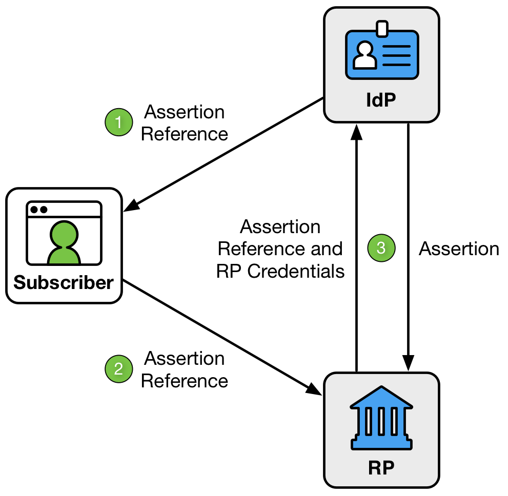
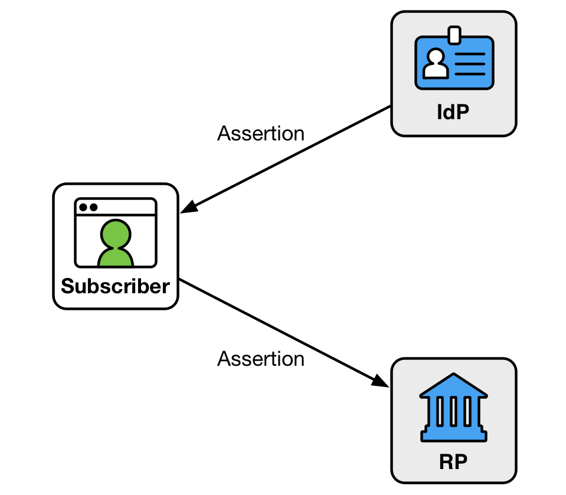
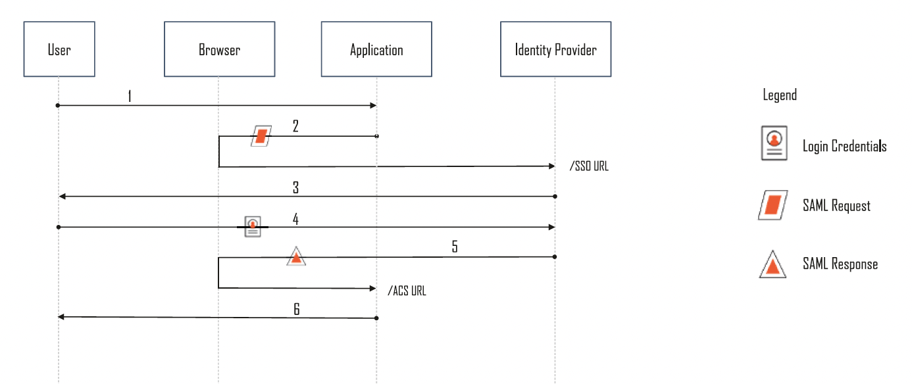
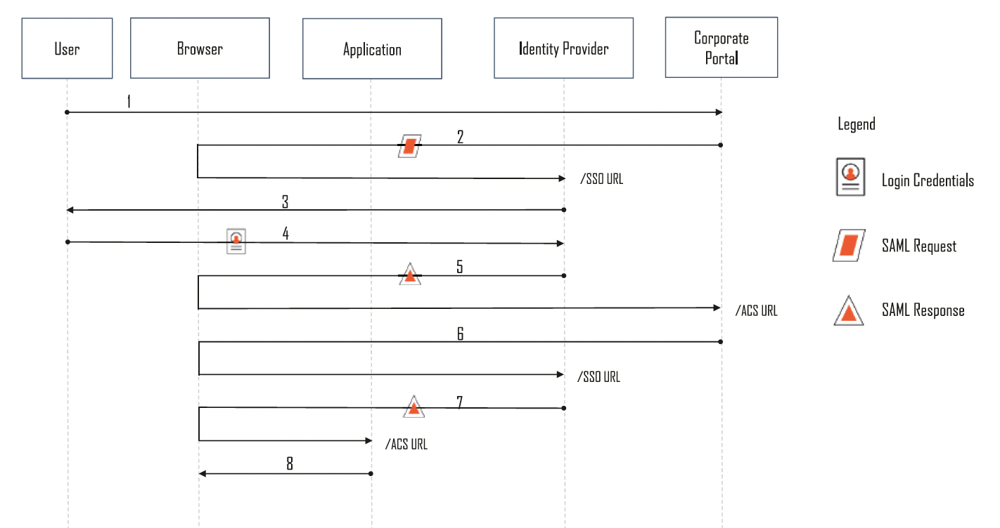

In this blog i will write about SAML concepts i learn during my work at MoneyForward. 

what is SAML => A federated identity protocol where IDp issues signed XML assertions that applications use to authenticate users. <!--more-->

>SAML solves two problems **cross-domain SSO**, and **Identity federation**.
It is used in many enterprise environments because it allows enterprise
to have applications used by employees delegate user authentication to
centralized enterprise identity provider. 
This helps enterprise to better manage and control identities.

I know SAML is very old and complex way of handling authentication but even in today’s world it still find its place. 
why? Because lot of enterprise SaaS vendors still only support SAML, companies must integrate with those systems to enable employee access the application.

**Why why cannot OIDC replaces SAML??**

Technically it can, but lot of older enterprise vendors support only SAML and there are some modern vendors which “supports OIDC” through identity brokers, but deep inside most of them are still SAML.

So, the real situation is like 

⇒ SAML shines in enterprise identity federation (like supporting your employees to access enterprise applications).

⇒ and OIDC really shines in the consumer identity federation (like the internal IDp for all you products).

May be if world started fresh today, **SAML wouldn't exist,** everyone would use OIDC, making enterprise apps to trust OIDC [if we make them enterprise-grade] (Okta, Azure, Ping, Google Workspace Enterprise).

Note:

- OIDC-federated SaaS are also slightly increasing recently.
- In a company these SaaS services are managed by IT management div and employees are forced to login using SAML.

# Identity management and federation

Let’ see how identities are managed & federated in a company, when an employee joins company IT management div should able to manage and also do federation of identities during his onboarding. Below are some in this process

Identity management tasks:

- Create a new user in the company IdP
- Create accounts in required SaaS apps
- Link the IdP identity with each SaaS identity
- Update attributes (licenses, roles, department, etc.)
- Suspend/disable/delete accounts on both IdP and SaaS

Identity federation tasks:

- Employee can sign in to all required SaaS apps from day one
- Some accounts are auto-provisioned at first login
- Employees may gain/lose access dynamically
- Sign-out and session management across all SaaS apps

note: ⚠️ Managed but not federated accounts are dangerous.

---

# Federation Patterns (Based on NIST)

Federation patterns describe how assertion (identity proof) flows between RP and IdP happens.

If you read [NIST federation patterns](https://pages.nist.gov/800-63-3/sp800-63c.html), you can see there are two types.

### 1. back channel federation pattern.


In this pattern, user passes only assertion reference to RP, and RP fetches the assertion directly from the IdP on secure back channel. This makes it safer (single-use, short-lived, RP-only) and reduces tampering since the assertion comes straight from the IdP.

But RP must still validate issuer, signature, time, and audience.

- OpenID Connect (Authorization Code Flow)

### 2. front channel federation pattern.



IdP sends the full assertion to the user’s browser, and the user passes it to the RP. This is less secure because the user can see and potentially replay the assertion, and the RP can’t easily fetch extra attributes later.Also RP must still validate issuer, signature, time, and audience.

Extra user attributes can be fetched later using separate authorized requests if needed

- SAML 2.0 (standard Web SSO)

---

# SAML vs OIDC binding
Bindings tells how messages travel between the browser, IdP, and SP.

| Binding Type | SAML | OpenID Connect (OIDC) |
|--------------|-------|------------------------|
| **HTTP-Redirect** | • SAML message sent as URL query params via HTTP GET redirect.<br>• Common for SAML Request (SP → IdP).<br>• Good for small messages. | • Most OIDC messages use URL redirects.<br>• Used for redirects RP → IdP and IdP → RP. |
| **HTTP-POST** | • SAML message sent in HTTP POST body (auto-submitting form).<br>• Common for SAML Response (IdP → SP).<br>• Supports large messages. | • Some IdPs (e.g., Apple) return OIDC response params via POST.<br>• Still front-channel but uses form POST instead of query params. |
| **HTTP Artifact** | • Browser receives only reference ID.<br>• Actual SAML message retrieved via back-channel using SOAP.<br>• More secure but uncommon today. | • Authorization code is a reference.<br>• RP exchanges code for tokens via secure back-channel call to IdP. |

# Configure SAML on Enterprise IdP
To set up SAML SSO, you first configure the necessary fields on your enterprise IdP.
- ACS URL – SP endpoint where the IdP will POST SAML Response.
- Audience URI (SP Entity ID) – A unique identifier for SP (used by the IdP to validate the audience)
- **RelayState**(Optional) – Used mainly in IdP-initiated flows to tell SP where to redirect user after SSO.
- NameID Format – Defines how user is identified (commonly email).
- App Username / Attributes – Any attributes the IdP should send in assertion.
- Signing & Encryption – SAML Responses and Assertions are typically signed, and Assertions may also be encrypted
- Attribute Statements & Group Mappings – Optional data to include.

After that, IdP provides metadata XML that contains certificates, SSO URLs and supported bindings.

>note: RelayState is a parameter which can be sent along with SAML Request. The exact same value is returned along with SAML Response. In spec, it’s a opaque string, but URL-formatted value is used often. It exists outside of XML messages, thus not signed. Very similar to OIDC’s state parameter.

### metadata XML
```saml
<md:EntityDescriptor xmlns:md="urn:oasis:names:tc:SAML:2.0:metadata" entityID="http://www.okta.com/exk28a7aitJsRsWWR5d7">
  <md:IDPSSODescriptor WantAuthnRequestsSigned="false" protocolSupportEnumeration="urn:oasis:names:tc:SAML:2.0:protocol">
    <md:KeyDescriptor use="signing">
      <ds:KeyInfo xmlns:ds="http://www.w3.org/2000/09/xmldsig#">
        <ds:X509Data>
          <ds:X509Certificate>MIIDpjC... [TRUNCATED BASE64 CERT] ...cd60NRB9d8=</ds:X509Certificate>
        </ds:X509Data>
      </ds:KeyInfo>
    </md:KeyDescriptor>

    <md:NameIDFormat>urn:oasis:names:tc:SAML:1.1:nameid-format:unspecified</md:NameIDFormat>
    <md:NameIDFormat>urn:oasis:names:tc:SAML:1.1:nameid-format:emailAddress</md:NameIDFormat>

    <md:SingleSignOnService Binding="urn:oasis:names:tc:SAML:2.0:bindings:HTTP-POST"
        Location="https://dev-2148273.okta.com/app/dev-2148273_samlapproproject1_2/exk28a7aitJsRsWWR5d7/sso/saml"/>

    <md:SingleSignOnService Binding="urn:oasis:names:tc:SAML:2.0:bindings:HTTP-Redirect"
        Location="https://dev-2148273.okta.com/app/dev-2148273_samlapproproject1_2/exk28a7aitJsRsWWR5d7/sso/saml"/>

  </md:IDPSSODescriptor>
</md:EntityDescriptor>
```
### Parameters Breakdown
| Field | Explanation |
|-------|-------------|
| WantAuthnRequestsSigned | whether the IdP requires AuthnRequests from SP to be signed. |
| entityID | Unique identifier of IdP. SP uses it to validate who issued the SAML response. |
| KeyDescriptor (signing certificate) | Public X.509 certificate SP uses to verify IdP’s SAML response signature. |
| NameIDFormat | Tells SP what type of user identifier to expect (email, unspecified, etc). |
| SingleSignOnService (HTTP-POST) | The main URL where SP sends SAML AuthnRequest using POST. |
| SingleSignOnService (HTTP-Redirect) | Alternate URL where SP sends SAML AuthnRequest using Redirect binding. |


# SAML Request Deep Dive
Using this metadata, SP constructs the XML AuthRequest like below

### SAML Request XML
```
<?xml version="1.0" encoding="UTF-8"?>
<saml2p:AuthnRequest
	xmlns:saml2p="urn:oasis:names:tc:SAML:2.0:protocol"
	AssertionConsumerServiceURL="{{SP_ACS_URL}}"
	Destination="{{IDP_SSO_TARGET_URL}}"
	ID="{{UNIQUE_ID}}"
	IssueInstant="{{ISSUE_INSTANT}}"
	ProtocolBinding="urn:oasis:names:tc:SAML:2.0:bindings:HTTP-POST"
	Version="2.0">
	<saml2:Issuer
		xmlns:saml2="urn:oasis:names:tc:SAML:2.0:assertion">{{SP_ENTITY_ID}}
	</saml2:Issuer>
</saml2p:AuthnRequest>

```
### Parameters Breakdown

| Field | Explanation |
|-------|-------------|
| ACS URL | SP’s Callback Endpoint to receive SAML AuthN Response (In OIDC, its Redirect URI) |
| Destination | Intended IdP’s endpoint to receive SAML AuthN Request (a.k.a SSO Service URL) (In OIDC, its Authorization Endpoint) |
| ID | Message ID applied to each XML messages, Each SAML Request, SAML Response and SAML Assertion have its own ID |
| IssueInstant | DateTime when the SAML Request is issued |
| Version | Fixed value “2.0” in SAML 2.0 |
| Issuer | Message Issuer ID (= SP’s Entity ID in SAML AuthN Request’s case) |
| NameIDPolicy | Requirements on returned End-User ID characteristics (format etc) |

This XML is then Base64-encoded and URL-encoded to get final auth request:

```
<idp-sso-url>?SAMLRequest=<base64_url_encoded_saml_request>
```

>Note: AuthnRequests are often not signed, depending on the IdP/SP configuration.
However, SAML Responses and Assertions are almost always signed.

---

# SAML Response Deep Dive
<span>SAML assertion == ID token == user info </span>

### SAML Response XML
```
<?xml version="1.0" encoding="UTF-8"?>
<saml2p:Response
version="2.0"
xmlns:saml2p="urn:oasis:names:tc:SAML:2.0:protocol" 
xmlns:xs="http://www.w3.org/2001/XMLSchema" 
4 <----------- Destination="http://localhost:9292/acs"
1 <----------- ID="id1511053110440237975657003"
5 <----------- InResponseTo="unique-generated-id-1234"
3 <----------- IssueInstant="2025-03-14T04:22:53.450Z"
2 <----------- Version="2.0">
6 <----------- <saml2:Issuer 
xmlns:saml2="urn:oasis:names:tc:SAML:2.0:assertion"
Format="urn:oasis:names:tc:SAML:2.0:nameid-format:entity">
http://www.okta.com/exkntdung4kWLqGMV5d7
</saml2:Issuer>

======== start of signature ========

7 <----------- <ds:Signature xmlns:ds="http://www.w3.org/2000/09/xmldsig#">
    <ds:SignedInfo>
      <ds:CanonicalizationMethod Algorithm="http://www.w3.org/2001/10/xml-exc-c14n#"/>
      <ds:SignatureMethod Algorithm="http://www.w3.org/2001/04/xmldsig-more#rsa-sha256"/>
(same ad ID) <-----------  <ds:Reference URI="#id1511053110440237975657003">
        <ds:Transforms>
          <ds:Transform Algorithm="http://www.w3.org/2000/09/xmldsig#enveloped-signature"/>
          <ds:Transform Algorithm="http://www.w3.org/2001/10/xml-exc-c14n#">
            <ec:InclusiveNamespaces xmlns:ec="http://www.w3.org/2001/10/xml-exc-c14n#" PrefixList="xs"/>
          </ds:Transform>
        </ds:Transforms>
        <ds:DigestMethod Algorithm="http://www.w3.org/2001/04/xmlenc#sha256"/>
        <ds:DigestValue>zbmPLhIrWdCnlKu+6OAK5UHpCDFU45xwKA91ptGbqP4=</ds:DigestValue>
      </ds:Reference>
    </ds:SignedInfo>
    <ds:SignatureValue>Y/t/R... [TRUNCATED BASE64 CERT] ...7aJaA==</ds:SignatureValue>
    <ds:KeyInfo>
      <ds:X509Data>
(X509) <----------- <ds:X509Certificate>MIIDpjC... [TRUNCATED BASE64 CERT] ...cd60NRB9d8=</ds:X509Certificate>
      </ds:X509Data>
    </ds:KeyInfo>
  </ds:Signature>

======== end of signature ========

8 <----------- <saml2p:Status xmlns:saml2p="urn:oasis:names:tc:SAML:2.0:protocol">
    <saml2p:StatusCode Value="urn:oasis:names:tc:SAML:2.0:status:Success"/>
  </saml2p:Status>

<saml2:Assertion 
....
discussed in next section
...
</saml2:Assertion>

</saml2p:Response>
```

### Parameters Breakdown

| Field | Explanation |
|-------|-------------|
| 1.ID | Message ID applied to each XML messages. If same ID’s SAML Response is received multiple times, it’s replay attack |
| 2.Version | Fixed value “2.0” in SAML 2.0. MFID (& libsaml) supports 2.0 only |
| 3.IssueInstant | DateTime when the SAML Response is issued (similar to OIDC ID Token “iat”) In SAML, both SAML Response & SAML Assertion have its own issued timestamp |
| 4.Destination | Intended SP’s endpoint to receive SAML AuthN Response (a.k.a ACS URL). In SAML, both SAML Response & SAML Assertion have its own expected recipient |
| 5.InResponseTo | Corresponding SAML Request ID. If different from the Request ID previously sent in the session, it’s CSRF attack |
| 6.Issuer | Message Issuer ID (= IdP’s Entity ID in SAML AuthN Response’s case) |
| 7.Signature | Signature on the whole SAML Response (following W3C XML Signature spec). Following SAML Assertion also includes its own Signature element, and X.509 certificate including the public key corresponding to the signing private key. DO NOT believe it’s valid only by it’s included in the SAML AuthN Response. Confirm it’s same with pre-registered certificate. In some cases, only certificate identifier can be included in the response message. |
| 8.StatusCode | as name indicates |

# SAML Assertion Deep Dive
SAML Assertion also has its own ID, IssueInstant & Version. Since Response and SAML Assertion are different XML Element, their IDs are different

### SAML Response XML
```
<saml2:Assertion 
xmlns:saml2="urn:oasis:names:tc:SAML:2.0:assertion" 
xmlns:xs="http://www.w3.org/2001/XMLSchema" 
ID="id15110531106260401222167389" 
IssueInstant="2025-03-14T04:22:53.450Z" 
Version="2.0">
1 <-----------<saml2:Issuer
 xmlns:saml2="urn:oasis:names:tc:SAML:2.0:assertion" Format="urn:oasis:names:tc:SAML:2.0:nameid-format:entity">http://www.okta.com/exkntdung4kWLqGMV5d7
</saml2:Issuer>
    
======== start of signature ========

2 <-----------<ds:Signature xmlns:ds="http://www.w3.org/2000/09/xmldsig#">
      <ds:SignedInfo>
        <ds:CanonicalizationMethod Algorithm="http://www.w3.org/2001/10/xml-exc-c14n#"/>
        <ds:SignatureMethod Algorithm="http://www.w3.org/2001/04/xmldsig-more#rsa-sha256"/>
        <ds:Reference URI="#id15110531106260401222167389">
          <ds:Transforms>
            <ds:Transform Algorithm="http://www.w3.org/2000/09/xmldsig#enveloped-signature"/>
            <ds:Transform Algorithm="http://www.w3.org/2001/10/xml-exc-c14n#">
              <ec:InclusiveNamespaces xmlns:ec="http://www.w3.org/2001/10/xml-exc-c14n#" PrefixList="xs"/>
            </ds:Transform>
          </ds:Transforms>
          <ds:DigestMethod Algorithm="http://www.w3.org/2001/04/xmlenc#sha256"/>
          <ds:DigestValue>vW+YEI/IMVpJi8Ty2u/q6x7KHVzQmwYwXKUKEv1GTQA=</ds:DigestValue>
        </ds:Reference>
      </ds:SignedInfo>
      <ds:SignatureValue>Fjlhg... [TRUNCATED BASE64 CERT] ...Njvpw==</ds:SignatureValue>
      <ds:KeyInfo>
        <ds:X509Data>
          <ds:X509Certificate>MIIDqDC... [TRUNCATED BASE64 CERT] ...
          ZQoyinw==
          </ds:X509Certificate>
        </ds:X509Data>
      </ds:KeyInfo>
    </ds:Signature>

======== end of signature ========

3 <-----------<saml2:Subject xmlns:saml2="urn:oasis:names:tc:SAML:2.0:assertion">
      <saml2:NameID Format="urn:oasis:names:tc:SAML:1.1:nameid-format:unspecified">kamandla.b+bala@moneyforward.co.jp</saml2:NameID>
      <saml2:SubjectConfirmation Method="urn:oasis:names:tc:SAML:2.0:cm:bearer">
        <saml2:SubjectConfirmationData InResponseTo="unique-generated-id-1234" NotOnOrAfter="2025-03-14T04:27:53.450Z" Recipient="http://localhost:9292/acs"/>
      </saml2:SubjectConfirmation>
    </saml2:Subject>

4 <-----------<saml2:Conditions xmlns:saml2="urn:oasis:names:tc:SAML:2.0:assertion" NotBefore="2025-03-14T04:17:53.450Z" NotOnOrAfter="2025-03-14T04:27:53.450Z">
      <saml2:AudienceRestriction>
        <saml2:Audience>http://localhost:9292/ruby_saml_auth</saml2:Audience>
      </saml2:AudienceRestriction>
    </saml2:Conditions>

5 <-----------<saml2:AuthnStatement xmlns:saml2="urn:oasis:names:tc:SAML:2.0:assertion" AuthnInstant="2025-03-14T04:22:53.450Z" SessionIndex="unique-generated-id-1234">
      <saml2:AuthnContext>
        <saml2:AuthnContextClassRef>urn:oasis:names:tc:SAML:2.0:ac:classes:PasswordProtectedTransport</saml2:AuthnContextClassRef>
      </saml2:AuthnContext>
    </saml2:AuthnStatement>

6 <-----------<saml2:AttributeStatement xmlns:saml2="urn:oasis:names:tc:SAML:2.0:assertion">
      <saml2:Attribute Name="firstName" NameFormat="urn:oasis:names:tc:SAML:2.0:attrname-format:unspecified">
        <saml2:AttributeValue xmlns:xs="http://www.w3.org/2001/XMLSchema" xmlns:xsi="http://www.w3.org/2001/XMLSchema-instance" xsi:type="xs:string">balashekhar</saml2:AttributeValue>
      </saml2:Attribute>
      <saml2:Attribute Name="lastName" NameFormat="urn:oasis:names:tc:SAML:2.0:attrname-format:unspecified">
        <saml2:AttributeValue xmlns:xs="http://www.w3.org/2001/XMLSchema" xmlns:xsi="http://www.w3.org/2001/XMLSchema-instance" xsi:type="xs:string">kamandla</saml2:AttributeValue>
      </saml2:Attribute>
    </saml2:AttributeStatement>
  </saml2:Assertion>

```

### Parameters Breakdown
| Field | Explanation |
|-------|-------------|
| 1.Issuer | Issuer of the SAML Assertion, In most cases, same with the one of the SAML Response |
| 2.Signature | Signature on the SAML Assertion Element |
| 3.Subject | Identifier of the user authenticated by the IdP. Unlike OIDC, several kind of identifier formats are available in SAML(email, numeric employee ID etc., reusable identifier is not ideal in theory though) |
| 4.Conditions | Lifetime of SAML Assertion & Audience SAML Assertion Audience, Subject Recipient and Response Destination can be different |
| 5. AuthnStatement | describes how, when, and by what method the user was authenticated by IdP |
| 6. AttributeStatement | User Attributes (except for NameID) OIDC usually returns them from UserInfo API, but SAML tend to include them in Assertion |


### How SAML Assertion is Signed

A SAML Assertion contains  `<Signature>` element, which contains `<SignedInfo>`, `<SignatureValue>` and `<KeyInfo>`.

Internally, the IdP performs two digest operations:

- Digest #1 (Hash of XML Assertion tag)
  - IdP takes assertion XML tag.
  - It computes SHA-256 digest → place it in `<DigestValue>`.
  - `<SignedInfo>` is created, referencing this digest.

- Digest #2 (Hash + Signature of `<SignedInfo>`)
  - IdP computes 2nd SHA-256 digest on the `<SignedInfo>` block.
  - This digest is then encrypted with the IdP’s private key(RSA or ECDSA).
  - The encrypted result is stored as the `<SignatureValue>`.

- `<KeyInfo>`
  - Contains the IdP’s x.509 certificate so SP can extract the public key to verify the signature.

> note:
> The Response can also be signed in the same manner.
> and some IdPs sign only the Assertion, some sign both Response + Assertion.

### How Signature Verification is done

- Verify Digest #2 (SignatureValue)
  - The SP uses the IdP’s public key to decrypt `<SignatureValue>`.
  - SP then recomputes SHA-256 digest of `<SignedInfo>` and compares.
  - If they match → the signature is authentic and created by the IdP. (ensures authenticity)

- Verify Digest #1 (DigestValue)
  - The SP recomputes a SHA-256 digest of the Assertion XML element.
  - It compares that digest with `<DigestValue>` inside `<SignedInfo>`.
  - If they match → the assertion data has not been tampered with.(Ensures data integrity)

>**To try out you can use [https://samltool.com/](https://samltool.com/)**

---

# SP-Initiated SSO
As name explain, the SAML sign-in flow starts from SP.

1. User visits SP.
2. SP redirects user to IDp with SAML request.
3. IDp interacts with user for authentication.
4. User authenticates. IDp validates credentials.
5. IDp redirects user back to SP with SAML response containing SAML assertion. The response is sent to SP's Assertion Consumer Service (ACS) URL.
6. SP consumes & validates SAML response & authenticates user.

---

# IDp-Initiated SSO
In this flow IDp redirects user’s browser to SP with SAML response message without SP having sent any authentication request.

After authenitcation at the portal, user can see all SaaS applications. And clicking on any one initiates IDp-Initiated SSO.



1. User visits corporate portal.
2. Portal redirects user’s browser to IDp with SAML request.
3. IDp interacts with user for authentication.
4. IDp validates credentials & User authenticates.
5. IDp redirects user’s browser back to portal with SAML response for portal (response #1) containing authentication assertion. Now User logged into portal which displays content to user, including list of applications.
6. User click link in portal for application. Then gets reddirected IDp with parameter indicating desired SP. The IdP checks the user’s session.(which is still valid).
7. IDp redirects user’s browser to SP’s Assertion Consumer Service(ACS) URL with SAML response (response #2) for that SP.
8. SP consumes & validates SAML response and authenticates user.

Note:
- This flow reduces phished attack and user can simply manage all SaaS at the portal. 
- OIDC doesn't have this kind of flow.
- IdP initiate is kind of CSRF attack itself. Users residing in that SAML IdP can let others use their SAML Responses and log others into their SP accounts. so IdP-initiate should not be used if you consider the risk of attacks among the employees in the same SAML IdP

---

# Bonus: Navis/MFID SAML Implementation

In MoneyForward, Navis is tenant management console where each tenant sets up SAML SSO by registering their IdP details, such as metadata, entity ID, and certificates. (and also mapping these settings to specific email domains which are configured for tenant)

MFID works as identity broker and plays actual SAML authentication by exposing necessary SAML endpoints like the SSO, ACS, and SLO.

When user signs in, MFID gets corresponding TenantUser SAML settings and builds tenant specific Authn Request using entity ID and ACS endpoint and redirects the user to their IdP. After IdP authenticates the user, it sends the SAML Response back to MFID, which validates the signature, audience, and assertion conditions using libsam ruby library. Once validated, MFID creates session and completes the login. 

This setup allows each tenant to have domain based SAML SSO authentication for its users.

> This is kind of single-instance multi-tenant architecutre where we expose only one ACS endpoint when dealing with multiple IdPs.
https://developer.okta.com/docs/concepts/saml/#single-idp-vs-multiple-idps

---

# conclusion

OIDC makes simple things simple and complex things possible.
SAML, on the other hand, often makes simple things complex, but still makes complex things possible.

At the end of the day, clients decide, and clients pay.
So even if SAML feels hard, hacky, and a bit unstable... we still end up loving it anyway.
