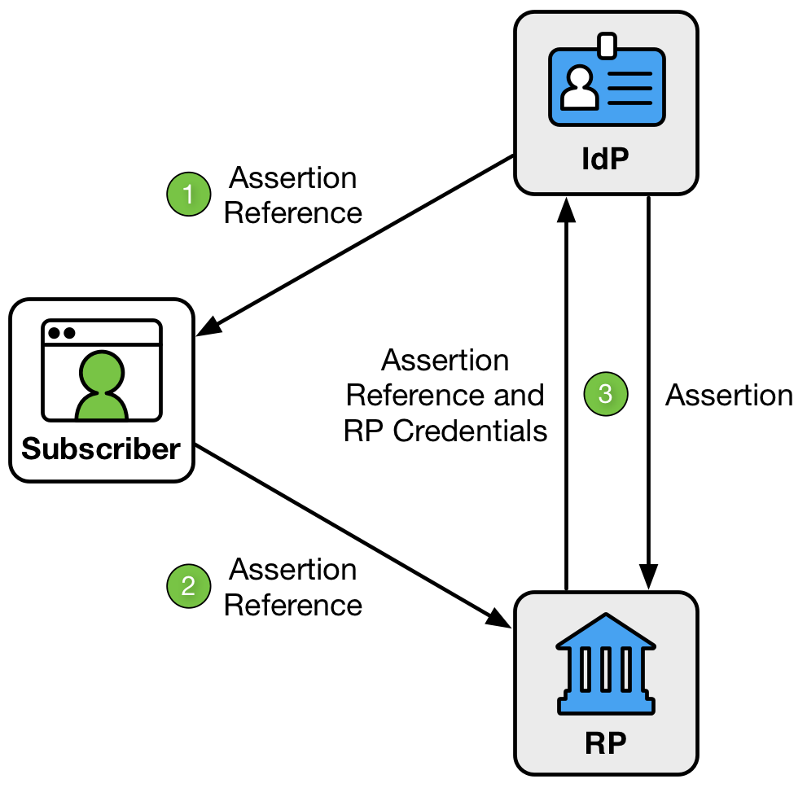
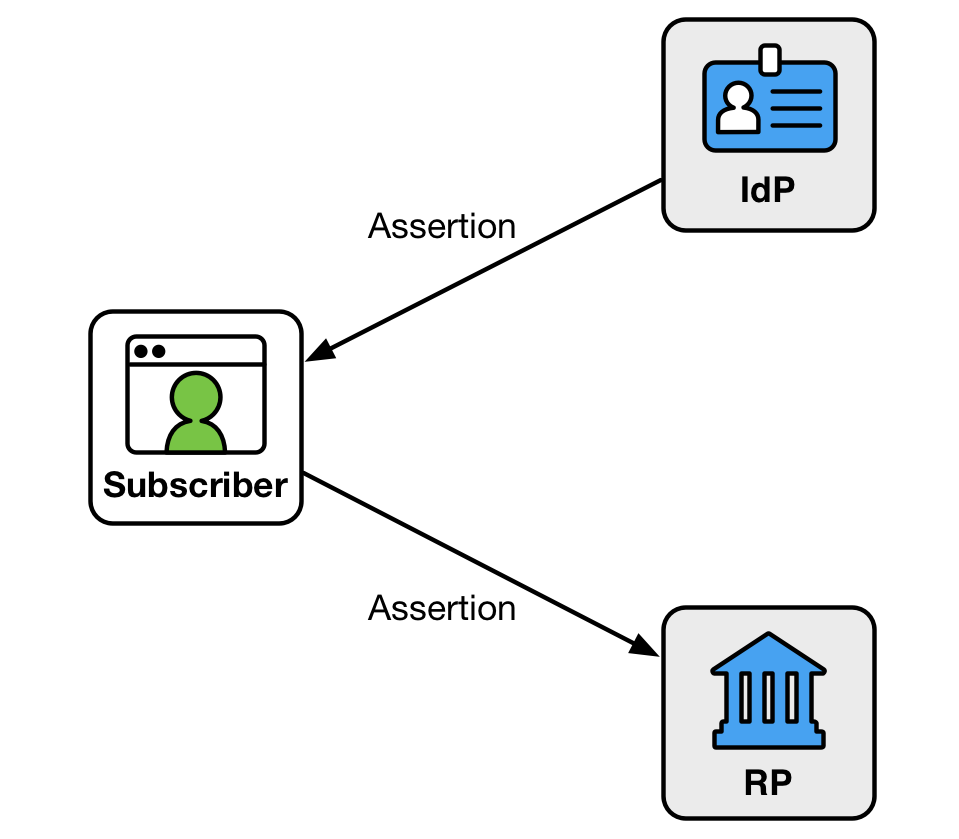
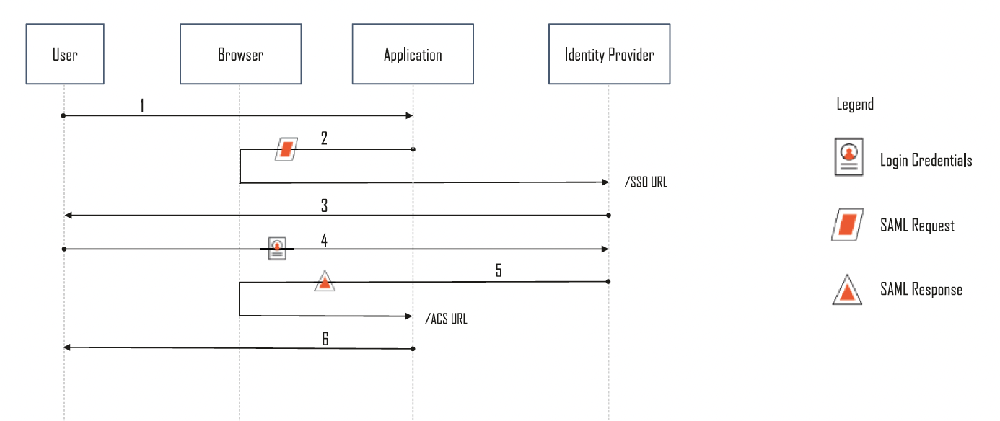
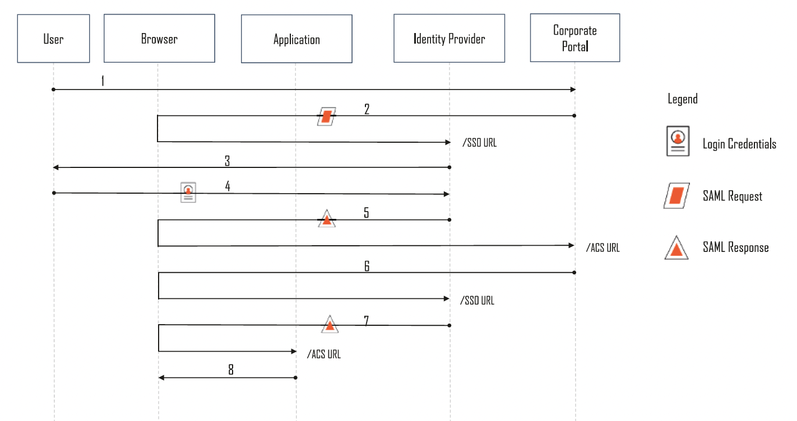

SAML is old, verbose, and XML-based. Every engineer who encounters it for the first time wishes the world had just used OIDC instead. But SAML isn't going anywhere. If you work on identity in an enterprise context, you'll integrate with it whether you want to or not.

<!--more-->

I learned SAML during my time at MFID, MoneyForward's identity service, where we built and maintained SAML SSO for enterprise tenants. This post covers what I needed to understand to do that work: from the federation model and XML structure down to signature mechanics and the attacks you need to guard against.

---

**What is SAML?**

A federated identity protocol where an IdP issues signed XML assertions that applications use to authenticate users.

SAML solves two problems: **cross-domain SSO** and **identity federation**. It lets enterprises delegate user authentication to a centralized identity provider, so employees can access third-party SaaS apps without each app managing its own credentials.

**Why hasn't OIDC replaced SAML?**

Technically it could. But many enterprise SaaS vendors still only support SAML. Some claim to support OIDC but use identity brokers that translate to SAML internally. The real split is:

- SAML dominates enterprise identity federation (employee access to SaaS tools)
- OIDC dominates consumer identity federation (your own products and APIs)

If the world started fresh today, SAML probably wouldn't exist. But it doesn't, so here we are.

> **Note:**
> - OIDC-federated SaaS is increasing, especially among newer vendors.
> - In most companies, SaaS integrations are managed by IT, and SAML is their default expectation.

---

# Identity Management and Federation

When an employee joins a company, IT needs to both **manage** and **federate** their identity.

Identity management tasks:
- Create the user in the company IdP
- Create accounts in required SaaS apps
- Link the IdP identity with each SaaS identity
- Update attributes (licenses, roles, department)
- Suspend or delete accounts on both IdP and SaaS sides

Identity federation tasks:
- Employee can sign into all required SaaS apps from day one
- Some accounts are auto-provisioned on first login (JIT provisioning)
- Employees gain or lose access dynamically as roles change
- Sign-out and session management across all SaaS apps

⚠️ **Managed but not federated accounts are dangerous.** If an employee is offboarded from the IdP but their SaaS accounts aren't deprovisioned or defederated, they retain access.

---

# Federation Patterns (Based on NIST)

Federation patterns describe how identity assertions flow between the RP (Service Provider) and IdP.

The [NIST SP 800-63C spec](https://pages.nist.gov/800-63-3/sp800-63c.html) defines two patterns.

## 1. Back-channel federation



The user passes only an assertion reference to the RP. The RP fetches the actual assertion directly from the IdP over a secure back-channel. The assertion is single-use, short-lived, and goes directly from IdP to RP. The user never touches it.

The RP must still validate issuer, signature, timestamps, and audience.

- **Example**: OpenID Connect Authorization Code Flow

## 2. Front-channel federation



The IdP sends the full assertion to the user's browser, and the user's browser forwards it to the RP. The user can see the assertion. It can be replayed or tampered with if the RP doesn't validate carefully.

The RP must validate issuer, signature, timestamps, audience, and guard against replay.

- **Example**: SAML 2.0 Web SSO

---

# SAML vs OIDC Bindings

Bindings define how messages travel between the browser, IdP, and SP.

| Binding Type | SAML | OIDC |
|--------------|-------|------|
| **HTTP-Redirect** | SAML message sent as URL query params via HTTP GET redirect. Common for AuthnRequests (SP → IdP). Limited to small messages. | Most OIDC messages use URL redirects for both RP → IdP and IdP → RP. |
| **HTTP-POST** | SAML message sent in HTTP POST body via auto-submitting HTML form. Common for SAML Responses (IdP → SP). Handles large messages. | Some IdPs (e.g., Apple) return OIDC response params via POST. Still front-channel. |
| **HTTP Artifact** | Browser receives only a reference ID. Actual SAML message is retrieved via back-channel SOAP call. More secure but rarely used today. | Authorization code is a reference. RP exchanges it for tokens via back-channel call to IdP token endpoint. |

---

# Configuring SAML on an Enterprise IdP

To set up SAML SSO, you configure these fields on your enterprise IdP:

- **ACS URL**: SP endpoint where the IdP will POST the SAML Response
- **Audience URI (SP Entity ID)**: unique identifier for the SP; IdP uses it to set the assertion audience
- **RelayState** (optional): used mainly in IdP-initiated flows to tell the SP where to redirect after SSO; it's an opaque string that's returned unchanged in the response
- **NameID Format**: how the user is identified (typically email or persistent ID)
- **Signing & Encryption**: SAML Responses and Assertions are typically signed; Assertions may also be encrypted
- **Attribute Statements**: any user attributes the IdP should include in the assertion

After configuration, the IdP provides a **metadata XML** containing its certificates, SSO URLs, and supported bindings.

> **Note on RelayState**: It's passed alongside SAML messages but exists outside the XML and is not signed. This makes it susceptible to injection. Very similar to OIDC's `state` parameter. Treat it with the same caution.

## Metadata XML

```xml
<md:EntityDescriptor xmlns:md="urn:oasis:names:tc:SAML:2.0:metadata" entityID="http://www.okta.com/exk28a7aitJsRsWWR5d7">
  <md:IDPSSODescriptor WantAuthnRequestsSigned="false" protocolSupportEnumeration="urn:oasis:names:tc:SAML:2.0:protocol">
    <md:KeyDescriptor use="signing">
      <ds:KeyInfo xmlns:ds="http://www.w3.org/2000/09/xmldsig#">
        <ds:X509Data>
          <ds:X509Certificate>MIIDpjC... [TRUNCATED BASE64 CERT] ...cd60NRB9d8=</ds:X509Certificate>
        </ds:X509Data>
      </ds:KeyInfo>
    </md:KeyDescriptor>

    <md:NameIDFormat>urn:oasis:names:tc:SAML:1.1:nameid-format:unspecified</md:NameIDFormat>
    <md:NameIDFormat>urn:oasis:names:tc:SAML:1.1:nameid-format:emailAddress</md:NameIDFormat>

    <md:SingleSignOnService Binding="urn:oasis:names:tc:SAML:2.0:bindings:HTTP-POST"
        Location="https://dev-2148273.okta.com/app/dev-2148273_samlapproproject1_2/exk28a7aitJsRsWWR5d7/sso/saml"/>

    <md:SingleSignOnService Binding="urn:oasis:names:tc:SAML:2.0:bindings:HTTP-Redirect"
        Location="https://dev-2148273.okta.com/app/dev-2148273_samlapproproject1_2/exk28a7aitJsRsWWR5d7/sso/saml"/>

  </md:IDPSSODescriptor>
</md:EntityDescriptor>
```

| Field | Explanation |
|-------|-------------|
| `WantAuthnRequestsSigned` | Whether the IdP requires AuthnRequests from the SP to be signed. |
| `entityID` | Unique identifier of the IdP. SP uses this to validate who issued the SAML Response. |
| `KeyDescriptor` (signing) | The IdP's public X.509 certificate. SP uses this to verify the SAML Response signature. |
| `NameIDFormat` | Tells the SP what type of user identifier to expect. |
| `SingleSignOnService` (POST) | URL where SP sends SAML AuthnRequest via POST binding. |
| `SingleSignOnService` (Redirect) | URL where SP sends SAML AuthnRequest via Redirect binding. |

---

# SAML Request Deep Dive

Using the IdP metadata, the SP constructs an XML `AuthnRequest`.

## AuthnRequest XML

```xml
<?xml version="1.0" encoding="UTF-8"?>
<saml2p:AuthnRequest
    xmlns:saml2p="urn:oasis:names:tc:SAML:2.0:protocol"
    AssertionConsumerServiceURL="{{SP_ACS_URL}}"
    Destination="{{IDP_SSO_TARGET_URL}}"
    ID="{{UNIQUE_ID}}"
    IssueInstant="{{ISSUE_INSTANT}}"
    ProtocolBinding="urn:oasis:names:tc:SAML:2.0:bindings:HTTP-POST"
    Version="2.0">
    <saml2:Issuer
        xmlns:saml2="urn:oasis:names:tc:SAML:2.0:assertion">{{SP_ENTITY_ID}}
    </saml2:Issuer>
</saml2p:AuthnRequest>
```

| Field | Explanation |
|-------|-------------|
| `AssertionConsumerServiceURL` | SP's callback endpoint to receive the SAML Response. Equivalent to OIDC's redirect_uri. |
| `Destination` | The IdP's SSO endpoint receiving this request. Equivalent to OIDC's authorization endpoint. |
| `ID` | Unique message ID. The SAML Response's `InResponseTo` must match this. |
| `IssueInstant` | Timestamp when the request was created. |
| `Version` | Fixed `"2.0"` for SAML 2.0. |
| `Issuer` | The SP's Entity ID, which identifies who sent the request. |

For HTTP-Redirect binding, this XML is deflated (zlib), Base64-encoded, and URL-encoded:

```
<idp-sso-url>?SAMLRequest=<base64_deflate_encoded_saml_request>
```

> AuthnRequests are often unsigned, depending on IdP/SP configuration. SAML Responses and Assertions are almost always signed.

---

# SAML Response Deep Dive

A SAML Response wraps the Assertion. Think of it as: `Response` = envelope, `Assertion` = the actual identity claim.

`SAML Assertion ≈ OIDC ID Token`

## Response XML

```xml
<?xml version="1.0" encoding="UTF-8"?>
<saml2p:Response
    xmlns:saml2p="urn:oasis:names:tc:SAML:2.0:protocol"
    xmlns:xs="http://www.w3.org/2001/XMLSchema"
    Destination="http://localhost:9292/acs"                    <!-- 4 -->
    ID="id1511053110440237975657003"                           <!-- 1 -->
    InResponseTo="unique-generated-id-1234"                   <!-- 5 -->
    IssueInstant="2025-03-14T04:22:53.450Z"                   <!-- 3 -->
    Version="2.0">                                            <!-- 2 -->

    <saml2:Issuer                                             <!-- 6 -->
        xmlns:saml2="urn:oasis:names:tc:SAML:2.0:assertion"
        Format="urn:oasis:names:tc:SAML:2.0:nameid-format:entity">
        http://www.okta.com/exkntdung4kWLqGMV5d7
    </saml2:Issuer>

    <!-- ======== start of signature ======== -->

    <ds:Signature xmlns:ds="http://www.w3.org/2000/09/xmldsig#">  <!-- 7 -->
        <ds:SignedInfo>
            <ds:CanonicalizationMethod Algorithm="http://www.w3.org/2001/10/xml-exc-c14n#"/>
            <ds:SignatureMethod Algorithm="http://www.w3.org/2001/04/xmldsig-more#rsa-sha256"/>
            <ds:Reference URI="#id1511053110440237975657003">  <!-- same as ID above -->
                <ds:Transforms>
                    <ds:Transform Algorithm="http://www.w3.org/2000/09/xmldsig#enveloped-signature"/>
                    <ds:Transform Algorithm="http://www.w3.org/2001/10/xml-exc-c14n#">
                        <ec:InclusiveNamespaces xmlns:ec="http://www.w3.org/2001/10/xml-exc-c14n#" PrefixList="xs"/>
                    </ds:Transform>
                </ds:Transforms>
                <ds:DigestMethod Algorithm="http://www.w3.org/2001/04/xmlenc#sha256"/>
                <ds:DigestValue>zbmPLhIrWdCnlKu+6OAK5UHpCDFU45xwKA91ptGbqP4=</ds:DigestValue>
            </ds:Reference>
        </ds:SignedInfo>
        <ds:SignatureValue>Y/t/R... [TRUNCATED] ...7aJaA==</ds:SignatureValue>
        <ds:KeyInfo>
            <ds:X509Data>
                <ds:X509Certificate>MIIDpjC... [TRUNCATED] ...cd60NRB9d8=</ds:X509Certificate>
            </ds:X509Data>
        </ds:KeyInfo>
    </ds:Signature>

    <!-- ======== end of signature ======== -->

    <saml2p:Status>                                           <!-- 8 -->
        <saml2p:StatusCode Value="urn:oasis:names:tc:SAML:2.0:status:Success"/>
    </saml2p:Status>

    <saml2:Assertion>
        <!-- covered in the next section -->
    </saml2:Assertion>

</saml2p:Response>
```

| # | Field | Explanation |
|---|-------|-------------|
| 1 | `ID` | Unique message ID. If the same ID is received twice, it's a replay attack. |
| 2 | `Version` | Fixed `"2.0"`. |
| 3 | `IssueInstant` | When the Response was issued. Both Response and Assertion have their own timestamps. |
| 4 | `Destination` | The ACS URL this response is intended for. Both Response and Assertion have their own expected recipient. |
| 5 | `InResponseTo` | Must match the `ID` of the original AuthnRequest. Mismatch → likely CSRF. |
| 6 | `Issuer` | The IdP's Entity ID. |
| 7 | `Signature` | XML signature over the Response element. The `Reference URI` must match the Response `ID`. Don't trust the certificate in `KeyInfo` blindly. Validate it against the pre-registered certificate from the IdP metadata. |
| 8 | `StatusCode` | Authentication result from the IdP. |

---

# SAML Assertion Deep Dive

The Assertion is a separate XML element with its own `ID`, `IssueInstant`, and `Version`, independent from the Response that wraps it.

## Assertion XML

```xml
<saml2:Assertion
    xmlns:saml2="urn:oasis:names:tc:SAML:2.0:assertion"
    xmlns:xs="http://www.w3.org/2001/XMLSchema"
    ID="id15110531106260401222167389"
    IssueInstant="2025-03-14T04:22:53.450Z"
    Version="2.0">

    <saml2:Issuer Format="urn:oasis:names:tc:SAML:2.0:nameid-format:entity">  <!-- 1 -->
        http://www.okta.com/exkntdung4kWLqGMV5d7
    </saml2:Issuer>

    <!-- ======== start of signature ======== -->

    <ds:Signature xmlns:ds="http://www.w3.org/2000/09/xmldsig#">               <!-- 2 -->
        <ds:SignedInfo>
            <ds:CanonicalizationMethod Algorithm="http://www.w3.org/2001/10/xml-exc-c14n#"/>
            <ds:SignatureMethod Algorithm="http://www.w3.org/2001/04/xmldsig-more#rsa-sha256"/>
            <ds:Reference URI="#id15110531106260401222167389">
                <ds:Transforms>
                    <ds:Transform Algorithm="http://www.w3.org/2000/09/xmldsig#enveloped-signature"/>
                    <ds:Transform Algorithm="http://www.w3.org/2001/10/xml-exc-c14n#">
                        <ec:InclusiveNamespaces xmlns:ec="http://www.w3.org/2001/10/xml-exc-c14n#" PrefixList="xs"/>
                    </ds:Transform>
                </ds:Transforms>
                <ds:DigestMethod Algorithm="http://www.w3.org/2001/04/xmlenc#sha256"/>
                <ds:DigestValue>vW+YEI/IMVpJi8Ty2u/q6x7KHVzQmwYwXKUKEv1GTQA=</ds:DigestValue>
            </ds:Reference>
        </ds:SignedInfo>
        <ds:SignatureValue>Fjlhg... [TRUNCATED] ...Njvpw==</ds:SignatureValue>
        <ds:KeyInfo>
            <ds:X509Data>
                <ds:X509Certificate>MIIDqDC... [TRUNCATED] ...ZQoyinw==</ds:X509Certificate>
            </ds:X509Data>
        </ds:KeyInfo>
    </ds:Signature>

    <!-- ======== end of signature ======== -->

    <saml2:Subject>                                                              <!-- 3 -->
        <saml2:NameID Format="urn:oasis:names:tc:SAML:1.1:nameid-format:unspecified">
            kamandla.b+bala@moneyforward.co.jp
        </saml2:NameID>
        <saml2:SubjectConfirmation Method="urn:oasis:names:tc:SAML:2.0:cm:bearer">
            <saml2:SubjectConfirmationData
                InResponseTo="unique-generated-id-1234"
                NotOnOrAfter="2025-03-14T04:27:53.450Z"
                Recipient="http://localhost:9292/acs"/>
        </saml2:SubjectConfirmation>
    </saml2:Subject>

    <saml2:Conditions                                                            <!-- 4 -->
        NotBefore="2025-03-14T04:17:53.450Z"
        NotOnOrAfter="2025-03-14T04:27:53.450Z">
        <saml2:AudienceRestriction>
            <saml2:Audience>http://localhost:9292/ruby_saml_auth</saml2:Audience>
        </saml2:AudienceRestriction>
    </saml2:Conditions>

    <saml2:AuthnStatement                                                        <!-- 5 -->
        AuthnInstant="2025-03-14T04:22:53.450Z"
        SessionIndex="unique-generated-id-1234">
        <saml2:AuthnContext>
            <saml2:AuthnContextClassRef>
                urn:oasis:names:tc:SAML:2.0:ac:classes:PasswordProtectedTransport
            </saml2:AuthnContextClassRef>
        </saml2:AuthnContext>
    </saml2:AuthnStatement>

    <saml2:AttributeStatement>                                                   <!-- 6 -->
        <saml2:Attribute Name="firstName" NameFormat="urn:oasis:names:tc:SAML:2.0:attrname-format:unspecified">
            <saml2:AttributeValue xsi:type="xs:string">balashekhar</saml2:AttributeValue>
        </saml2:Attribute>
        <saml2:Attribute Name="lastName" NameFormat="urn:oasis:names:tc:SAML:2.0:attrname-format:unspecified">
            <saml2:AttributeValue xsi:type="xs:string">kamandla</saml2:AttributeValue>
        </saml2:Attribute>
    </saml2:AttributeStatement>

</saml2:Assertion>
```

| # | Field | Explanation |
|---|-------|-------------|
| 1 | `Issuer` | Who issued the Assertion. Usually the same as the Response `Issuer`. |
| 2 | `Signature` | Signature covering the Assertion element specifically. |
| 3 | `Subject` | The authenticated user's identity. Contains `NameID` (the identifier) and `SubjectConfirmationData` which ties this assertion to the specific ACS URL and original request. |
| 4 | `Conditions` | Validity window and audience. SP must reject assertions outside `NotBefore`/`NotOnOrAfter` and with wrong `Audience`. |
| 5 | `AuthnStatement` | How and when the user was authenticated. `AuthnContextClassRef` tells the SP what authentication method was used (password, MFA, etc.). `SessionIndex` is used later for SLO. |
| 6 | `AttributeStatement` | User attributes beyond NameID. OIDC typically serves these from the UserInfo endpoint; SAML bundles them directly in the assertion. |

## NameID Formats

`NameID` is the primary user identifier in a SAML assertion. The `Format` attribute tells the SP how to interpret the value. The choice matters for how you link IdP identities to SP accounts.

| Format URI | Common Name | Behaviour |
|-----------|-------------|-----------|
| `...nameid-format:emailAddress` | Email | User's email address. Simple, but breaks if the user changes email. |
| `...nameid-format:persistent` | Persistent | Opaque identifier, stable over time, unique per IdP-SP pair. The same user gets a different persistent NameID at each SP (good for privacy). Ideal for account linking. |
| `...nameid-format:transient` | Transient | Random per session. A new value every login. The SP can't use it to link accounts across sessions, only for single-session authorization. |
| `...nameid-format:unspecified` | Unspecified | No format specified; the IdP decides. In practice, often ends up being email. |

**Practical advice**: prefer `persistent` for account linking. `email` is convenient but creates a coupling. If the user's email changes in the IdP, your SP-side link breaks and you'll have orphaned accounts.

## How Assertions Are Signed

The `<Signature>` element inside a SAML Assertion uses two nested digest operations:

**Digest 1: Hash of the Assertion element:**
1. The IdP takes the canonical form of the `<Assertion>` XML
2. Computes SHA-256 → stores it in `<DigestValue>` inside `<SignedInfo>`
3. `<SignedInfo>` references this digest via `<Reference URI="#assertionID">`

**Digest 2: Signature of `<SignedInfo>`:**
1. The IdP computes SHA-256 of the canonical `<SignedInfo>` block
2. Encrypts that digest with its private key (RSA or ECDSA)
3. Stores the result in `<SignatureValue>`

**`<KeyInfo>`** contains the IdP's X.509 certificate so the SP can extract the public key.

Some IdPs sign only the Assertion; some sign both the Response and the Assertion. Your SP must handle both.

## Signature Verification

**Step 1: Verify the signature:**
1. SP extracts the IdP's public key from `<KeyInfo>`
2. **Critically: verify this certificate matches the one registered in the IdP metadata.** Do not trust an inline certificate you haven't seen before.
3. Use the public key to decrypt `<SignatureValue>`
4. Recompute SHA-256 of `<SignedInfo>` and compare
5. Match → the signature was made by the IdP (authenticity)

**Step 2: Verify data integrity:**
1. SP recomputes SHA-256 of the `<Assertion>` XML element
2. Compares with `<DigestValue>` inside `<SignedInfo>`
3. Match → the assertion was not tampered with (integrity)

> To inspect and debug SAML messages manually: [https://samltool.com/](https://samltool.com/)

## XML Signature Wrapping (XSW) Attacks

This is one of the most common and dangerous attack classes against SAML implementations. It has a long history of CVEs across SAML libraries.

**The attack:**

A valid signed assertion has its signature tied to the element with a specific `ID`. The `<Reference URI="#id123">` inside `<SignedInfo>` points to `id123`. An attacker can:

1. Take a valid signed assertion (e.g., from their own legitimate login)
2. Copy the `<Signature>` element
3. Create a new `<Assertion>` with a fake identity (e.g., `admin@company.com`)
4. Inject it into the XML in a position where a naive SP parser will find it first
5. Move the original signed assertion somewhere else in the document

The signature is technically valid. It still references and correctly signs the original assertion. But the SP is consuming the injected one.

**Why this works:**

SAML implementations that find the first `<Assertion>` in the document, or that don't verify that the element being consumed is actually the one referenced in the signature, are vulnerable.

**Mitigation:**
- Always validate by `ID`: find the element whose `ID` matches the `Reference URI` in `<SignedInfo>`, then verify the signature over *that specific element*
- Never consume the first assertion you find in the XML tree without confirming it's the signed one
- Use a well-maintained, actively patched SAML library. Do not roll your own XML signature validation.
- Verify there is exactly one `<Assertion>` (or at least that you're consuming the correct one)

---

# SP-Initiated SSO

The SSO flow starts from the SP, the most common pattern.



1. User visits SP
2. SP redirects user to IdP with a SAML AuthnRequest
3. IdP authenticates the user (login page, MFA, etc.)
4. IdP sends SAML Response with Assertion to SP's ACS URL via the browser
5. SP validates the Response and Assertion, creates a session

---

# IdP-Initiated SSO

The IdP sends a SAML Response directly to the SP without any prior AuthnRequest from the SP.

Common in enterprise portals: the employee logs into the corporate portal, then clicks an app tile to launch it. The portal delegates to the IdP, which initiates SSO directly to each app.



1. User visits the corporate portal
2. Portal redirects to IdP for authentication
3. IdP authenticates the user
4. IdP sends SAML Response to the portal's ACS URL (response #1)
5. User lands on the portal, sees the list of apps
6. User clicks an app. Browser is redirected to the IdP with a parameter indicating the target SP. The IdP checks the existing session (still valid).
7. IdP sends SAML Response to the app's ACS URL (response #2)
8. SP validates and logs the user in

**Important caveats:**
- There is no `InResponseTo` in IdP-initiated flows, so the SP can't bind the response to a known request. This removes a CSRF protection that SP-initiated flows rely on.
- IdP-initiated SSO is essentially a CSRF vector by design. Any user in the same IdP can potentially replay an IdP-initiated SAML Response to log someone else into an SP account. Consider whether your threat model allows for this.
- OIDC has no equivalent to IdP-initiated SSO.

---

# Single Logout (SLO)

SLO is how SAML propagates logout across all SPs that share the same IdP session. It's notoriously difficult to implement correctly.

The key identifier that links login and logout sessions is **`SessionIndex`**, set in the `<AuthnStatement>` during login. The SP must store this and include it in logout requests.

## SP-Initiated SLO

1. User clicks logout on the SP
2. SP sends a `<LogoutRequest>` to the IdP's SLO endpoint, including the user's `NameID` and `SessionIndex`
3. IdP invalidates the session
4. IdP sends `<LogoutRequest>` to every other SP that shares that session (via front-channel redirects)
5. Each SP invalidates its local session and responds with `<LogoutResponse>`
6. IdP sends `<LogoutResponse>` back to the original SP
7. User is redirected to the logout landing page

## IdP-Initiated SLO

1. User initiates logout from the IdP portal (or the IdP forces logout, e.g., admin deactivates the user)
2. IdP sends `<LogoutRequest>` to each SP that has an active session
3. Each SP invalidates its local session and responds with `<LogoutResponse>`

## Why SLO is hard in practice

- It's entirely front-channel. The logout propagation happens through browser redirects, so if the user closes the browser mid-flow or one SP is slow to respond, other SPs don't get notified.
- Not all SPs implement SLO. If an SP doesn't respond to a `<LogoutRequest>`, the IdP typically continues anyway, and that SP's session stays active.
- Clock skew matters. SLO uses short-lived requests with timestamps; if clocks drift, valid requests get rejected.
- `SessionIndex` must be stored and correlated correctly. If your SP doesn't track `SessionIndex` from the original assertion, it can't respond to logout requests properly.

In practice, many enterprise deployments treat SLO as best-effort and rely on short session lifetimes as a fallback.

---

# Bonus: MFID SAML Implementation

At MoneyForward, Navis is the tenant management console where each tenant registers their IdP details (metadata, entity ID, and certificates) mapped to specific domains.

MFID acts as an **Identity Broker**, exposing SAML endpoints (SSO, ACS, SLO) on behalf of each tenant.

1. When a user signs in, MFID looks up the tenant's SAML configuration based on the user's domain
2. Builds a tenant-specific AuthnRequest and redirects the user to their IdP
3. After the IdP authenticates the user, it sends the SAML Response back to MFID's ACS URL
4. MFID validates the signature, audience, and assertion conditions (using a library like libsaml)
5. Once validated, MFID creates a session and completes the login

This is a **single-instance multi-tenant** architecture. MFID exposes one set of ACS endpoints while handling hundreds of different IdPs simultaneously. Each tenant's SAML config is resolved at request time based on the domain.

Reference: https://developer.okta.com/docs/concepts/saml/#single-idp-vs-multiple-idps

---

# Bonus: SAML SSO with Okta

A minimal Ruby implementation of SAML SSO with Okta, developed as part of my SAML learning:

https://github.com/baala3/ruby_saml_auth

---

# Conclusion

OIDC makes simple things simple and complex things possible.
SAML makes simple things complex, but still makes complex things possible.

At the end of the day, clients decide what they support, and clients pay. So even if SAML feels hard, brittle, and verbose... it's part of the job.

The key things to internalize:
- SAML is front-channel. The user's browser carries the full assertion, so validation must be strict.
- Signature verification is not just "is the signature valid". It's "is this the element that was actually signed".
- SLO works in theory; in production, treat it as best-effort and keep session lifetimes short
- Use a well-maintained library. The attack surface on hand-rolled XML signature validation is large.
