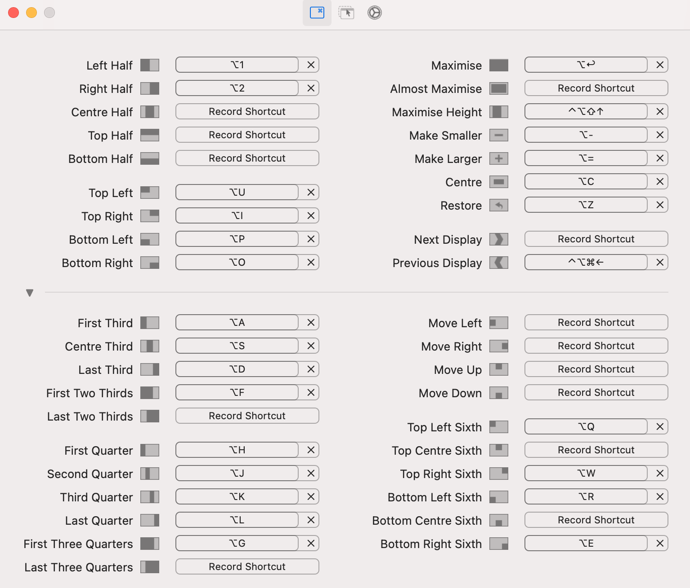

In this blog I want to share the tools I use on macOS that make my daily work easier and faster as Ruby and Go developer. I’ll skip the usual work related tools/IDEs like Docker, VS Code, IntelliJ IDEA, and Xcode. 
 <!--more--> Instead, focus on the ones that actually improve my Productivity.

---

### 1. Homebrew (package manager)

https://brew.sh/

Homebrew is the first thing i installed on any Mac. It’s an open-source package manager for macOS that makes installing apps and command-line tools simple.

```bash
# Search for formulas and casks
brew search bala

# Example: Install formula
brew install formula

# Example: Install cask
brew install --cask cask
```

You can install both formulas (CLI tools) and casks (full apps). A must-have one for any developer.

---

### 2. Fork (git client)
https://git-fork.com/

I mostly use Git from the command line, but Fork helps me review changes visually before pushing changes. It reduces mistakes like committing wrong commits to the wrong branches.

---

### 3. Warp (terminal)

https://www.warp.dev/

Warp is a modern terminal with useful features like Customization options Workflows for automating common tasks, recently has built-in AI that remembers and suggests commands.

It’s fast, smart, and more user-friendly than the default terminal.

---

### 4. Rectangle (window manager)

https://rectangleapp.com/

Window management on macOS is limited compared to Windows. Rectangle solves this with simple keyboard shortcuts to snap and organize windows.

I set custom shortcuts (see below), so managing multiple apps became simple after installing this tool.



---

### 5. AltTab (windows alt-tab on macOS)

https://alt-tab-macos.netlify.app/

By default, macOS's `cmd+tab` only lets you switch between apps, not windows of the same app.

AltTab is a tool just to fix this. I just replaced `cmd+tab` with AltTab and also mapped ` Cmd+` ` to switch between windows of the current app. 

Huge time saver and something I never imagined it exists.
(Espically in arc browser, i couldn't find a shortcut to switch below windows)

---

### 6. Raycast (app launcher)

https://www.raycast.com/

Raycast is a faster, cleaner replacement for Spotlight. I’d say it’s a bit of a heavy tool that exceeds my needs and requires many external extensions to be installed. I haven’t used all its features yet, but even basic search feels better than Spotlight.

---

### 7. Clipy (clipboard extention)

https://clipy-app.com/

macOS didn’t have proper clipboard history for a long time. Even now, the built-in option in macOS26 is very limited. Clipy keeps full history of copied items.

My shortcut is `Cmd+Shift+D` to quickly check the history and paste.

---

### 8. AS Timer

https://apps.apple.com/jp/app/as-timer/id512464723

A simple countdown timer. Nothing fancy, just works when I need to focus or take a break.

---

### 9. PDF Gear (pdf editor)

https://www.pdfgear.com/

I sometimes need to edit PDFs, when I do, PDF Gear is lightweight and easy to use option for me.

---

### 10. Bitwarden (password manager)

https://bitwarden.com/

My password manager of choice. It’s open source, secure, and syncs my credentials across all platforms.

---

### 11. Ente Authenticator (2FA)

https://ente.io/auth/

For 2FA, I use Ente Authenticator. It’s open source, syncs across iOS, Android, and macOS, and even has a website app for 2FA codes. Very convenient compared to traditional authenticators which are OS bound or device bound ones. 

I found this one on reddit.

---

### 12. Calibre (E-book manager)

https://calibre-ebook.com/

If you use ebooks, Calibre is the best tool to manage and convert them. I use it mainly for my Kindle to convert my pdf's to .epub, .mobi formats. This is great and very powerful tools for such use cases.

---

### 13. Vimium browser extension

[https://chromewebstore.google.com/detail/vimium/dbepggeogbaibhgnhhndojpepiihcmeb?hl](https://chromewebstore.google.com/detail/vimium/dbepggeogbaibhgnhhndojpepiihcmeb?hl=en)

On browsers (Arc, Chrome, Safari, Firefox), I use Vimium for Vim-style keyboard shortcuts. It makes browsing faster and keeps my hands on the keyboard.

---

That’s my current macOS setup tools. Ofcourse you can use an many tools as you want to, but be careful on not to overwhelm yourself with so many tools at once. Always think twice before installing the tool whether it really solving your needs and at what cost?..

That's all for now & i’ll update this list when I discover new ones.
