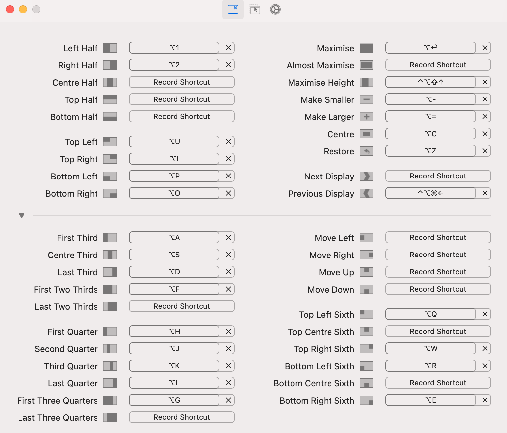

In this post, I’ll share the macOS tools I actually use and depend on. I’ll intentionally skip obvious, work specific tools like Docker, VS Code, IntelliJ IDEA, and Xcode. Instead, focus on tools that improve day-to-day work efficiency.

<!--more-->

I'm skipping the obvious dev tools like Docker, VS Code, IntelliJ, and Xcode. You already have those. This is about everything else.

---

# Core Essentials

### Homebrew

https://brew.sh/

The first thing I install on any new Mac. If you're not using it, you're wasting time manually downloading and updating software.

```bash
# Install a CLI tool
brew install ripgrep

# Install a desktop app
brew install --cask rectangle

# Keep everything up to date
brew upgrade
```

The `--cask` flag is the part people forget. It handles GUI apps too, not just CLI tools.

---

### Fork (git client)

https://git-fork.com/

I mostly use Git from command line, but Fork helps me review changes visually before pushing them. 
It helps me review diffs before pushing, double-check branch history and avoid accidental commits.

---

### Warp (terminal)

https://www.warp.dev/

Warp replaces the default Terminal with something that actually feels modern. Block-based output means you can select and copy command output without fighting the cursor. Workflows let you save and run command sequences. The built-in AI is useful for looking up flags without leaving the terminal.

It's faster and less frustrating than iTerm2 was for me.

---

### Rectangle (window manager)

https://rectangleapp.com/

macOS window management is still embarrassingly basic. Rectangle fixes that with keyboard shortcuts to snap windows to halves, thirds, and corners.

I set custom shortcuts that became muscle memory fast. Managing multiple windows across a wide monitor is now just a few keystrokes.



---

### AltTab

https://alt-tab-macos.netlify.app/

macOS `Cmd+Tab` switches between apps, not windows. If you have two browser windows or two terminal sessions open, you can't get to the right one with the default switcher.

AltTab replaces `Cmd+Tab` with a real window switcher. I also mapped `Cmd+\`` to cycle windows within the current app. This was a bigger quality-of-life improvement than I expected. Arc browser in particular has no good built-in shortcut for switching between windows, so AltTab fills that gap.

---

### Raycast (app launcher)

https://www.raycast.com/

A faster, cleaner replacement for Spotlight. Basic search already feels better, and the extension ecosystem is large if you want to go further. I mostly use it for app launching and quick calculations, but it handles clipboard history, snippets, and window management if you want to consolidate tools.

---

### Clipy (clipboard manager)

https://clipy-app.com/

macOS clipboard history is still limited even in recent versions. Clipy keeps a full history of everything you copy, accessible with `Cmd+Shift+D`. Once you have clipboard history, you can't go back. It changes how you copy and paste.

---

# Other Useful Ones

### AS Timer

https://apps.apple.com/jp/app/as-timer/id512464723

A simple countdown timer. Nothing fancy. I use it for Pomodoro-style focus blocks.

---

### PDF Gear

https://www.pdfgear.com/

Free PDF editor for annotating, merging, and light editing. Does the job without a subscription.

---

### Bitwarden (password manager)

https://bitwarden.com/

Open source, cross-platform, and audited. It syncs across all my devices and has a solid browser extension. I trust it more than most alternatives because the code is public.

---

### Ente Auth (2FA)

https://ente.io/auth/

Most 2FA apps lock you to one platform or one device. Ente Auth is open source and syncs across iOS, Android, macOS, and the web. Moving to a new phone doesn't mean losing all your codes.

---

### Calibre (e-book manager)

https://calibre-ebook.com/

If you have e-books in different formats or manage a library across devices, Calibre handles conversion and organization well. It's not pretty, but it works.

---

### Vimium (browser extension)

https://chromewebstore.google.com/detail/vimium/dbepggeogbaibhgnhhndojpepiihcmeb

Works on Arc, Chrome, Safari, and Firefox. Vim-style keyboard shortcuts for navigation: `f` to open link hints, `j`/`k` to scroll, `H`/`L` for history. Once the bindings are in muscle memory, you reach for the mouse a lot less.

---

# That's it

That's it my current macOS setup tools. Ofcourse you can use an many tools as you want to, but be careful on not to overwhelm yourself with so many tools at once. Always think twice before installing the tool whether it really solving your needs and at what cost?..
