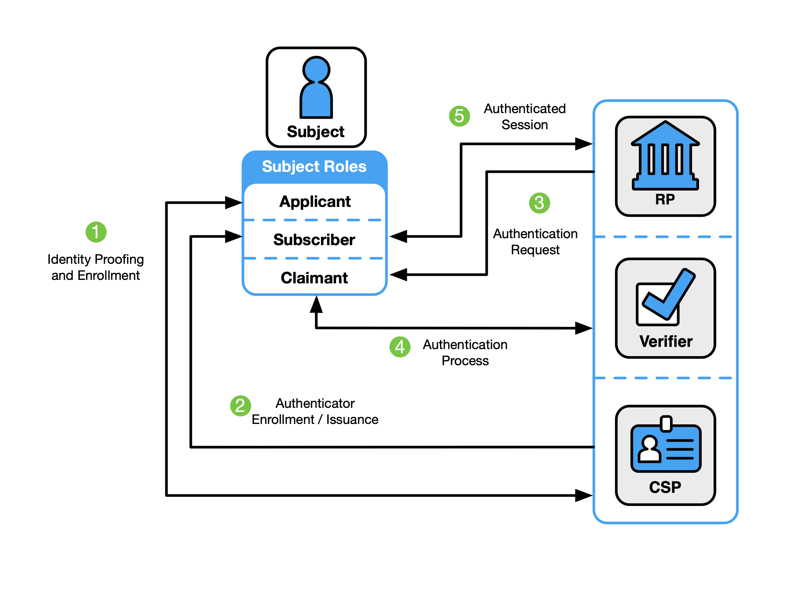
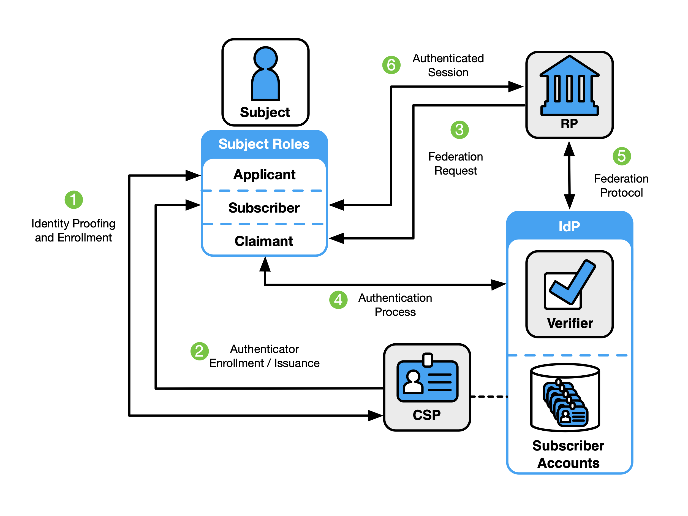
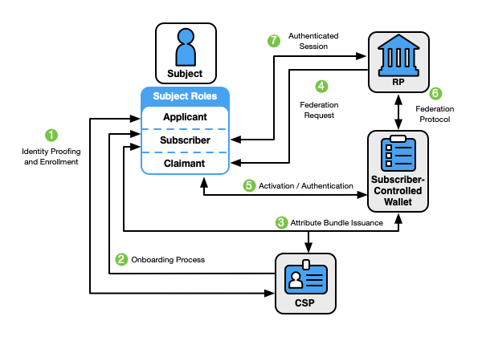
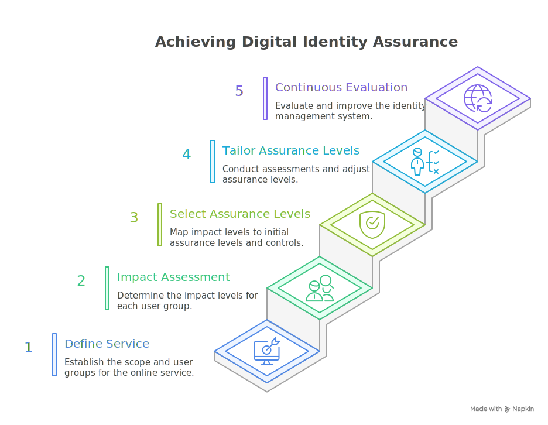
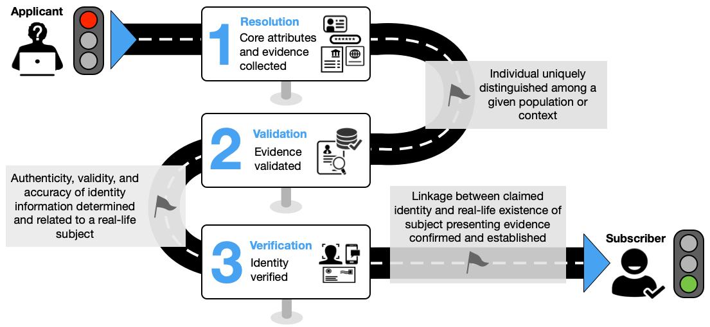

The [NIST Digital Identity Guidelines](https://pages.nist.gov/800-63-3/) provide a comprehensive framework for how organizations should approach identity proofing, authentication, and federation of users—especially when dealing with government data and individaul users.

 <!--more-->

With the rapid growth of online services, protecting digital information is no longer optional. Systems need to get a balance between strong security and reliable user experience.

```
privacy is not an extra feature; it’s a requirement.
```

One challenge in today’s online system is that identity systems are typically developed to meet the needs of a single organization. A user have to maintain multiple identities across different platforms, leading to complexity and larger attack surfaces. Since there is no universal, user-controlled “meta-identity” systems that organizations must take responsibility for implementing strong, user-centric identity practices. But it's an another topic to discuss. So to such risks and attacks it's important for organizations to following these guidelines.


The NIST Digital Identity Guidelines are broken down into four parts:

- **[SP 800-63](https://pages.nist.gov/800-63-3/sp800-63-3.html)**: Describes the overall digital identity model, risk assessment process, and how to select assurance levels.
- **[SP 800-63A](https://pages.nist.gov/800-63-3/sp800-63a.html)**: Details identity proofing and enrollment processes across IALs, including how CSPs should manage subscriber accounts and authenticators.
- **[SP 800-63B](https://pages.nist.gov/800-63-3/sp800-63b.html)**: Focuses on authentication requirements, authenticator types, and lifecycle events such as revocation or theft.
- **[SP 800-63C](https://pages.nist.gov/800-63-3/sp800-63c.html)**: Explains how federated identity architectures and assertions should securely convey authentication results and identity information.

I will go through all the suites in this blog, so please bear with me, as it might go long.

---

# 1. SP 800-63 (Digital Identity Model & DIRM)

These guidelines promote mainly focuses on risk-based approach to digital identity. Instead of one-size-fits-all solution, organizations are encouraged to adapt controls based on their specific context, risks, and user needs. Key points include:

- Encouraging outcome-based digital identity risk management specific to organization’s environment.
- Offering guidance to Credential Service Providers (CSPs) and Relying Parties (RPs) on how to integrate with the NIST Risk Management Framework (RMF).
- Organization following these guidelines are also required to follow FISMA and RMF.
  - and beyond just following, they should actively communicate with users about changes, risks, or breaches to build long-term trust.

**Assurance Levels:**

NIST defines three different assurance levels, each tied to a specific aspect of digital identity, and we will go more details on each in their specific suite.

- Identity Assurance Level (IAL): Focuses on how thoroughly a system verifies a user’s identity (proofing and enrollment).
- Authentication Assurance Level (AAL): Focuses on strengths of authentication methods (e.g., passwords, MFA, biometrics).
- Federation Assurance Level (FAL): Focuses on trustworthiness of identity assertions shared across systems via federated protocols.

By selecting the right level for each function, organizations can align their identity systems with the sensitivity of the resources they protect.

> **Note:** Identity systems should be designed so that it’s **easy for users to do the right thing, hard to do the wrong thing, and simple to recover when mistakes happen**. 
This balance not only strengthens security but also builds user confidence
in system and leads to long-term adoption.

---

## 1.1 Digital Identity Model
First lets got though roles defined to be used in this guide:

| Role/Function | Description |
|---------------|-------------|
| **Subject** | A person in the digital identity process, with one of three roles:<br>• **Applicant** – Needs identity proofing and enrollment.<br>• **Subscriber** – Successfully enrolled or authenticated.<br>• **Claimant** – Claims eligibility for authentication. |
| **Service Provider** | Delivers online services and may act as a CSP, RP, verifier, or IdP. |
| **Credential Service Provider (CSP)** | Handles identity proofing, enrollment, subscriber accounts, and authenticator binding. Can also be managed by third parties. |
| **Relying Party (RP)** | Provides services and relies on verified identity assertions from a verifier or IdP. |
| **Verifier** | Confirms a claimant’s identity by checking authenticators and ensuring the subscriber account is valid. |
| **Identity Provider (IdP)** | In federated systems, manages primary authenticators and issues identity assertions to RPs. |


### 1.1.1 Identity Proofing & Enrollment (SP 800-63A)

Identity proofing starts when an **applicant** attempts to access a CSP service. The CSP collects identity evidence, validates it, and if successful, enrolls the applicant as a **subscriber**. A unique subscriber account is created and authenticators (e.g., keys, devices) are bound to it.

Subscribers must maintain control of authenticators (like protecting a password or security key) to remain in good standing.

### 1.1.2. Authentication & Authenticators (SP 800-63B)

Authentication proves that a **claimant** controls valid authenticators tied to their subscriber account. Authenticators fall into three categories:

- **Something you know** (password, PIN)
- **Something you have** (security key, device)
- **Something you are** (biometric like fingerprint or iris)

Single-factor uses one type (often a password). **MFA** combines distinct factors, e.g., password + hardware key.

Secrets inside authenticators can be asymmetric keys (public/private) or symmetric keys (OTP seeds, shared secrets). Biometrics enhance MFA but cannot be used alone. Weak methods like knowledge-based Q&A are explicitly disallowed.

The **authentication process** involves the claimant, verifier, and RP: the claimant proves control of authenticators, the verifier checks validity, and the RP establishes a trusted session. Strong protocols prevent phishing and replay attacks.

### 1.1.3.Federation & Assertions (SP 800-63C)

Federation enables **identity reuse across domains** via assertions issued by an IdP and trusted by RPs. This reduces friction and cost while enhancing security. Benefits include:

- Single identity proofing for multiple services
- Reduced authenticator sprawl and infrastructure load
- Stronger privacy through pseudonymous identifiers
- Centralized account lifecycle management

Federation is preferred when:

- Users already hold strong authenticators
- Multiple user communities must be supported
- Organizations lack full identity infrastructure
- Environments require cross-platform compatibility

Federation can even apply within a single domain to simplify account management and upgrades.

### 1.1.4. Examples of Digital Identity Models

Digital identity can be implemented in different ways depending on whether services are isolated, federated, or subscriber-controlled. Below are three common models that illustrate how interactions and trust flow across entities.

<b>a. Non-Federated Model</b>


```
In the non-federated model, the Relying Party (RP) also can acts as verifier.
Process:
    1. Applicant enrolls with a CSP → becomes a subscriber.
    2. CSP maintains the subscriber account and authenticators.
    3. Subscriber authenticates directly with RP, which verifies identity against the CSP.
    4. Once validated, the RP establishes a session.
note: Tight coupling between RP and CSP. This works, 
but it limits scalability and flexibility.
```


<b>b. Federated Model with IdP</b>


```
In the federated model, the Identity Provider (IdP) takes on CSP 
and verifier responsibilities.
Process:
    1. Applicant enrolls with a CSP → subscriber account created.
    2. IdP is provisioned with subscriber attributes.
    3. When authentication is requested, RP redirects to IdP.
    4. IdP verifies authenticators and issues an assertion to RP.
    5. RP validates assertion using federation protocol & establishes session.
note: Separation of duties enables cross-domain trust,
so subscriber can authenticate once and reuse their digital identity across multiple RPs.
```

<b>c. Federated Model with Subscriber-Controlled Wallet</b>


```
This is a newer model where the subscriber directly controls digital wallet
(device or cloud-hosted). The wallet essentially acts as the IdP.

Process:
    1. Subscriber enrolls with a CSP → receives attribute bundle
     (signed data with attributes + keys).
    2. Wallet stores this bundle securely.
    3. When authenticating, RP requests proof from the wallet.
    4. Wallet signs and returns an assertion + CSP-signed attributes.
    5. RP validates and grants access.
note: This shifts control to the subscriber, enhancing privacy and portability. 
Trust is established via federation protocols and CSP-issued bundles.
```
---

## 1.2 Digital Identity Risk Management (DIRM)

DIRM describes how organizations should follow a structured methodology to better assess digital identity risks associated with online services.

DIRM focuses on two key dimensions:
1. Operational risks: Risks that arise from running the online service itself, which can be mitigated through an identity system.
2. Implementation risks: Risks introduced as a result of deploying the identity system.

The first dimension helps determine the initial assurance level requirements, while the second guides the tailoring process, modifying assurance levels based on outcomes, metrics, or observed impacts.

Organizations need to assess how different types of impacts affect their digital identity systems. For each component—identity proofing, authentication, and federation—the organization must evaluate potential risks and consequences.

Additionally, CSPs (Credential Service Providers) must follow the assurance levels required by RPs (Relying Parties), since it is ultimately the RP that uses and handles the user’s identity data.

The DIRM process consists of five main steps:




### a. Define the Online Service

Start by clearly describing the service: its purpose, functions, business context, and regulatory obligations. Identify **user groups** (who directly use the service) versus **impacted entities** (who may be affected indirectly). Focus on identity and access: which users can access what, what evidence is available, and what risks exist if access is misused. Consider impacts beyond users, partners, organizations, and communities and evaluate the potential severity of harm, from operational disruptions to societal consequences.

### b. Conduct Initial Impact Assessment

Assess the risks tied to identity proofing, authentication, and federation. Categorize potential impacts—mission, reputation, financial, safety, unauthorized access—and rate them as **Low, Moderate, or High**. Evaluate each user group separately, considering both their privileges and external effects. Combine these results into an overall impact level for consistent evaluation across services.

### c. Select Initial Assurance Levels

Translate impact levels into **identity, authentication, and federation assurance levels (IAL, AAL, FAL)**. Each level has three tiers from basic protections to strong resistance against advanced attacks. This ensures baseline controls (from NIST SP800-63A/B/C) are applied either internally or via trusted third parties. Tailoring comes later, but the initial mapping sets a consistent starting point.

### d. Tailor and Document Assurance Levels

Adjust initial IAL, AAL, and FAL levels to match your organization’s mission, risks, and user environment. Document the process in **Digital Identity Acceptance Statement (DIAS)**, including governance, rationale, compensating, and supplemental controls. Balance security, privacy, and user experience, while ensuring all risks are mitigated. Compensating controls replace baseline requirements when needed; supplemental controls strengthen protections in high risk areas. The DIAS becomes the authoritative record for identity assurance decisions.

### e. Continuously Evaluate and Improve

Identity systems must evolve with threats and user needs. Track metrics like proofing success/failure, authentication outcomes, fraud incidents, and user feedback. Use these insights to improve accessibility, usability, privacy, and threat mitigation—without collecting unnecessary personal data. Collaborate with CSPs, IdPs, and other stakeholders to iteratively strengthen identity assurance and maintain secure, user-centric services.

---

## 1.2.1 Additional Considerations

### a. Redress Mechanisms

Design services with robust **redress processes** to resolve disputes or failures fairly and transparently. Include evidence review, human oversight, and trained support personnel. Make processes publicly accessible and trackable, test for unintended impacts, and integrate findings into continuous improvement programs.

### b. Collaboration & Threat Intelligence

Coordinate with cybersecurity, fraud, and program integrity teams. Share relevant threat and fraud data internally and externally while complying with privacy laws. This helps detect compromised accounts and improve identity processes.

### c. AI & Machine Learning

Use AI/ML carefully in identity systems—for biometrics, fraud detection, or user assistance. Document all AI/ML applications, share methods and datasets with stakeholders, and perform privacy risk assessments. Apply frameworks like **NIST AI Risk Management** to evaluate and mitigate potential risks.

---

# 2. SP 800-63a (Identity Proofing)

Identity proofing is the process of establishing a relationship between a subject accessing online services and a real-life person, to a defined level of assurance.  

Mostly identity proofing is performed by CSP (Credential Service Provider). The CSP must assert identification at useful **Assurance Level (ASL)** and support multiple types and combinations of identity evidence.

---

## 2.1 Identity Assurance Levels (IAL)

| Level   | Proofing Requirements |
|---------|------------------------|
| **No Identity Proofing** | No link to a real person required; attributes may not be validated; no verification. |
| **IAL1** | Confirms claimed identity exists; validates core attributes against credible sources; proofing may be remote or on-site (with or without CSP representative). |
| **IAL2** | Requires stronger evidence; validates and verifies applicant is rightful owner; protects against falsification, theft, and social engineering. |
| **IAL3** | In-person proofing with trained CSP (proofing agent); requires at least one biometric; authenticators are bound to the account. |

## 2.2 Identity Proofing Flow

Identity proofing generally has three main steps:



### 2.2.1 Resolution
- CSP collects one or more pieces of identity evidence of appropriate strength.  
- CSP collects additional core attributes (if needed) to supplement those on the presented evidence.  

---

### 2.2.2 Validation
- CSP confirms the evidence is **authentic, accurate, and valid**.  
- CSP validates attributes from Step 1 against authoritative or credible sources.  

#### a. Evidence Strength Levels

| Strength   | Requirements |
|------------|--------------|
| **Fair** | • Formal ID checks (e.g., CIP, MNO account setup)<br>• Delivered securely (in-person, mail, protected remote)<br>• Must include: name, unique ref/biometric/ID attribute, security features<br>• Core attributes validated with credible sources |
| **Strong** | • Issued with written procedures (IAL2+), under regulated oversight<br>• Must include: name, unique ref, biometric, strong security features<br>• Attributes validated against authoritative sources |
| **Superior** | • Issued under IAL2+ with attended enrollment<br>• Attributes cryptographically protected (digital signatures)<br>• Must include: name, unique ref, biometric, security features<br>• Highest rigor in validation and oversight |

#### b. Evidence & Attribute Validation
- **Evidence Validation** → Check authenticity, accuracy, and validity.  
- **Attribute Validation** → Confirm all core attributes with authoritative or credible sources.  

#### c. Validation Methods
- Visual/tactile inspection (on-site)  
- Visual inspection (remote)  
- Automated document validation (technology-based)  
- Cryptographic verification of digital evidence  
- Attribute validation via issuer or trusted service (e.g., digitally signed assertion, MNO data)  

---

### 2.2.3. Verification
CSP uses approved verification methods to confirm that the applicant is the rightful owner of the identity evidence. Below are identity verification methods. 

| Verification Method                   | Description                                                                                  |
|--------------------------------------|----------------------------------------------------------------------------------------------|
| **Confirmation Code**                 | Applicant returns a code sent to evidence source (per Sec. 3.8).                              |
| **Authentication/Federation Protocols** | Applicant proves control of a digital account or signed assertion (e.g., online bank login, credential presentation). |
| **Transaction Verification**          | Applicant confirms ownership via micro-transaction (e.g., bank micro-deposit).               |
| **Visual Facial Comparison (On-site)** | Agent compares applicant’s face with ID photo in person.                                     |
| **Visual Facial Comparison (Remote)**  | Agent compares applicant’s face with ID photo remotely (live video or recorded image).       |
| **Automated Biometric Comparison**    | Automated matching (face, fingerprint, iris, voice, vein, etc.) with evidence or authoritative record. |


> ⚠️ **KBV (Knowledge-Based Verification/Authentication)** → **Not allowed** for identity verification.

---

## 2.3 Identity Proofing Roles

| Role                | Description                                                                 |
|---------------------|-----------------------------------------------------------------------------|
| **Proofing Agent**  | Trained CSP staff; checks ID evidence; limited risk-based decisions.         |
| **Trusted Referee** | Handles exceptions when applicant lacks or mismatches evidence; requires more training/resources. |
| **Applicant Reference** | Vouches for applicant’s identity/attributes; not a proxy in the process. |
| **Process Assistant**   | Provides support (translation, accessibility); no role in decision-making. |


## 2.4 Identity Proofing Types

| Type                | Description |
|---------------------|-------------|
| **Remote Unattended** | Fully automated; no agent/referee; applicant uses own device/location. |
| **Remote Attended**   | Secure video session with agent/referee; applicant uses own device/location. |
| **On-site Unattended** | Automated kiosk/workstation; no agent/referee; CSP controls devices/location. |
| **On-site Attended**   | In-person at CSP location; agent/referee present throughout the process. |

## 2.5 Core Attributes
- First name  
- Middle name  
- Last name  
- Date of birth  
- Physical address  

