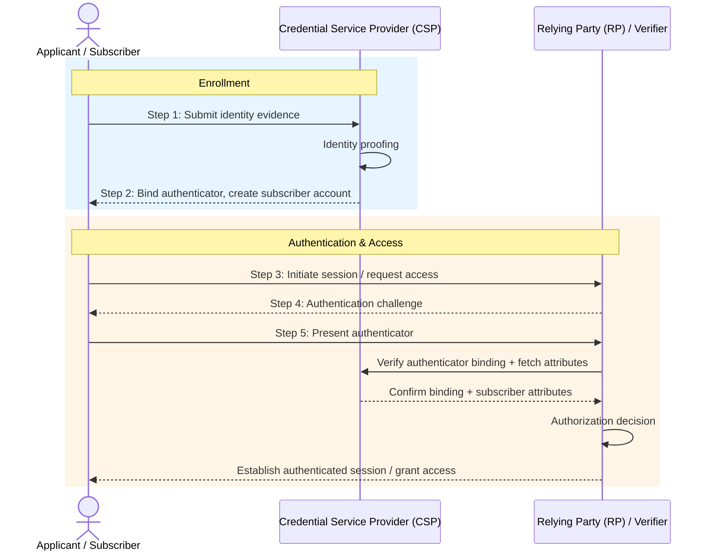
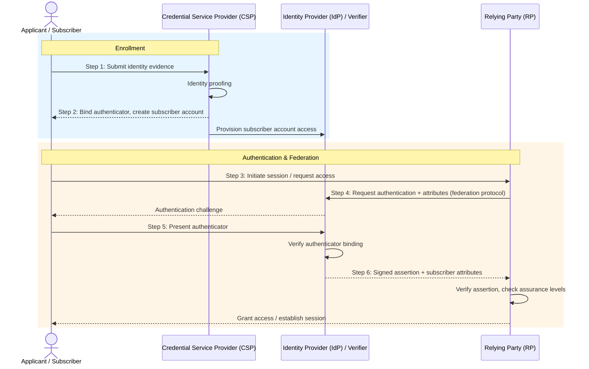
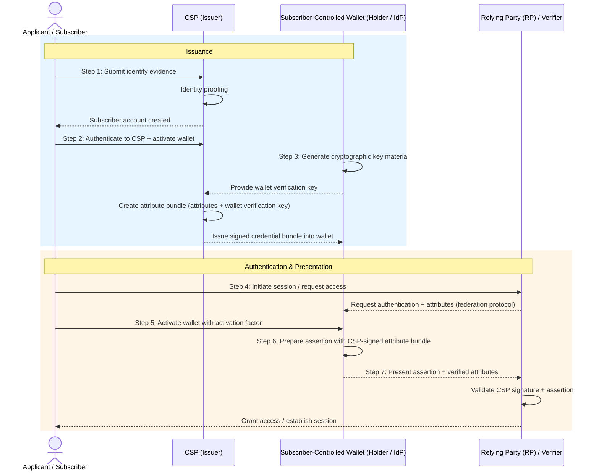

Most engineers think about identity in binary terms: the user is authenticated or they aren't. If you've built a login system, you've probably made decisions like "we'll require MFA for sensitive actions" or "we'll use SSO." Those are reasonable calls, but they're incomplete. <!--more--> They answer *how* someone authenticates without asking *who* you need them to be or *how confident* you need to be about it.

[NIST SP 800-63-4](https://pages.nist.gov/800-63-4/) gives that question a formal structure. It breaks identity assurance into three independent axes, each with three levels, and wraps the whole thing in a risk management process. The result is a framework that forces you to be explicit about what you're actually protecting and why.

---

**Series: NIST SP 800-63-4**
- **Part 1 (this blog):** The framework, assurance levels, and risk management model
- Part 2: [SP 800-63A-4 — Identity Proofing and Enrollment](/blogs/nist-sp-800-63a-4-identity-proofing)
- Part 3: [SP 800-63B-4 — Authentication and Authenticator Management](/blogs/nist-sp-800-63b-4-authentication)
- Part 4: [SP 800-63C-4 — Federation and Assertions](/blogs/nist-sp-800-63c-4-federation)

---

# Why This Spec Exists

Most organizations approach identity security as compliance exercise. You implement MFA because your auditor requires it. You add SSO because it's on the enterprise checklist. The security properties you actually get are an afterthought.

NIST's framing is different. Identity failure causes concrete harm: financial loss, unauthorized access to benefits or data, safety risks to individuals, erosion of public trust in digital services. The question isn't "did we check the MFA box?" but "what happens if we get this wrong, and for whom?"

SP 800-63-4 is the fourth major version of these guidelines, published in July 2025 after nearly four years of revisions and roughly 6,000 public comments. The previous version (800-63-3, published in 2017) held up reasonably well, but the threat landscape shifted enough to warrant significant updates:

- **Fraud prevention** is now a first-class requirement, not a footnote. CSPs must run active fraud management programs.
- **Deepfakes and injection attacks** are explicitly addressed. Remote identity proofing now has normative controls for synthetic media and virtual camera spoofing.
- **Syncable authenticators** (passkeys) are explicitly supported at AAL2, resolving the ambiguity in 800-63-3 that made some teams avoid them.
- **Subscriber-controlled wallets** are introduced as a new federation model, reflecting the growing verifiable credentials ecosystem.
- **Privacy and customer experience** requirements are strengthened throughout.

The spec is organized as a suite of four documents. This blog covers the main volume (SP 800-63-4), which defines the model and risk management process. The later blogs cover identity proofing (63A), authentication (63B), and federation (63C).

---

# The Digital Identity Model

Before getting to assurance levels, Let's understand some terms.

## The Cast

**Applicant:** Someone seeking access to digital service. Before they're enrolled, they're an applicant.

**Subscriber:** An applicant who has completed enrollment. The CSP has bound one or more authenticators to their account.

**Credential Service Provider (CSP):** Collects and verifies identity attributes, manages subscriber accounts, and issues credentials. In many systems, your app is the CSP.

**Identity Provider (IdP):** Performs authentication for subscribers and issues assertions to relying parties. In federated systems, the CSP and IdP are often the same entity (Google, Okta, your corporate SSO).

**Verifier:** Verifies the subscriber's authenticator. In practice, this is usually the IdP.

**Relying Party (RP):** The application that needs to know who the user is. It consumes assertions from the IdP.

## Three Architectural Models

The spec describes three ways these entities can be arranged:

**1. Non-federated:** The CSP, IdP, and RP are the same system. This is the classic "your app has a login page." The user registers, your app stores their credentials, your app authenticates them. Simple, but every RP has to manage the full identity lifecycle.

---

**2. General-purpose federation:** The CSP provisions a subscriber account; the IdP handles authentication and issues assertions to separate RPs. This is how enterprise SSO and consumer identity providers (Sign in with Google, GitHub OAuth) work.

---

**3. Subscriber-controlled wallet:** New in 800-63-4. The CSP issues signed attribute bundles (verifiable credentials) directly to the subscriber. The subscriber's wallet manages them and presents them directly to RPs, without the IdP being involved at assertion time.

The wallet model shifts control to the subscriber. The RP trusts the CSP's signature on the credential, not a live assertion from an IdP. This has real privacy benefits (the IdP can't track which RPs you're visiting) but introduces new challenges around credential revocation and wallet security.

---

# The Three Assurance Axes

This is the main idea of the framework. Identity assurance is not one thing. It's three independent properties, each of which can be at a different level depending on what your service needs.

## IAL: Identity Assurance Level

**How well was the real-world identity of this person established?**

| Level | What it means |
|-------|---------------|
| IAL1 | No identity proofing required. The claimed identity may or may not correspond to a real person. |
| IAL2 | The identity is linked to a real person with reasonable confidence. Evidence was validated against authoritative sources. Can be done remotely. |
| IAL3 | High confidence that the identity is real and belongs to this specific person. Requires in-person attendance with a trained proofing agent and biometric collection. |

## AAL: Authentication Assurance Level

**How confident are you that the person authenticating now is the same subscriber who enrolled?**

| Level | What it means |
|-------|---------------|
| AAL1 | Single-factor or multi-factor authentication. Basic proof of authenticator possession. |
| AAL2 | Two distinct authentication factors required. Phishing-resistant options must be offered. |
| AAL3 | Cryptographic key-based authentication with a non-exportable key. Phishing resistance mandatory. |

## FAL: Federation Assurance Level

**How trustworthy is the assertion the RP received from the IdP?**

FAL only applies when federation is in use. If your app authenticates users directly, FAL isn't relevant.

| Level | What it means |
|-------|---------------|
| FAL1 | Bearer assertions acceptable. Multiple RPs per assertion allowed. Dynamic or pre-established trust. |
| FAL2 | Single RP per assertion. Strong injection attack prevention required. Pre-established trust agreements. |
| FAL3 | Holder-of-key assertions required. The subscriber proves possession of a key, not just presentation of a token. |

## These Axes Are Independent

This is the part that confuses people a lot. IAL, AAL, and FAL measure different things. You can have any combination:

- **IAL1 + AAL3:** Anonymous user with a hardware key. Makes sense for high-security services where you don't need to know who the user is, just that they have the right key. A physical access system, for example.
- **IAL2 + AAL1:** Verified identity with password-only authentication. Reasonable for a low-risk service that still needs to know who you are (a newsletter with paid tiers, say).
- **IAL3 + AAL3:** Maximum assurance. Required for the highest-stakes government services.

The mistake is assuming that stronger authentication implies stronger identity proofing. A hardware key proves you have the key. It doesn't prove anything about who you are in the real world if that was never established.

---

# Digital Identity Risk Management (DIRM)

The framework doesn't just hand you a set of levels and say "pick one." It describes a five-step process for deciding which levels are right for your service.

## Step 1: Define the Online Service

What are users doing? What resources are they accessing? What's the context of use? This step forces you to be specific about the service boundary before you start making security decisions.

## Step 2: Assess Impact

For each category of harm, ask: if identity fails here, what's the impact?

- **Mission degradation:** Does this compromise your organization's ability to operate?
- **Trust damage:** Does this erode public or user trust in your service?
- **Unauthorized access:** Does this give someone access to resources they shouldn't have?
- **Financial loss:** Does this result in monetary harm to users or the organization?
- **Safety threats:** Does this put people's physical safety at risk?

Critically, you're not just assessing impact in the abstract. You're mapping harm to specific user groups and affected entities. A breach that exposes medication history harms patients differently than it harms a healthcare provider. The framework asks you to be explicit about who bears the cost.

## Step 3: Select Initial xALs

Based on the impact assessment, select baseline IAL, AAL, and FAL. The spec provides guidance on which impact levels correspond to which assurance levels.

## Step 4: Tailor Controls and Document Decisions

The initial xAL selection is starting point. You can go higher or lower with documented justification. If your baseline analysis suggests IAL2 but the user population includes people who can't provide standard government ID (elderly users, recent immigrants, people experiencing homelessness), you might add trusted referee processes rather than simply requiring IAL2 and excluding those users.

Tailoring must be documented. The point is deliberate decision-making, not a shortcut to drop requirements.

## Step 5: Continuously Evaluate

Identity assurance isn't set-and-forget. The spec requires ongoing measurement: fraud rates, failed enrollment rates, authentication failure rates, user support volume. If your dropout rate at IAL2 enrollment is 40%, that's a signal that either the process is broken or the assurance level is wrong for your population.

This loop matters. The threat landscape changes (deepfakes get better, new phishing kits emerge), your user base changes, and your service changes. The DIRM process is meant to be revisited, not completed once.

---

# Choosing xAL Combinations in Practice

Some concrete examples of how this plays out:

**Consumer app (e.g., a productivity tool with no sensitive data)**
IAL1 + AAL1. You don't need to know who the user actually is, and the consequences of account compromise are low. Social login (Sign in with Google) covers both. FAL1 if you're using OIDC.

**Federal benefits portal (e.g., filing for unemployment)**
IAL2 + AAL2, at minimum. You need to know this is a real person with a valid identity (to prevent fraud), and you need reasonable confidence they're the account holder (to prevent account takeover). FAL2 if using a federated IdP like Login.gov.

**Internal admin tool with access to production data**
IAL1 + AAL3. You already know who your employees are. You don't need to re-proof their identity. But you do need strong authentication with a hardware key or platform authenticator to protect against phishing. FAL2+ if using your enterprise IdP.

**Healthcare portal with access to medical records**
IAL2 + AAL2 at a minimum, likely with step-up to AAL3 for sensitive operations. You need a real identity (for HIPAA compliance and to ensure records belong to the right person), and strong authentication to prevent account takeover. The stakes around account recovery are high here.

The pattern: **IAL is about enrollment-time identity proofing, AAL is about runtime authentication strength.** They solve different problems. Upgrading AAL doesn't compensate for weak IAL if fraudulent enrollment is your actual threat.

---

# What Changed from 800-63-3

If you're familiar with the 2017 version, here's what's materially different:

**Fraud management is now normative.** CSPs must establish comprehensive fraud programs, including death record checks, device fingerprinting, transaction analytics, and insider threat controls. In 800-63-3, fraud controls were largely guidance. In 800-63-4, they're requirements.

**Deepfake and injection attack controls are required.** Remote identity proofing must include detection of virtual cameras, device emulators, and AI-generated media. This is a direct response to how much synthetic media generation improved between 2017 and 2025.

**Syncable authenticators (passkeys) are explicitly supported.** 800-63-3 was ambiguous about whether exportable keys could meet authenticator requirements. 800-63-4 explicitly permits syncable authenticators at AAL2, with specific conditions around encrypted sync and device binding.

**Subscriber-controlled wallets are a first-class model.** The verifiable credentials ecosystem didn't really exist in 2017. The wallet model in 800-63-4 reflects where decentralized identity is heading, even if adoption is still early.

**Privacy and customer experience requirements are stronger.** CSPs must assess their processes for access challenges, document mitigations, and periodically reassess. The spec explicitly requires that applicants not be penalized for needing accommodations.

---

# Conclusion

The value of 800-63-4 isn't that it tells you exactly what to build. It's that it gives you common vocabulary and structured way to think about trade-offs. When someone says "we need stronger auth," the framework helps you ask: stronger in what way? For which users? Against which threats? With what impact if it fails?

The compliance first instinct is to find minimum required level and implement that. The risk management approach is to understand what you're protecting, decide what level of confidence you actually need, and build accordingly, with documented reasoning you can revisit when things change.

Blogs 2, 3 and 4 go deeper into each volume: identity proofing in 63A, authentication in 63B, and federation in 63C. Each one has its own set of requirements worth understanding in detail.
