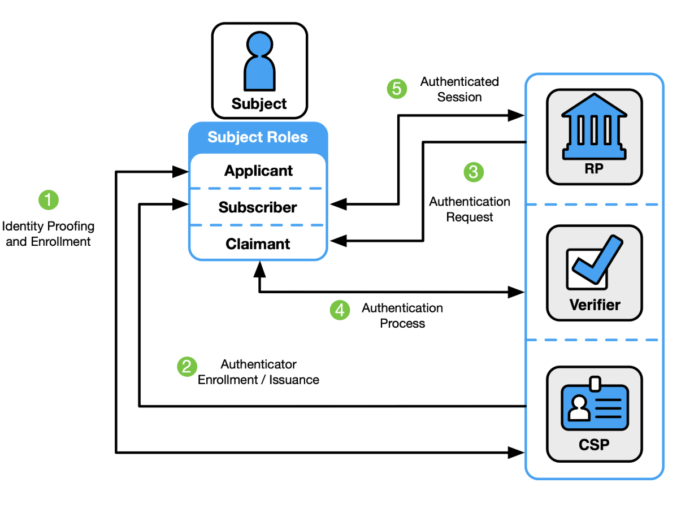
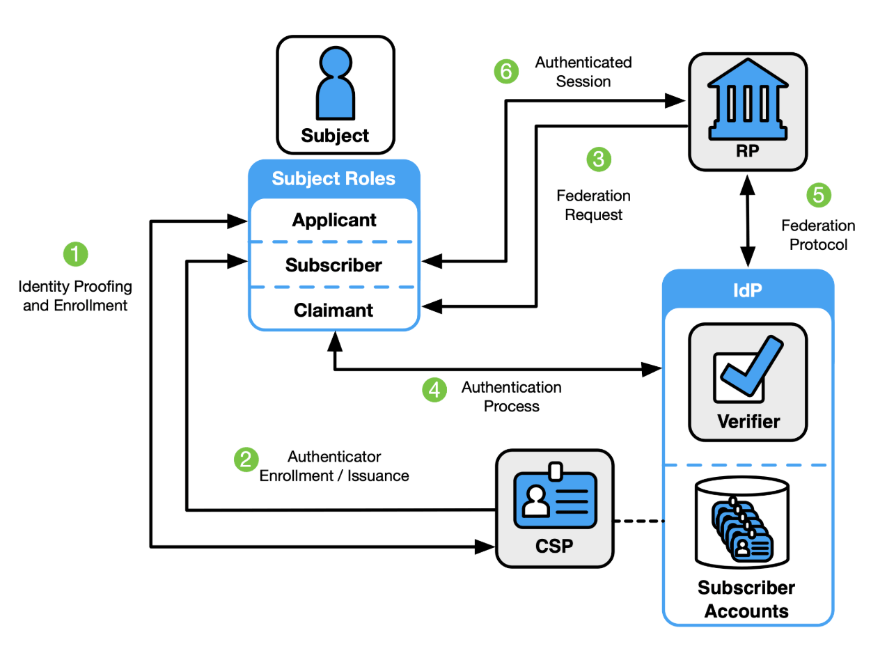
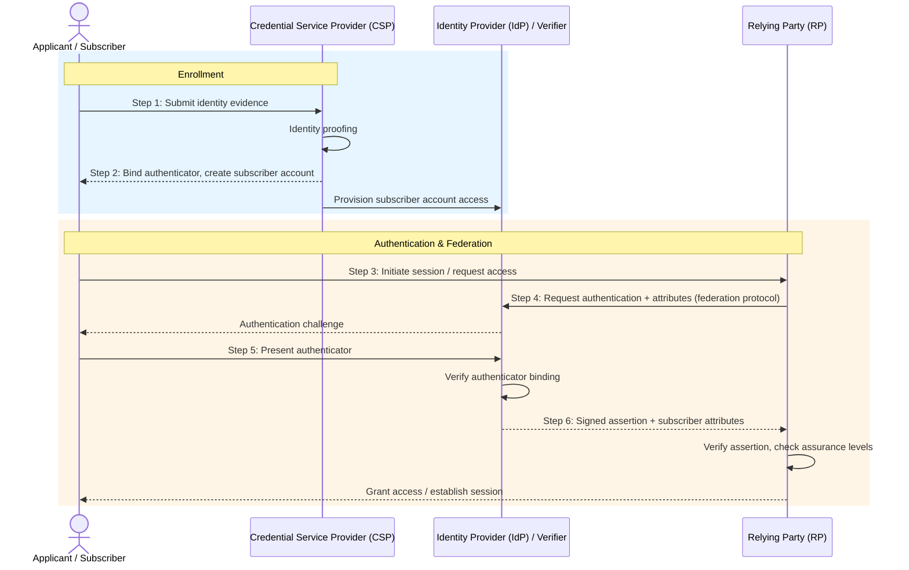
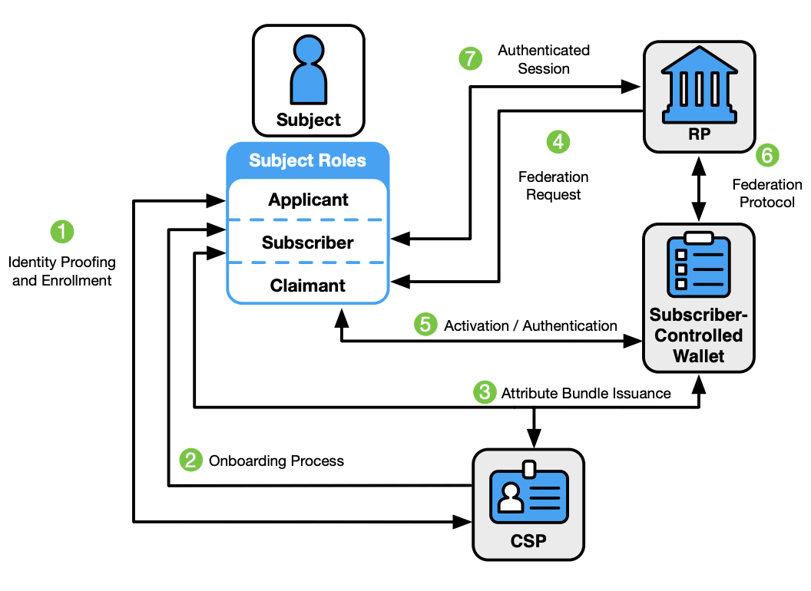
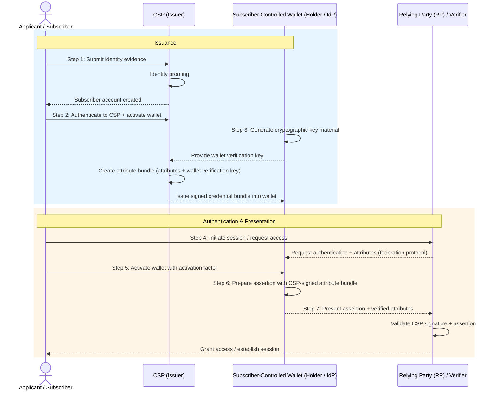

Most engineers think about identity in two terms: the user is authenticated or they aren't. If you've built a login system, you've probably made calls like "we'll require MFA for sensitive actions" or "we'll use SSO." Those are reasonable calls, but they're incomplete. <!--more--> They answer *how* someone authenticates without asking *who* you need them to be, or *how confident* you need to be about it.

[NIST SP 800-63-4](https://pages.nist.gov/800-63-4/) gives you a structured way to answer both. It splits identity assurance into three independent axes, each with three levels, and ties them together with a risk management process. The result is a framework that forces you to say, explicitly, what you're actually protecting and why.

---

**Series: NIST SP 800-63-4**
- **Part 1 (this blog):** 800-63-4 => The framework, assurance levels, and risk management model
- Part 2: [SP 800-63A-4 => Identity Proofing and Enrollment](/blogs/nist-sp-800-63a-4-identity-proofing)
- Part 3: [SP 800-63B-4 => Authentication and Authenticator Management](/blogs/nist-sp-800-63b-4-authentication)
- Part 4: [SP 800-63C-4 => Federation and Assertions](/blogs/nist-sp-800-63c-4-federation)

---

# Why This Spec Exists

Most organizations treat identity security as a compliance checkbox. You implement MFA because your auditor requires it. You add SSO because it's on the enterprise checklist. What security properties you actually end up with is an afterthought.

NIST's framing is different. Identity failure causes concrete harm: financial loss, unauthorized access to benefits or data, safety risks to individuals, erosion of public trust in digital services. The question isn't "did we check the MFA box?" but "what happens if we get this wrong, and for whom?"

SP 800-63-4 is the fourth major version of these guidelines, published in July 2025 after nearly four years of revisions and roughly 6,000 public comments. The previous version (800-63-3, from 2017) held up reasonably well, but the threat landscape has moved, and the update reflects that:

- **Fraud prevention is now mandatory**, not optional. CSPs must run active fraud management programs: death record checks, device fingerprinting, transaction analytics, threat controls.
- **Deepfake and injection attack controls are required.** Remote identity proofing must detect virtual cameras, device emulators, and AI-generated media.
- **Syncable authenticators (passkeys) are explicitly supported at AAL2**, closing an ambiguity in 800-63-3 that made some teams avoid them.
- **Subscriber-controlled wallets** show up as a new federation model, reflecting the growing verifiable credentials ecosystem.
- **Privacy and customer experience** requirements are stronger throughout.

The spec is a suite of four documents. This post covers the main volume (SP 800-63-4), which defines the digital identity model and risk management process. Later posts in this series cover identity proofing (63A), authentication (63B), and federation (63C).

---

# The Digital Identity Model

Before assurance levels make any sense, you need the cast of characters the spec talks about. Six terms, and once they click the rest of the document reads a lot easier.

## The Cast

**Applicant:** Someone asking for access to a digital service. Before they're enrolled, they're an applicant.

**Subscriber:** An applicant who has completed enrollment. The CSP has bound one or more authenticators to their account.

**Credential Service Provider (CSP):** Collects and verifies identity attributes, manages subscriber accounts, and issues credentials. In a lot of systems, your app is the CSP.

**Identity Provider (IdP):** Authenticates subscribers and issues assertions to relying parties. In federated systems, the CSP and IdP are often the same entity (Google, Okta, your corporate SSO).

**Verifier:** Verifies the subscriber's authenticator. In practice, this is usually the IdP.

**Relying Party (RP):** The application that needs to know who the user is. It consumes assertions from the IdP.

## Three Architectural Models

With the cast in place, the spec lays out three ways these entities can be wired together, and each one changes where trust and control actually sit.

**1. Non-federated:** The CSP, IdP, and RP are the same system. This is the classic "your app has a login page" setup. The user registers, your app stores their credentials, your app authenticates them. Simple, but every RP has to manage the full identity lifecycle on its own.

---

**2. General-purpose federation:** The CSP provisions a subscriber account; the IdP handles authentication and issues assertions to separate RPs. This is how enterprise SSO and consumer identity providers (Sign in with Google, GitHub OAuth) work.

A more detailed flow:

---

**3. Subscriber-controlled wallet:** New in 800-63-4. The CSP issues signed attribute bundles (verifiable credentials) directly to the subscriber. The subscriber's wallet holds them and presents them straight to RPs, without the IdP being involved at assertion time.

A more detailed flow:

The wallet model shifts control to the subscriber. The RP trusts the CSP's signature on the credential, not a live assertion from an IdP. That buys real privacy (the IdP can't track which RPs you're visiting), but it also introduces new problems around credential revocation and wallet security, since there's no IdP left in the loop to revoke a live session.

---

# The Three Assurance Axes

This is the core idea of the framework. Identity assurance isn't one thing, it's three independent properties, and each one can sit at a different level depending on what your service actually needs.

## IAL: Identity Assurance Level

**How well was this person's real-world identity established?**

| Level | What it means |
|-------|---------------|
| IAL1 | No identity proofing required. The claimed identity may or may not correspond to a real person. |
| IAL2 | The identity is linked to a real person with reasonable confidence. Evidence was validated against authoritative sources. Can be done remotely. |
| IAL3 | High confidence that the identity is real and belongs to this specific person. Requires in-person attendance with a trained proofing agent and biometric collection. |

## AAL: Authentication Assurance Level

**How confident are you that the person authenticating now is the same subscriber who enrolled?**

| Level | What it means |
|-------|---------------|
| AAL1 | Single-factor or multi-factor authentication. Basic proof of authenticator possession. |
| AAL2 | Two distinct authentication factors required. Phishing-resistant options must be offered. |
| AAL3 | Cryptographic key-based authentication with a non-exportable key. Phishing resistance mandatory. |

## FAL: Federation Assurance Level

**How trustworthy is the assertion the RP received from the IdP?**

FAL only applies when federation is in use. If your app authenticates users directly, FAL doesn't come into play.

| Level | What it means |
|-------|---------------|
| FAL1 | Bearer assertions acceptable. Multiple RPs per assertion allowed. Dynamic or pre-established trust. |
| FAL2 | Single RP per assertion. Strong injection attack prevention required. Pre-established trust agreements. |
| FAL3 | Holder-of-key assertions required. The subscriber proves possession of a key, not just presentation of a token. |

## These Axes Are Independent

This is the part people get wrong most often. IAL, AAL, and FAL measure different things, so you can mix and match:

- **IAL1 + AAL3:** an anonymous user with a hardware key. Makes sense for high-security services where you don't need to know who the user is, just that they hold the right key, a physical access system for example.
- **IAL2 + AAL1:** a verified identity with password-only authentication. Reasonable for a low-risk service that still needs to know who you are, say a newsletter with paid tiers.
- **IAL3 + AAL3:** maximum assurance, required for the highest-stakes government services.

The mistake is assuming stronger authentication buys you stronger identity proofing. It doesn't. A hardware key only proves you hold the key, it says nothing about who you are in the real world if that was never established in the first place.

---

# Digital Identity Risk Management (DIRM)

Knowing the three axes exist doesn't tell you which levels to pick, and the framework doesn't just hand you a table and say "pick one." It lays out a five-step process for deciding what's right for your service.

## Step 1: Define the Online Service

What are users doing? What resources are they accessing? What's the context of use? This step forces you to pin down the service boundary before you start making security decisions.

## Step 2: Assess Impact

For each category of harm, ask: if identity fails here, what's the impact?

- **Mission degradation:** does this compromise your organization's ability to operate?
- **Trust damage:** does this erode public or user trust in your service?
- **Unauthorized access:** does this give someone access to resources they shouldn't have?
- **Financial loss:** does this cause monetary harm to users or the organization?
- **Safety threats:** does this put people's physical safety at risk?

Critically, you're not assessing impact in the abstract, you're mapping harm to specific user groups and affected entities. A breach that exposes medication history harms patients differently than it harms a healthcare provider. The framework asks you to be explicit about who bears the cost.

## Step 3: Select Initial xALs

Based on the impact assessment, pick baseline IAL, AAL, and FAL. The spec gives guidance on which impact levels map to which assurance levels.

## Step 4: Tailor Controls and Document Decisions

The initial xAL selection is a starting point, not the final answer. You can go higher or lower with justification, as long as you document it. Say your baseline analysis suggests IAL2, but some of your users can't provide standard government ID (elderly users, recent immigrants, people experiencing homelessness). Instead of requiring IAL2 and excluding them, you might add a trusted referee process instead.

Tailoring has to be documented. The point is deliberate decision-making, not a shortcut for dropping requirements you don't feel like meeting.

## Step 5: Continuously Evaluate

Identity assurance isn't something you set once and walk away from. The spec requires ongoing measurement: fraud rates, failed enrollment rates, authentication failure rates, user support volume. If your dropout rate at IAL2 enrollment is 40%, that's a signal the process is broken, or the assurance level is wrong for your users, or both.

This feedback loop matters, since none of the inputs stay fixed: the threat landscape shifts (deepfakes get better, new phishing kits show up), your user base changes, your service changes. DIRM is meant to be revisited on an ongoing basis, not completed once and filed away.

---

# Choosing xAL Combinations in Practice

The five-step process is abstract until you see it applied. Here's how it plays out for a few common service shapes:

**Consumer app (e.g., a productivity tool with no sensitive data)**
IAL1 + AAL1. You don't need to know who the user actually is, and the consequences of account compromise are low. Social login (Sign in with Google) covers both. FAL1 if you're using OIDC.

**Federal benefits portal (e.g., filing for unemployment)**
IAL2 + AAL2, at minimum. You need to know this is a real person with a valid identity (to prevent fraud), and reasonable confidence they're the account holder (to prevent account takeover). FAL2 if you're using a federated IdP like Login.gov.

**Internal admin tool with access to production data**
IAL1 + AAL3. You already know who your employees are, so there's no need to reproof their identity. But you do need strong authentication, a hardware key or platform authenticator, to protect against phishing. FAL2+ if you're using your enterprise IdP.

**Healthcare portal with access to medical records**
IAL2 + AAL2 at minimum, likely with step-up to AAL3 for sensitive operations. You need a real identity (for HIPAA compliance, and to make sure records belong to the right person), plus strong authentication to prevent account takeover. The stakes around account recovery are especially high here.

The pattern across all four: **IAL is about enrollment-time identity proofing, AAL is about runtime authentication strength.** They solve different problems, so upgrading AAL doesn't compensate for weak IAL if fraudulent enrollment is the actual threat you're facing.

---

# Conclusion

These guidelines won't tell you exactly what to build. What they give you is a shared vocabulary and a structured way to reason about trade-offs. When someone says "we need stronger auth," the framework helps you ask: stronger in what way? For which users? Against which threats? With what impact if it fails?

The compliance-first instinct is to find the minimum required level and implement that. The risk management approach is to understand what you're protecting, decide what level of confidence you actually need, and build accordingly, with documented reasoning you can revisit when things change.

The next posts in this series go deeper into each volume: identity proofing in 63A, authentication in 63B, and federation in 63C. Each one has its own set of requirements worth understanding on its own terms.
