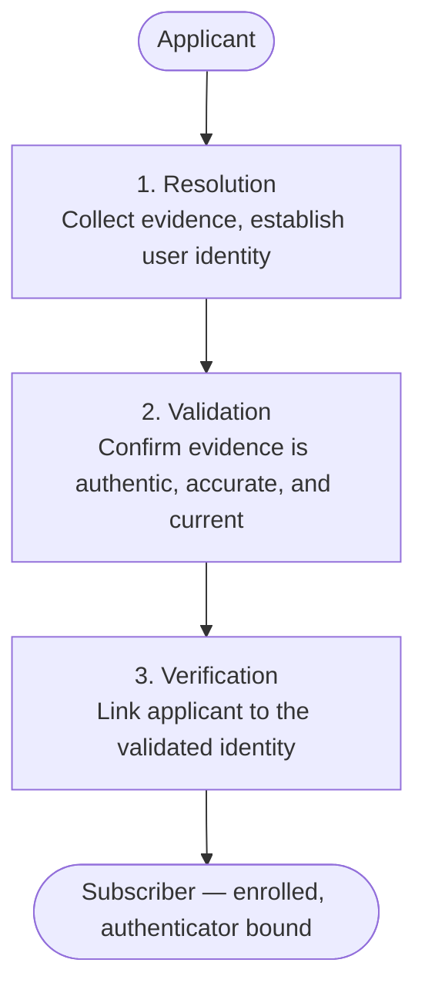
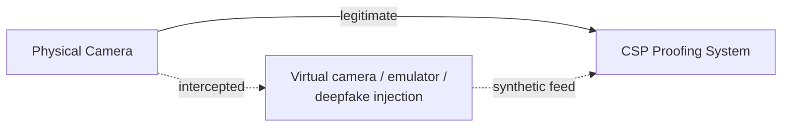

[NIST SP 800-63A-4](https://pages.nist.gov/800-63-4/sp800-63a.html) is the identity proofing volume of the 800-63-4 suite. It defines exactly what "verified identity" means at each assurance level, what evidence qualifies, how to handle the cases that break the happy path, and what your fraud program needs to look like. <!--more-->

If you've integrated a KYC provider, you've probably been told something like: "the user uploads their ID, we scan it, we do a selfie match, done." That description isn't wrong, but it skips over several details that matter once your threat model includes fraud at scale, synthetic media, or users who can't produce a standard government ID.

This post is part two of the series, and it goes into that model in detail.

---

**Series: NIST SP 800-63-4**
- Part 1: [SP 800-63-4 => The Framework, Assurance Levels, and Risk Management](/blogs/nist-sp-800-63-4-overview)
- **Part 2 (this blog):** SP 800-63A-4 => Identity Proofing and Enrollment
- Part 3: [SP 800-63B-4 => Authentication and Authenticator Management](/blogs/nist-sp-800-63b-4-authentication)
- Part 4: [SP 800-63C-4 => Federation and Assertions](/blogs/nist-sp-800-63c-4-federation)

---

# The Problem with "Just Verify the ID"

Document scanning solves one problem: is this document real? It doesn't answer the one that actually matters: is this the right person presenting it?

Identity proofing has three distinct failure modes, and each needs its own control:

1. **Wrong person:** a real, valid document belonging to someone else. A stolen passport, a family member's ID, a purchased identity. The document passes every check, the person holding it just isn't the person on it.
2. **Fake document:** a forged or altered document. Passes visual inspection, fails forensic checks against the issuing authority.
3. **Manipulated media:** in remote flows, the video or image feed itself is synthetic. A deepfake face, a virtual camera injecting pre-recorded footage, or a device emulator replaying a known-good session.

800-63A-4's three-step model maps directly onto these failure modes. Resolution and validation address document authenticity. Verification addresses whether the applicant is the person the document belongs to. Deepfake and injection controls address the third failure mode, which is new enough that 800-63-3 never covered it.

---

# The Three-Step Proofing Model

## Resolution

Collect evidence and attributes to establish a unique user identity. At this step you're asking: based on what the applicant has provided, who do we think this person is?

That means collecting core attributes: full name, date of birth, address, and a government identifier (SSN, passport number, and so on). The goal is to resolve to a single, unique individual. If your collected attributes match multiple records, you haven't resolved yet.

## Validation

Confirm that the evidence provided is genuine and current. This is where you check against authoritative sources.

An **authoritative source** is an entity that issued or maintains the record: the DMV for a driver's license, the passport authority for a passport, a credit bureau for address history. Validation means the data in the document matches what that authority has on record, not just that the document looks real.

"Credible sources" (not authoritative, but reliable) are also allowed for some attributes. A recent bank statement is a credible source for an address even if no single authority issued it.

## Verification

Establish that the applicant in front of you is the same person the validated identity belongs to. This is where facial comparison, biometrics, or other binding mechanisms come in.

Validation proves the document is real. Verification proves the person holding it has a right to it.

---

# Identity Assurance Levels

## IAL1

No formal identity proofing required. The claimed identity may or may not correspond to a real person. Basic attribute validation is optional.

IAL1 fits when the consequences of fraudulent enrollment are low: a comment-based form, a freemium SaaS tool, a public newsletter. The spec supports it explicitly, and a lot of systems are over-built relative to what their actual risk profile calls for.

## IAL2

The identity is linked to a real person with reasonable confidence. Requires enhanced evidence, rigorous validation against authoritative sources, and verification that the applicant matches the identity. Includes controls against scaled attacks and evidence falsification.

IAL2 can be done remotely or on-site, attended or unattended. Most commercial KYC products target IAL2.

## IAL3

Maximum confidence. Requires:
- An in-person, attended session with a trained proofing agent
- Collection of biometrics (typically a facial image)
- The highest tier of evidence (see below)

IAL3 is for high-stakes services: government benefits with significant financial value, access to sensitive federal systems, situations where a fraudulent enrollment is genuinely costly.

| | IAL1 | IAL2 | IAL3 |
|---|---|---|---|
| Evidence required | None | SUPERIOR, or STRONG + FAIR | SUPERIOR + STRONG, or two STRONG |
| Verification method | None required | Facial comparison, biometric, or document control check | Biometric + trained agent comparison |
| Delivery model | Any | Remote or on-site, attended or unattended | In-person attended only |
| Biometric collection | Not required | Required for remote unattended | Required |

---

# Evidence Tiers: FAIR, STRONG, SUPERIOR

The spec also sorts identity evidence into three tiers based on how reliably it establishes a real identity.

## FAIR

Formally issued by a recognized authority. Includes the applicant's name and a unique identifier (account number, reference number). Has basic security features, and delivery was confirmed (mailed to an address, for example).

Examples: utility bill, bank statement, government correspondence, library card.

FAIR evidence establishes that someone received mail at an address or held an account. It doesn't strongly establish who they are.

## STRONG

Issued under a regulated process with legal oversight. Requires a facial image or biometric. Has physical or digital security features (holograms, chips, encoded data). Capable of cryptographic validation, even if that's not always exercised.

Examples: driver's license, national ID card, standard passport.

Most KYC flows are built around STRONG evidence. It's what most people carry, it's what most automated scanners are built to read, and it's enough for IAL2 when paired with facial verification.

## SUPERIOR

The highest tier. Attributes are cryptographically protected. Enrollment was attended. The document can be verified through a digital signature rather than just visual or database checks.

Examples: chip-enabled passports (where the chip is actually read and the signature verified), some national digital ID schemes.

A standard passport photographed and OCR'd is STRONG. The same passport with the chip read, the data extracted, and the issuing authority's digital signature verified is SUPERIOR. The physical document is identical, what changes is the verification method.

## Combining Evidence for IAL2 and IAL3

Meeting IAL2 requires one of:
- One piece of SUPERIOR evidence
- One piece of STRONG evidence plus one piece of FAIR evidence

Meeting IAL3 requires one of:
- One piece of SUPERIOR evidence plus one piece of STRONG evidence
- Two pieces of STRONG evidence (with specific verification method requirements)

The combinations matter. If your IAL2 flow accepts a driver's license (STRONG) and a bank statement (FAIR), you're within spec. If you accept only a driver's license with no second piece of evidence, the verification method has to compensate for that gap.

---

# Proofing Delivery Models

How a proofing session is conducted is a separate question from what assurance level it achieves, and the spec defines four delivery models to cover the combinations.

**Remote unattended:** fully automated, no CSP agent in the loop. The applicant submits documents and completes facial comparison through an app or web flow. This is what most consumer KYC products deliver. Permitted at IAL2, not IAL3.

**Remote attended:** a video session with a CSP proofing agent or trusted referee. The agent watches the session in real time, can ask questions, and can make judgment calls. Permitted at IAL2 and IAL3.

**On-site unattended:** a controlled public booth or workstation where the applicant interacts with an automated system in person. Permitted at IAL2.

**On-site attended:** a physical location with a proofing agent present. The classic DMV or bank branch model. Permitted at all IALs.

One practical consequence: if you're using a third-party KYC provider that runs a fully automated remote flow, you're in remote unattended territory. That model is legitimate for IAL2, but it has a ceiling. IAL3 requires an attended session, which most off-the-shelf KYC APIs don't offer. If you need IAL3, you need a provider that supports supervised video proofing or an in-person channel.

---

# Biometrics: Requirements and Constraints

Biometrics in identity proofing serve two purposes:
- **verification** (a 1:1 match between the applicant and their document)
- **binding** (establishing a biometric that can be used for future recognition)

The requirements differ slightly between the two, but the same baseline performance thresholds apply to both.

**Performance thresholds:**
- False match rate: no more than 1 in 10,000 (1:10,000)
- False non-match rate: no more than 1 in 100 (1:100)
- Demographic performance gap: no more than 25% variance in error rates across demographic groups

The demographic requirement matters. If a system performs well for one group but noticeably worse for others, it doesn't meet the specification, full stop. That means testing has to include representative populations, not just overall averages.

**Independent testing is mandatory.** Biometric performance can't be self-certified. Testing has to come from an independent party using standards such as [ISO/IEC 19795](https://www.iso.org/standard/41447.html) (biometric performance testing) and [ISO/IEC 30107-3](https://www.iso.org/standard/67381.html) (presentation attack detection).

**Consent and deletion:**
- Applicants must give explicit informed consent before biometric collection.
- They must be told how the biometric will be used, how long it'll be stored, and when it'll be deleted.
- Organizations must document and enforce biometric deletion policies.
- Any regulatory exceptions that require longer retention must also be documented.

If a KYC provider handles biometrics on your behalf, their performance reports and independent testing results become part of your compliance evidence, so it's worth requesting those directly from them.

---

# Defending Against Deepfakes and Injection Attacks

Most of this section is new in 800-63-4. The previous version didn't address synthetic media because it wasn't a practical threat at scale back in 2017. But it is now.

## What "Digital Injection" Means

In a remote proofing flow, the applicant typically opens a camera to capture their face and document. A digital injection attack replaces the real camera feed with synthetic content before it reaches the CSP's proofing system. Three main variants:

- **Virtual camera spoofing:** a software-based virtual camera replaces the physical camera, injecting a pre-recorded or generated video stream.
- **Device emulator injection:** the proofing session runs inside an emulated device environment that can replay known-good session data.
- **Manipulated media:** real footage that's been altered, a deepfake overlay on a live feed, or a replay of a previous legitimate session.

The attack surface is the gap between the applicant's physical camera and the CSP's receipt of the media. If that gap can be exploited, the rest of your proofing controls are checking a fabricated input, as the flow below shows.

## Required Controls

For remote unattended proofing, the following controls are now required, not just recommended:

- **Virtual camera detection:** the system must detect and reject sessions where a virtual camera driver is substituted for a physical camera.
- **Device emulator detection:** the system must detect when a session is running inside an emulated device.
- **Manipulated media analysis:** submitted images and video must be checked for signs of manipulation, including generative AI signatures and splice artifacts.

Passive forgery detection is also required: the system should be able to analyze media without making the applicant perform active liveness tasks (though active liveness checks are allowed on top of that).

The goal isn't stopping a handful of sophisticated attackers, it's raising the floor against tooling that's cheap and easy to get. If your remote proofing flow can be beaten by a free virtual camera app and a generated face image, it isn't actually IAL2, whatever the vendor calls it.

---

# Exceptions: Trusted Referees, Minors, Edge Cases

No identity proofing system works for everyone. The spec recognizes this and treats equitable access as a requirement, not a nice-to-have.

## Trusted Referees

A trusted referee is a trained and approved person (either a CSP employee or a contracted third party) who helps applicants who can't complete the normal proofing process. This covers:

- People with disabilities who can't complete biometric capture
- Unhoused individuals without a fixed address
- Identity theft victims whose records are flagged or disputed
- Elderly users unfamiliar with digital proofing flows
- Non-citizens whose documents aren't on the standard evidence list

Trusted referees must be identity-proofed themselves, trained in document validation and facial comparison, and trained to spot social engineering attempts. They're a supervised exception path, not a shortcut around identity proofing.

## Applicant References

An applicant reference is a person who vouches for the applicant when standard evidence isn't available. Unlike trusted referees, the reference is chosen by the applicant, not the CSP.

One key rule: the reference must be identity-proofed at the same or higher IAL as the enrollment being attempted. An unverified person can't vouch for someone enrolling at IAL2.

## Automated Biometric Rejection Requires Manual Review

If an automated biometric system rejects an applicant, that decision can't be final without human review. The goal is to confirm the rejection isn't a false non-match.

In practice, this means your proofing flow must support manual escalation. If a KYC provider's API returns a rejection, a trained reviewer should be able to look at the case before it's closed.

## Minors

CSPs must have written policies for applicants under 18. For applicants under 13, [COPPA](https://www.ftc.gov/legal-library/browse/rules/childrens-online-privacy-protection-rule-coppa) compliance is required. Applicant references are supported for minor enrollment.

---

# Fraud Management Program Requirements

Even solid individual controls fail if an attacker probes them one at a time, which is why the spec requires CSPs to run a fraud management program instead of relying on isolated checks.

**Required elements:**

- **Death record checking:** compare applicant identity against death records to catch stolen or synthetic identities tied to deceased individuals.
- **Device fingerprinting and tenure evaluation:** evaluate the device used during enrollment. A brand-new device with no history attempting to enroll a high-value identity is a signal worth investigating.
- **Transaction analytics:** analyze behavior during the enrollment flow. Signals can include unusual completion times, repeated attempts with small variations, or patterns suggesting automation.
- **Insider threat controls:** proofing agents have access to sensitive data and can influence outcomes, so systems must include controls to catch agent-assisted fraud.
- **Real-time fraud communication to RPs:** if fraud is discovered after enrollment, the CSP must notify relying parties in real time.
- **Red team testing:** periodic adversarial testing of the proofing system is required to surface weaknesses.

**SIM swap detection** isn't mandatory, but it's strongly recommended, since SIM swaps show up often in account takeover attacks after enrollment.

**Knowledge-based verification (KBV) is prohibited for identity verification.** The spec explicitly bans using security questions or knowledge checks ("what was the name of your first car?") as a proofing mechanism. These checks are weak because the answers can often be found through public records, social media, or old data breaches.

KBV can still be used as a fraud signal, but not to verify identity. If an IAL2 proofing flow relies on KBV as a primary verification step, that needs to be replaced.

---

# Conclusion

Most commercial KYC providers (Jumio, Onfido, Persona, Stripe Identity, and the like) cover a subset of what 800-63A-4 requires. They handle document scanning, OCR, facial comparison, and increasingly liveness detection. But meeting the full spec usually takes more than what these tools give you out of the box:

- Their biometric performance documentation, including demographic parity data
- Evidence that their anti-injection controls meet the normative requirements (virtual camera detection, emulator detection)
- Clear policies for automated rejection and manual review
- Fraud reporting capabilities, such as notifying you in real time if a previously proofed identity is later flagged

The spec applies to the CSP, which is usually you, not the vendor. Third-party KYC tools are just components in your proofing pipeline. Using them doesn't transfer the compliance responsibility.

With identity proofing covered, the next question is how you authenticate that subscriber once they're enrolled, at AAL1, AAL2, and AAL3. That's what part three of this series covers.
