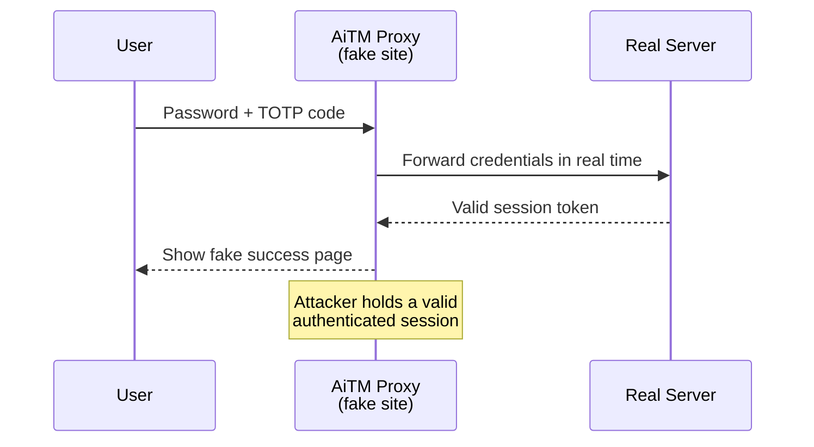
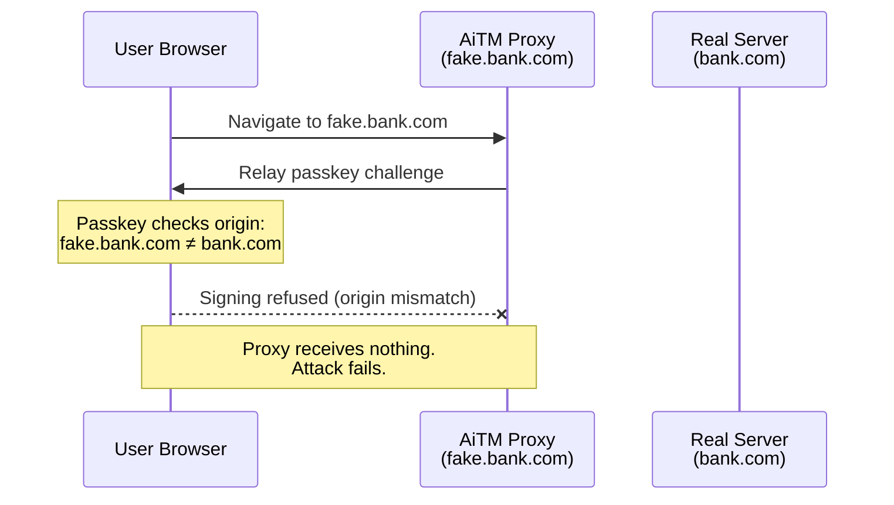

[NIST SP 800-63B-4](https://pages.nist.gov/800-63-4/sp800-63b.html) is the authentication volume of the 800-63-4 suite. It defines exactly what authenticator types qualify at each assurance level, what phishing resistance actually requires, and what your session and recovery policies need to look like. <!--more--> It officially bans password composition rules and explicitly supports passkeys, both of which were unclear or missing in the 2017 version.

---

**Series: NIST SP 800-63-4**
- Part 1: [SP 800-63-4 => The Framework, Assurance Levels, and Risk Management](/blogs/nist-sp-800-63-4-overview)
- Part 2: [SP 800-63A-4 => Identity Proofing and Enrollment](/blogs/nist-sp-800-63a-4-identity-proofing)
- **Part 3 (this blog):** SP 800-63B-4 => Authentication and Authenticator Management
- Part 4: [SP 800-63C-4 => Federation and Assertions](/blogs/nist-sp-800-63c-4-federation)

---

# The Problem 800-63B Is Solving

Traditional MFA was designed for a different threat model, one where attackers mainly tried to steal passwords. Attacks like credential stuffing, brute force, and password reuse across breaches are largely defeated once users have to provide a second factor.

That threat still exists, but it's no longer the main one. Today, a lot of successful attacks focus on phishing users in real time, even when MFA is turned on.

**Phishing with real-time proxies.** Adversary-in-the-middle (AiTM) toolkits (Evilginx, Modlishka, and their commercial successors) sit between the user and the legitimate site. The user types their password and TOTP code into what looks like the real site. The proxy forwards those credentials to the real site in real time, logs in, and captures the session token. The MFA code was valid, it was used, and the attacker is now authenticated. TOTP doesn't help here.

**Push notification fatigue:** attackers repeatedly send MFA push requests until the user approves one just to make the notifications stop. No phishing site required here.

**SIM swap:** the attacker convinces the mobile carrier to move the victim's phone number to a SIM they control. Once that happens, SMS OTP codes go straight to the attacker.

The common thread: MFA that isn't phishing-resistant can still be bypassed. Saying "we have MFA" only matters if the second factor can't be relayed, replayed, or socially engineered.

800-63B-4 is built around this distinction. Instead of just ranking authenticators by strength, it also asks a sharper question: is the authentication method phishing-resistant? At higher assurance levels, phishing resistance becomes a hard requirement, not a nice-to-have.

---

# Authentication Assurance Levels

**AAL1: basic confidence.** Authentication requires one or more factors. The system verifies that the user controls an authenticator linked to their account. Most consumer logins are AAL1. Reauthentication is required every 30 days.

**AAL2: high confidence.** Authentication requires two distinct factors. The system must also offer at least one phishing-resistant option, though users may choose other methods. Reauthentication every 24 hours, with a 1-hour inactivity timeout.

**AAL3: very high confidence.** Authentication requires hardware-based cryptographic authentication using a non-exportable private key. Phishing resistance is mandatory. Reauthentication every 12 hours, with a 15-minute inactivity timeout.

| | AAL1 | AAL2 | AAL3 |
|---|---|---|---|
| Factors required | 1+ | 2 (distinct) | 2 (one must be hardware-bound crypto) |
| Phishing resistance | Not required | Must be offered | Mandatory |
| Session timeout (absolute) | 30 days | 24 hours | 12 hours |
| Inactivity timeout | Not specified | 1 hour | 15 minutes |

The common mistake is deploying SMS OTP as a second factor and calling it AAL2. SMS OTP is allowed at AAL2, but the spec also requires that users be offered a phishing-resistant authenticator. If SMS is the only option, the system isn't fully compliant. The next section covers the authenticator types this covers in more detail.

---

# Authenticator Types

The spec defines two categories: single-factor and multi-factor. Within each, there are several types.

## Single-Factor Authenticators

**Memorized secret (password):** something the user knows. This is the most common authenticator. For single-factor use, the minimum length is 15 characters.

**Look-up secrets:** a pre-generated list of one-time codes, such as backup or recovery codes. These can be stored or printed and used if the main authenticator is unavailable (valid at AAL1 and AAL2).

**Out-of-band (OOB):** authentication happens through a separate communication channel, such as SMS, voice call, or mobile push notification. Allowed at AAL1 and AAL2, but the spec is clear about the security risks. These methods are not phishing-resistant.

**Single-factor OTP:** a one-time code generated by an authenticator, typically TOTP or HOTP, using a hardware token or an authenticator app. Valid at AAL1 and AAL2, but also not phishing-resistant.

**Single-factor cryptographic:** a device that proves possession of a cryptographic key. This can be implemented in hardware or software. If the private key is hardware-bound and non-exportable (a hardware security key used without a PIN, for example), it can qualify at AAL1 or AAL2. It doesn't meet AAL3 on its own though, since AAL3 requires two factors.

## Multi-Factor Authenticators

**Multi-factor OTP:** an OTP device that requires activation with a second factor (a PIN or biometric) before it generates the code. Valid at AAL2.

**Multi-factor out-of-band:** a push-based authenticator that requires the user to enter a PIN or use a biometric before approving the request. Still not phishing-resistant.

**Multi-factor cryptographic:** a cryptographic device that requires activation (PIN or biometric) before using the private key. This can be hardware or software based. When the key is hardware-bound and non-exportable, it can satisfy AAL3 as a single authenticator.

**Biometric paired with a physical authenticator:** here the biometric unlocks a cryptographic device (a fingerprint unlocking a security key or device credential, for example). The biometric itself isn't a separate factor, it's just the activation mechanism for the physical authenticator.

## The Biometric Clarification

In this framework, biometrics aren't a standalone authentication factor. A fingerprint or face scan doesn't prove the user possesses a cryptographic key or knows a secret. Instead, it unlocks access to a physical authenticator that does the actual authenticating.

This distinction matters when you're claiming assurance levels. Saying "we use Face ID" doesn't mean your system performs biometric authentication at the protocol level, it usually means the device requires a biometric to unlock the private key stored on that device.

In other words: the authentication factor is the key, the biometric just activates it.

## AAL Compatibility Matrix

| Authenticator Type | AAL1 | AAL2 | AAL3 |
|---|---|---|---|
| Password alone | Yes | No | No |
| Password + OTP | Yes | Yes | No |
| Password + hardware crypto | Yes | Yes | Yes (if hardware-bound) |
| MF cryptographic device (hardware) | Yes | Yes | Yes |
| SMS / voice OTP | Yes | Yes (with phishing-resistant option offered) | No |
| TOTP | Yes | Yes (with phishing-resistant option offered) | No |
| Passkey (syncable) | Yes | Yes | No |
| Hardware security key (non-exportable) | Yes | Yes | Yes (as part of MFA) |

---

# The Password Rules Have Changed

Earlier guidelines had already started moving away from strict password composition rules. NIST SP 800-63B-4 finishes that shift and lays out a simpler, more practical policy.

**Minimum length:**
- 15 characters for single-factor (password-only) authentication
- 8 characters when used as part of multi-factor authentication

**No composition rules.** Verifiers must not require specific character combinations like uppercase letters, numbers, or symbols. Rules like "one uppercase, one number, one special character" don't meaningfully increase security. In practice, users just make predictable substitutions like `P@ssw0rd` or `Tr0ub4dor`, which makes passwords harder to remember without making them much harder to crack.

**No mandatory rotation.** Passwords shouldn't require periodic rotation unless there's evidence of compromise. Forced rotation usually pushes users toward small predictable changes (incrementing a number at the end, say), which weakens security instead of improving it.

**Blocklist requirement.** Verifiers must check new passwords against a list of known-compromised credentials, meaning breach databases like [Have I Been Pwned](https://haveibeenpwned.com/). Common passwords, dictionary words, and contextual guesses (username, service name) should be blocked too.

**Accept all printable ASCII and Unicode.** Systems should accept all printable ASCII and Unicode characters and avoid unnecessary restrictions. Password paste must also be allowed, since blocking paste makes password managers harder to use, which cuts into real-world security rather than helping it.

If your system still enforces "password must contain at least one uppercase letter, one number, and one special character," that's now explicitly out of spec. The fix is simple: drop the composition check, keep a minimum length and blocklist check.

---

# Phishing Resistance: What It Actually Means

Phishing resistance means the authenticator's output is cryptographically bound to the specific site it was issued for. Because of that binding, the authentication response can't be replayed or relayed to another site.

The spec recognizes two mechanisms:

## Verifier Name Binding

The authenticator's output is cryptographically bound to the verified domain name of the verifier. When a browser-based authenticator (like a passkey) generates a signature, it includes the origin (the `rpId` in [WebAuthn](https://www.w3.org/TR/webauthn-3/) terms). The signature is only valid for that specific origin.

If an attacker sets up `yourbank-secure.com` and proxies the login, the passkey will refuse to sign, since the origin doesn't match the registered `rpId`. The proxy gets no usable authentication response, and the attack fails.

This is how passkeys work. The private key is bound to the relying party ID at registration time. Authentication at a different origin produces a signature the real server will reject, because the assertion was made for a different domain.

## Channel Binding

With channel binding, the authenticator's output is tied to the specific TLS session between client and verifier. Even if an attacker proxies the connection, the binding breaks at the TLS layer, since the client's session is with the proxy, not the real server, so the bound output won't verify.

Channel binding is stronger than verifier name binding because it operates at the transport layer, not the application layer. But it's also more complex to implement and less widely deployed.

## What Is Not Phishing-Resistant

**TOTP codes:** time-based one-time passwords can still be proxied in real time. An adversary-in-the-middle attack captures the code from the victim and immediately forwards it to the real site.

**Push notifications** are not phishing-resistant. The approval is tied to the authentication request, not to a specific origin or session.

**SMS OTP** is not phishing-resistant, and carries additional risks (SIM swap, SS7 interception) on top of that.

At AAL2, you must offer a phishing-resistant authenticator option. At AAL3, the phishing-resistant authenticator is the only option.

---

# Syncable Authenticators (Passkeys) Are Now Explicitly Supported

Earlier versions of the guidelines left ambiguity around authenticators with exportable private keys. The concern was simple: if the private key can leave the device, the guarantee of device possession gets weaker. Because of that, some security teams avoided passkeys entirely, while others allowed them with restrictions.

800-63B-4 clears this up: syncable authenticators are explicitly permitted at AAL2, as long as certain conditions are met.

**The conditions:**

- Sync must be tied to the subscriber's account or devices. Apple iCloud Keychain syncing your passkeys to your other Apple devices is fine. Exporting a passkey to an arbitrary third party is not.
- Sync must be end-to-end encrypted. The sync provider must not have access to the private key in plaintext.
- The CSP must evaluate the sync provider's risk profile. Supporting passkeys means accepting where and how those keys are stored, and that can't be treated as a neutral choice.

**AAL3 still requires hardware-bound keys.** The restriction at AAL3 hasn't changed: private keys must be hardware-bound and non-exportable. So a passkey synced through iCloud Keychain satisfies AAL2. A YubiKey or other hardware security key with a non-exportable key satisfies AAL3.

For most consumer applications targeting AAL2, passkeys are a strong default. They're phishing-resistant, easier for users than hardware tokens, and handle device migration more smoothly. For internal tools or high-risk systems that need AAL3, dedicated hardware security keys are still necessary.

If you want more depth on passkeys specifically, the [passkey introduction blog](/blogs/passkey-introduction) covers the WebAuthn registration and authentication ceremonies.

---

# Out-of-Band Authenticators and Their Limits

SMS OTP, voice calls, and push notifications are all "out-of-band" authenticators: they use a separate communication channel from the primary login flow. The spec permits them at AAL1 and AAL2, but it's also clear-eyed about their limitations.

**SMS OTP** is vulnerable to SIM swap attacks (the attacker takes over the victim's phone number) and SS7-based interception (theoretical for most threat models, practical for high-value targets). The spec acknowledges these risks and permits SMS anyway at AAL2, on the condition that a phishing-resistant option is also offered.

The practical guidance: don't build SMS as your only MFA option at AAL2. It can be one option among several, but users who need higher assurance should have a phishing-resistant authenticator available.

**Push notifications** are convenient but not phishing-resistant, and can be abused through approval fatigue attacks. They're allowed at AAL2 as a second factor, but don't satisfy the phishing-resistant requirement on their own.

**Same-device vs out-of-band.** The OOB model assumes the second channel is independent. If login and push approval happen on the same device, that separation disappears. The spec allows this, but the threat model changes: malware controlling the device could potentially control both factors.

---

# Session Management

Authentication creates a session, and a session needs clear lifecycle rules. The spec defines timeout requirements at each AAL.

**AAL1:** reauthentication required at least every 30 days. No inactivity timeout specified (though it's good practice to have one anyway).

**AAL2:** reauthentication required after 24 hours regardless of activity. If the session has been inactive for 1 hour, reauthentication is required before continuing.

**AAL3:** reauthentication required after 12 hours regardless of activity. If inactive for 15 minutes, reauthentication is required.

The spec distinguishes between **absolute timeouts** (session expires after a fixed time from creation) and **idle timeouts** (session expires after a period of inactivity). AAL2 and AAL3 require both. At AAL2, for instance, a user must reauthenticate after 24 hours even if they've been continuously active.

**Step-up authentication** is the right pattern for high-risk actions within a session. Rather than making the user fully reauthenticate for every sensitive operation, you confirm they still control their authenticator at the moment of the sensitive action. Accessing payment settings, changing an email address, or approving a large transaction are all candidates for step-up. The step-up challenge should sit at the same AAL as the session.

**Session binding.** Sessions must be bound to the verifier's authentication assertion, and the verifier must be the expected one (this matters a lot in federated login flows, which part four of this series covers).

---

# Account Recovery Without Undermining AAL

Account recovery is where authentication security often breaks down. A strong AAL2 login flow doesn't help if the recovery path bypasses it entirely.

The rule is simple: recovery must not grant a higher assurance level than the recovery method itself provides. If you recover an account with an email link (roughly AAL1 equivalent), you shouldn't immediately get full AAL2 access to the account. The session created through recovery should stay limited until the user re-establishes their authenticator.

**Knowledge-based verification (security questions) is prohibited.** The same reasoning that rules out KBV in identity proofing (covered in part two of this series) applies here. The answers are often discoverable from public records, social media, or old data breaches. "What was your childhood pet's name?" isn't a meaningful security control for account recovery.

**Acceptable recovery at AAL2** typically uses a verified communication channel, such as the email or phone number registered during enrollment. After access is restored, the user must register a new authenticator. The recovery step proves control of the contact channel, not immediate AAL2 authentication.

**Acceptable recovery at AAL3** is more restrictive. Because AAL3 depends on a hardware-bound key, losing that key is a serious event. Recovery options include a pre-registered backup hardware key, recovery codes stored at enrollment time, or an in-person identity reverification process.

---

# Conclusion

The practical takeaway from 800-63B-4 is a hierarchy of authenticator strength:

1. **Hardware security key (non-exportable):** AAL3 capable and phishing-resistant via verifier name binding. Required for the highest assurance use cases.
2. **Passkey (platform authenticator, synced):** AAL2 capable and phishing-resistant. The right default for consumer-facing systems that need to balance security and usability.
3. **TOTP / authenticator app:** AAL2 capable, but not phishing-resistant. Better than SMS, not as good as a passkey.
4. **SMS OTP / push notification:** allowed at AAL1/AAL2, with acknowledged weaknesses. Fine as one option, not acceptable as the only option at AAL2.
5. **Password alone:** AAL1 only, with specific length requirements and mandatory blocklist checking.

If you're auditing an existing system: check whether your AAL2 offering includes a phishing-resistant option, verify your password policy doesn't enforce composition rules, confirm your session timeouts match the AAL you're targeting, and make sure your recovery path doesn't undercut the assurance level you've built everywhere else.

Part four covers what happens after authentication: how that authentication event gets passed across trust boundaries through federation, what the assertion security requirements look like, and how the new subscriber-controlled wallet model changes the IdP's role.
