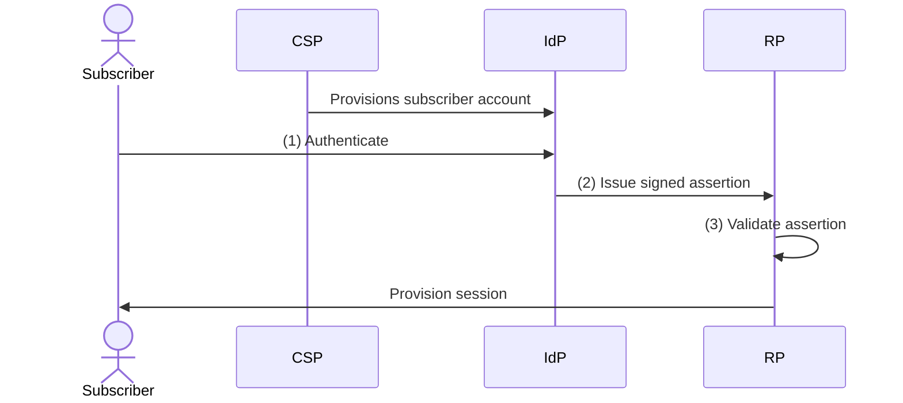
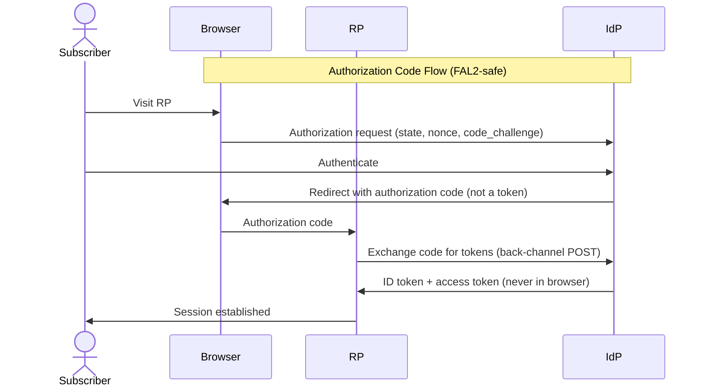
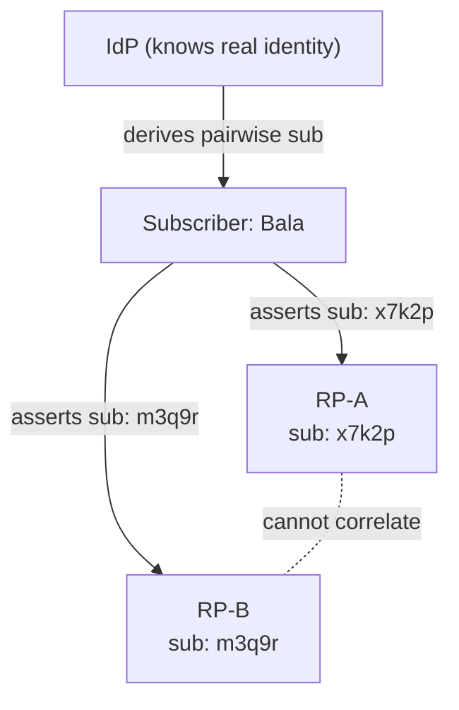
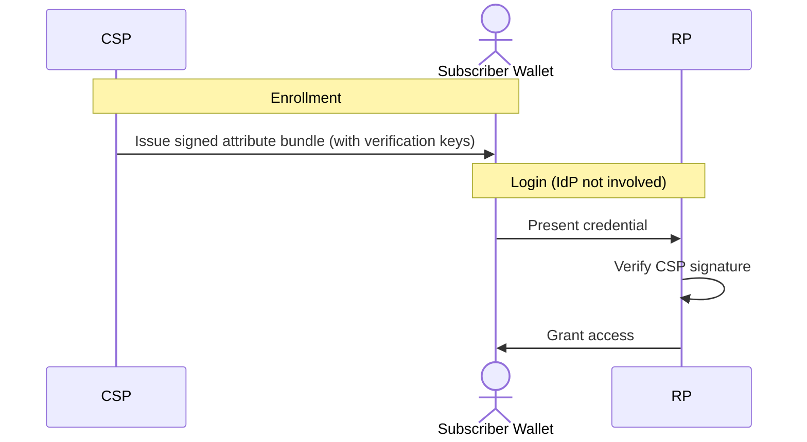
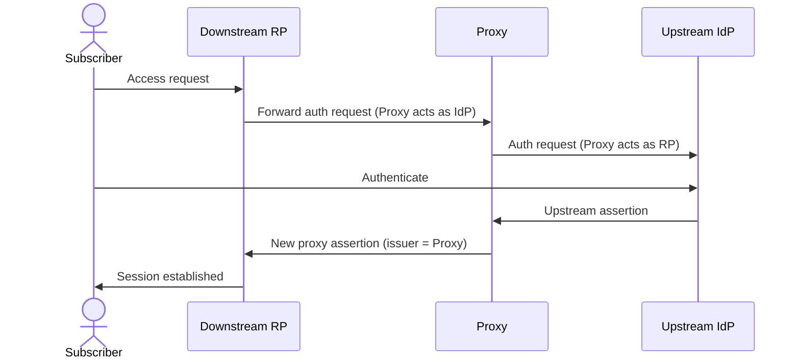
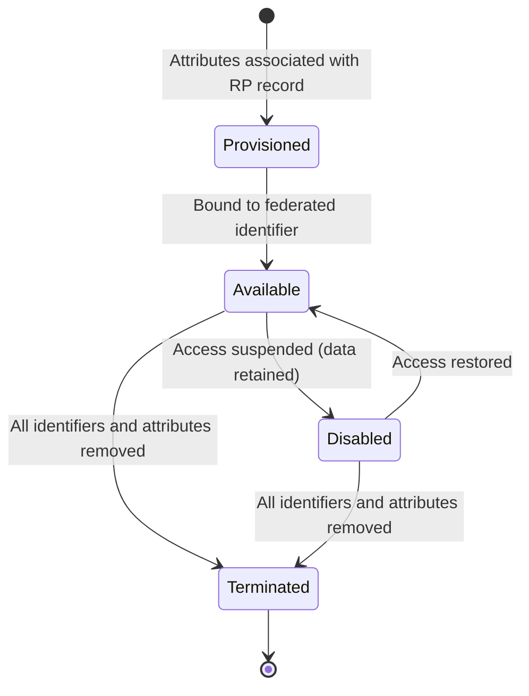

Every time a user clicks "Sign in with Google" or gets SSO access to a third-party app from a corporate IdP, identity crosses a trust boundary. Identity proofing happened somewhere, authentication happened somewhere else, and now another system needs to rely on that result. <!--more-->

That handoff is where a lot goes wrong. [NIST SP 800-63C-4](https://pages.nist.gov/800-63-4/sp800-63c.html) is the federation volume of the 800-63-4 suite. It defines what a trustworthy authentication assertion looks like, what protections are needed against injection and replay attacks, what privacy safeguards are expected, and how the emerging subscriber-controlled wallet model changes the relationship between the identity provider (IdP) and the relying party (RP).

---

**Series: NIST SP 800-63-4**
- Part 1: [SP 800-63-4 => The Framework, Assurance Levels, and Risk Management](/blogs/nist-sp-800-63-4-overview)
- Part 2: [SP 800-63A-4 => Identity Proofing and Enrollment](/blogs/nist-sp-800-63a-4-identity-proofing)
- Part 3: [SP 800-63B-4 => Authentication and Authenticator Management](/blogs/nist-sp-800-63b-4-authentication)
- **Part 4 (this blog):** SP 800-63C-4 => Federation and Assertions

---

# Why Federation Is Its Own Security Problem

The appeal of federation is real. Prove a user once at IAL2, authenticate them strongly at AAL2, and any relying party in the ecosystem can act on that with confidence. One identity, many services, no repeated enrollment.

But the risk is that the handoff itself becomes the attack surface. A strong identity proofing process and a phishing-resistant authenticator don't help if the assertion carrying that authentication event can be stolen, replayed, or injected.

The threat categories in federation:

**Assertion theft.** An attacker intercepts a valid assertion in transit and uses it to establish a session at the RP before the legitimate subscriber does. Bearer tokens in URL fragments are risky because they show up in browser history, server logs, and referrer headers.

**Assertion replay.** An attacker captures a valid assertion and reuses it after the original session ends. Without replay protection (nonces, short expiry, one-time-use enforcement), a stolen assertion can be used multiple times.

**Assertion injection.** An attacker inserts a valid assertion from one context into the wrong context. They may have legitimately obtained an assertion for one RP and inject it into a session at a different RP, or obtained an assertion from a previous session and inject it into a new one.

**Cross-RP tracking.** This isn't an attack on authentication, it's a privacy violation. If all RPs receive the same subject identifier for a given user, any two RPs can collude (or be breached together) and correlate that user's activity across services without their knowledge or consent.

NIST SP 800-63C-4 introduces Federation Assurance Levels (FAL) to address these risks. FAL focuses specifically on the security of federated assertions and operates independently of IAL and AAL. It only applies when a federated identity protocol is in use. If an application authenticates users directly without exchanging assertions, FAL doesn't apply.

---

# Core Roles and the Federation Flow

The spec defines three roles, and you probably already know two of these from the earlier posts in this series.

**CSP (Credential Service Provider):** collects and validates identity attributes, manages subscriber accounts, and binds authenticators. The CSP is responsible for what the subscriber's identity actually is.

**IdP (Identity Provider):** authenticates subscribers and issues assertions to relying parties. The IdP says "this subscriber authenticated successfully, here are their attributes."

**RP (Relying Party):** receives and validates assertions from the IdP, then grants the subscriber access based on what the assertion says.

In most commercial deployments, the CSP and IdP are the same entity. Google manages your identity (CSP) and also issues assertions to apps you sign into with Google (IdP). Your corporate Okta or Entra tenant does the same.

For [SAML](/blogs/introduction-to-saml) flows, the assertion is a signed XML document passed through the browser. For [OIDC](/blogs/oauth2-nuts-and-bolts-p1), it's a signed JWT (the ID token), typically retrieved through a back-channel token endpoint after an authorization code exchange. The mechanics differ, but the trust model is the same.

---

# Federation Assurance Levels

**FAL1: basic protection.** Bearer assertions are acceptable. A single assertion can be used by multiple RPs. Trust between IdP and RP can be established dynamically (at the time of first interaction) or through a pre-existing agreement.

**FAL2: high protection.** Each assertion must be bound to a single RP, so the assertion is useless to any other RP even if stolen. Strong injection attack prevention is required. Pre-established trust agreements are mandatory (no dynamic trust). Manual identifier and key setup is recommended over dynamic discovery.

**FAL3: maximum protection.** The subscriber must prove possession of a key at assertion time, not just present a bearer token. This is holder-of-key: the RP doesn't just trust that the IdP vouches for the subscriber, it requires the subscriber to demonstrate they hold a specific cryptographic key that the assertion was bound to. Pre-established trust and manual key establishment are required.

| | FAL1 | FAL2 | FAL3 |
|---|---|---|---|
| Assertion type | Bearer | Bearer, single-RP | Holder-of-key |
| Injection prevention | Basic | Strong (required) | Strong (required) |
| Trust agreement | Dynamic or pre-established | Pre-established | Pre-established |
| Identifier/key setup | Dynamic or manual | Dynamic or manual | Manual (required) |
| Subscriber key proof | Not required | Not required | Required |

**How this maps to OIDC in practice:**

FAL1 corresponds to basic OIDC with an authorization code flow: you get an ID token, you validate the signature, you trust the claims. Most "Sign in with X" integrations sit here.

FAL2 corresponds to OIDC with proper `nonce` and `state` parameter handling, audience restriction enforced, short token lifetimes, and a pre-registered client. The `nonce` binds the token to the specific authentication request, `state` protects against CSRF, and audience restriction makes sure the token is only valid for your client ID.

FAL3 corresponds to OIDC with [DPoP](https://datatracker.ietf.org/doc/html/rfc9449) (Demonstrating Proof of Possession) or mutual TLS ([RFC 8705](https://datatracker.ietf.org/doc/html/rfc8705)), where the access or ID token is cryptographically bound to a client key and the client must prove possession of that key on every request.

---

# Trust Agreements

A trust agreement is the documented basis for a federation relationship. At FAL2 and FAL3, these are required. At FAL1, they can be established dynamically.

A trust agreement must cover:

- The rights and responsibilities of each party
- Vetting practices for all parties in the federation
- The assurance levels (xALs) that assertions in this federation may claim
- What subscriber attributes can be requested and under what conditions
- How data must be handled, retained, and deleted
- Redress mechanisms and dispute resolution procedures
- Key management: how signing keys are established, rotated, and revoked

One requirement that's easy to overlook: the terms of the trust agreement have to be available to subscribers in clear and understandable language. That's a formal requirement, not just best practice, and it shapes how the federation relationship and its policies get documented for end users.

**Bilateral agreements** are direct agreements between an IdP and an RP. Many enterprise integrations using OpenID Connect follow this model. For example, when you register a client on a platform like Okta or Microsoft Entra ID and accept its terms of service, that often ends up acting as the agreement, sometimes implicitly.

**Multilateral agreements** involve a federation authority: a third party that reviews Identity Providers and Relying Parties, defines common policies, and maintains a shared trust registry. Many government or academic identity federations (often built on SAML metadata aggregates) work this way.

In practice, most commercial OpenID Connect integrations function as implicit bilateral agreements with minimal documented terms beyond the provider's terms of service. That's usually fine for FAL1. It doesn't meet FAL2, though, since FAL2 requires a pre-established agreement covering the elements listed above. If you're building a government service or a high-assurance B2B integration targeting FAL2, you need a formal agreement, not just a registered OAuth client.

---

# Assertion Security Requirements

Every assertion must be cryptographically signed (using a digital signature) or protected with a message authentication code (MAC). The IdP's signing key must be managed securely, and federal agencies must use [FIPS 140](https://csrc.nist.gov/publications/detail/fips/140/3/final) validated cryptographic modules.

**Required assertion contents:**

- Subject identifier (who this assertion is about)
- Audience (which RP this assertion is for)
- Issuer (which IdP issued it)
- Expiry time (when it becomes invalid)
- Authentication event (when and how the subscriber authenticated)
- Assurance levels claimed (IAL, AAL, and optionally FAL)

The audience field is mandatory at FAL2 and above. Without it, an assertion could be taken from one RP and reused at another. Validating the audience claim is the RP's job. When using a JSON Web Token in OpenID Connect, for example, the RP must check that the `aud` claim matches its client ID. Accepting any validly signed token from a trusted IdP without checking the audience is a common, and dangerous, misconfiguration.

**Replay protection:**

At FAL1, basic expiration is usually enough. At FAL2 and above, assertions must be one-time-use or include nonces that bind the assertion to a specific authentication request. Short validity windows (minutes rather than hours) reduce replay risk. If an IdP issues a token valid for 24 hours with no one-time-use protection, a stolen token could be replayed for a long time.

**xAL reporting:**

The IdP must always include the resulting IAL, AAL, and FAL in every assertion, even when the RP's requested minimums weren't met. The RP must define the minimum xALs it accepts and check each assertion against those requirements before granting access. RPs may also vary what functionality is available based on the assurance levels in a given transaction, which means xAL is a per-transaction signal, not just an account-level setting.

**Key storage:**

All signing keys, decryption keys, and symmetric keys must be stored securely. Symmetric keys used in federation must be unique per pair of participants, so the same key should never be reused across multiple federation relationships. Domain names and URIs in federation configurations also must not use wildcards, since a wildcard expands the trust scope to any subdomain, which can unintentionally include subdomains outside your control.

---

# Injection Attack Defenses

Assertion injection is different from assertion theft. Theft means someone steals a token. Injection means a token from one context gets used in another. A token legitimately issued for one RP, for example, could be reused at a different RP.

## Why the Implicit Flow Is the Problem

In the [OAuth 2.0](/blogs/oauth2-nuts-and-bolts-p2) implicit flow, the access token or ID token is returned directly in the URL fragment after authorization. That means:

- The token appears in the browser's address bar
- It's stored in browser history
- It may show up in server logs if the fragment leaks via referrer headers
- It can be extracted by JavaScript on the page

The authorization code flow avoids all of this: the browser receives a short-lived, single-use authorization code, which is exchanged for tokens through a back-channel POST to the token endpoint. The tokens never appear in the URL. The implicit flow is effectively deprecated in the [OAuth 2.0 Security Best Current Practice](https://datatracker.ietf.org/doc/html/draft-ietf-oauth-security-topics) and isn't a valid path to FAL2.

## PKCE

For public clients (mobile apps, SPAs) that can't keep a client secret, [PKCE](https://datatracker.ietf.org/doc/html/rfc7636) (Proof Key for Code Exchange) prevents authorization code injection. The client generates a random `code_verifier`, hashes it into a `code_challenge`, includes the challenge in the authorization request, and proves knowledge of the verifier when exchanging the code for tokens. An attacker who intercepts the code can't use it without the verifier.

## Required Controls at FAL2+

To meet FAL2 injection prevention requirements, the RP must:

- Use the authorization code flow (not implicit)
- Use PKCE for public clients
- Include a `nonce` in the authorization request and verify it matches in the ID token
- Use and validate `state` to bind the authorization response to the original request
- Enforce audience restriction on all tokens
- Use short token lifetimes with one-time-use enforcement where possible

These practices are already well established in OpenID Connect implementations and documented in the [OAuth 2.0 Security Best Current Practice](https://datatracker.ietf.org/doc/html/draft-ietf-oauth-security-topics). NIST SP 800-63 just formalizes them as requirements when you're targeting FAL2.

---

# Privacy: Pairwise Pseudonymous Identifiers

If every RP receives the same `sub` claim for a given user, two RPs can correlate activity for that user without even coordinating. If both systems see `sub: abc123`, they can infer it's the same person, even when that user never intended to link their accounts across those services.

At scale, a large IdP issuing the same subject identifier across many RPs can unintentionally enable cross-service tracking. A consistent identifier across thousands of services can build a detailed activity profile if that data ever becomes accessible to the wrong party.

Pairwise pseudonymous identifiers solve this. The IdP generates a different `sub` value for each (subscriber, RP) pair, derived deterministically so it stays consistent across sessions but unique across RPs.

RP-A and RP-B each see a different identifier for the same subscriber. Because the identifiers differ, the two services can't correlate the user without cooperation from the IdP.

**When pairwise identifiers are required:** the spec requires pairwise identifiers when the IdP knows the RP doesn't need a globally unique identifier, and when cross-service correlation would be a privacy risk. At FAL2 and FAL3, privacy protections are stronger, and pairwise identifiers are generally expected unless there's a documented reason to use global identifiers.

**Shared PPIs** are allowed, but only under strict conditions. The trust agreement must explicitly allow it, an authorized party must approve it, the RPs must have a legitimate relationship that justifies correlating subscriber activity, and all participating RPs must consent. Identifiers can't be casually shared across services. Federated identifiers also must not contain plaintext personal information such as email addresses, usernames, or employee numbers. At FAL2 and above, this is a strict requirement, not a recommendation.

**Ephemeral identifiers.** Some systems go further and generate a new `sub` value for every session. These provide the strongest unlinkability between sessions. But they also stop the RP from recognizing returning users, which can break features that depend on persistent identity.

**Attribute minimization** is the other side of the privacy requirement. The IdP should release only the attributes an RP actually needs. At FAL2 and above, runtime consent is also required before releasing attributes. If a service only needs a user's email address, the IdP shouldn't include extra attributes like name, phone number, or address in the token. In systems built on OpenID Connect, the scopes the RP registers should reflect the minimum data it actually needs.

**Permitted uses for subscriber data.** The IdP may only transmit subscriber information for:

- Identity proofing, authentication, or attribute assertion purposes
- A specific request from the subscriber
- Fraud reduction related to the identity service itself
- Security incident response

The IdP must not require users to consent to unrelated data processing as a condition of authentication. Bundling in additional data uses like marketing or resale into the login flow isn't allowed.

**Federal agency obligations.** Agencies acting as an IdP or RP must consult their Senior Agency Official for Privacy on Privacy Act applicability, publish a System of Records Notice (SORN) if the Privacy Act applies, consult the Senior Agency Official for Privacy on E-Government Act applicability, and publish a Privacy Impact Assessment (PIA) if required. These aren't suggestions, the spec makes them normative for federal systems. If you're building a government identity service, the privacy compliance work isn't separate from the technical implementation, it's part of it.

---

# Subscriber-Controlled Wallets

The traditional federation model has a structural privacy issue: the IdP knows every time a subscriber logs in to an RP, since the assertion flow always passes through the IdP during login. Even with pairwise identifiers in use, the IdP can still build a complete record of where each subscriber goes and when.

The subscriber-controlled wallet model changes this. Instead of the IdP generating a live assertion during login, the CSP issues signed credential bundles directly to the subscriber at enrollment time. These credentials sit in the subscriber's wallet. When an RP needs identity attributes, the subscriber presents the relevant credentials, and the RP verifies the CSP's signature. The IdP isn't involved in this step at all.

The privacy improvement here is real. After issuing the credential, the CSP has no visibility into which RPs the subscriber accesses. The RP can verify the credential without contacting the IdP. The subscriber controls what information gets shared and decides when and with whom to share it.

**Attribute bundles vs. assertions.** There's a structural difference between what a CSP issues to a wallet and what a general-purpose IdP issues. CSP attribute bundles include verification keys, which let the RP confirm the credential was issued by that CSP. General-purpose IdP assertions usually don't include CSP-originated verification keys. In some architectures, the wallet software may act as an RP to an external IdP (functioning as a proxy), but the core idea is that the CSP is removed from the real-time authentication flow.

**Key storage for FAL3 wallets.** Signing keys must be stored in hardware that prevents key export, for example a secure element, TEE (Trusted Execution Environment), or TPM (Trusted Platform Module). This hardware must be separate from the host processor and must not let the host extract keys. The reasoning is straightforward: if the wallet device is compromised and key storage isn't properly isolated, attackers could get the credentials directly.

**Current standards alignment.** The wallet model in 800-63-4 aligns with [W3C Verifiable Credentials](https://www.w3.org/TR/vc-data-model/) and [ISO/IEC 18013-5](https://www.iso.org/standard/69084.html) (the mdoc format used for mobile driver's licenses). These standards already have real-world implementations. Both Apple Wallet and Google Wallet support mdoc-format IDs in some regions.

**The trade-offs are real.** Credential revocation gets harder when there's no live IdP in the authentication path. In traditional federation, the IdP can immediately stop issuing assertions for a suspended account. In the wallet model, the credential is already issued and sitting in the subscriber's wallet, so revocation needs a different approach: short-lived credentials, revocation registries that RPs must check, or accepting a delay before revocation takes effect. None of these are as clean as simply refusing to issue a new assertion.

Wallet security also opens up a new attack surface. If the subscriber's wallet is compromised, the attacker gets access to the credentials. Compromising a subscriber's device in a traditional federation setup, by contrast, doesn't expose the IdP's signing key.

This model is promising, but it's still early days for adoption. The spec treats it as a first-class option rather than an experimental one, which is a meaningful signal about where identity is heading.

---

# Proxied Federation

A federation proxy sits in the middle of a federation relationship. It acts as an RP to an upstream IdP and as an IdP to one or more downstream RPs.

Common use cases:

- **B2B federation:** a SaaS product may need to accept logins from many enterprise customer IdPs. Maintaining direct federation with each one gets operationally expensive fast, so a proxy consolidates the upstream relationships.
- **Multi-tenant SaaS:** the proxy routes authentication to the correct tenant IdP based on the subscriber's domain.
- **Legacy bridging:** an older SAML IdP may need to work with OIDC-only RPs. A proxy can translate between the protocols.

**Assertion handling options** in a proxy:

- Create a new assertion with no upstream information (full blinding)
- Copy upstream attributes into the proxy assertion
- Include the entire upstream assertion within the proxy assertion

**Blinding** is an optional privacy property. The proxy may hide the downstream RP's identity from the upstream IdP (RP blinding), or hide the upstream IdP's identity from the downstream RP (IdP blinding). RP blinding has a strong privacy benefit, since the upstream IdP (a corporate SSO system, say) may not need to know which third-party services an employee is accessing.

**FAL propagation rule:** the FAL of the connection between the proxy and the downstream RP is the lowest FAL across the entire path. If any segment operates at FAL1, the downstream RP effectively gets FAL1, regardless of what the upstream segment provides. The federated identifier in the proxy's assertion must list the proxy as issuer.

A proxy that strips nonces, loosens audience restrictions, or converts a back-channel token exchange into a front-channel redirect can quietly reduce the effective FAL without the RP ever knowing.

If you're using a proxy while targeting FAL2, verify that it explicitly preserves FAL2 properties throughout the translation. Many general-purpose identity brokers don't clearly advertise this behavior, and some don't guarantee it at all.

---

# RP Subscriber Account Lifecycle

The RP's subscriber account is separate from the IdP's subscriber account. Each has its own lifecycle, and that separation can create operational problems that are easy to overlook until an incident forces the issue.

**Account states** the spec defines:

- **Provisioned:** attributes are associated with an RP data record. This may happen either before or after the first authentication.
- **Available:** the account is bound to federated identifiers or can be reached through the account resolution process.
- **Disabled:** access isn't allowed, but the information is kept for record keeping or investigation.
- **Terminated:** all access is removed, including federated identifiers, bound authenticators, and associated attributes.

**Linking:** when a subscriber first authenticates to an RP through federation, the RP creates a local account and links it to the federated identifier (typically the pairwise `sub` and the IdP issuer). Future logins resolve to the same local account through this link. A single RP account may be associated with more than one federated identifier, but all linking operations require an authenticated session.

**Account resolution:** when a subscriber presents credentials without a federated identifier (the wallet case), the RP must resolve the subscriber from attributes alone. The spec requires that the attributes be enough to uniquely resolve the subscriber, and the design must prevent assigning the presentation to the wrong account.

**Provisioning and deprovisioning:** the RP may need to create resources, assign permissions, or set defaults when a new federated account is first seen. Deprovisioning is more complex. If a subscriber's account is terminated at the IdP, the RP may not find out until the next login attempt fails. Where provisioning APIs exist, the IdP must use that API to deprovision RP subscriber accounts when the subscriber account is terminated (except where regulation or retention requirements prevent it).

SCIM (System for Cross-domain Identity Management) is the standard protocol for proactive provisioning and deprovisioning across federation boundaries. Without it, RPs operate reactively and only discover account terminations when authentication fails. With SCIM, the IdP can push deprovisioning events in real time.

**Identifier conflicts:** problems can crop up when a subscriber tries to link a second IdP to an existing account, or when an identifier previously used by one subscriber gets reused for another. This is rare but possible with pairwise identifiers if the derivation scheme changes. The RP must have a policy for handling these conflicts, and the spec requires that these procedures be documented.

**Subscriber notice:** the RP must notify subscribers of significant changes to their federated account, including account linking, attribute changes that affect access, and account termination. This requirement applies even when the change originates at the IdP.

---

# Requesting and Validating xALs

The trust agreement defines the xALs a federation relationship supports. But at runtime, an RP may need to enforce a higher minimum level for a particular transaction.

The spec requires IdPs to support a mechanism for RPs to specify minimum acceptable xALs as part of the trust agreement. At runtime, the IdP should support the RP specifying a stricter minimum. If the IdP can satisfy that request, it should. If it can't, it should fail the request rather than issue an assertion that doesn't meet the required level.

The IdP must always include the resulting xAL in the assertion for every transaction, even when the requested level wasn't met. Because of this, the RP can't just assume the IdP honored its request. The RP must inspect the xAL claims in the assertion and reject the transaction if the levels don't meet its required minimum. If an assertion contains `acr: aal1` when AAL2 was required, for example, the transaction has to be treated as a failure, not a degraded success.

RPs may vary the functionality they expose based on the xALs in a specific transaction. A service could allow read-only access at AAL1 but require AAL2 for writes. That means checking xAL claims on each request, not just at session establishment.

---

# Concluding the Series

The four volumes of 800-63-4 form a chain.
- Identity proofing (63A) establishes who the subscriber is.
- Authentication (63B) establishes that the person authenticating now is the same subscriber.
- Federation (63C) conveys that authentication event to the RP securely and with appropriate privacy protections.

A failure at any point in the chain weakens the entire system. Strong authentication doesn't help if the identity was never properly proofed. Strong proofing and authentication don't help if the assertion carrying them can be injected or replayed. And all three are undermined if the federation layer leaks subscriber behavior across RPs without their knowledge.

The point of the NIST framework is that it makes these trade-offs explicit and puts them inside a single decision process. When you pick IAL2 + AAL2 + FAL2 for a service, you've made a documented risk decision you can revisit when the threat model changes. That's a better position to be in than "we have MFA and SSO, so we're fine."

That wraps up this series. If there's one thing worth carrying forward from all four posts, it's this: the hardest part of identity systems has never been authentication, it's everything around it.
