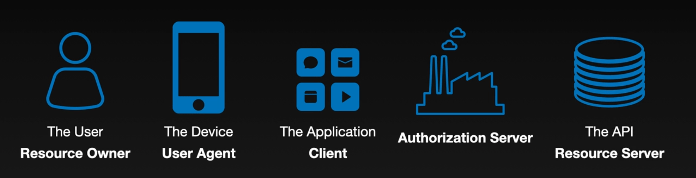

In this blog, i want to summarise what ever i learn from `the nuts and bolts of OAuth2.0` by Aaron parecki udemy course. This was one of the nice things i have done when starting to learn oauth myself. (and i surely recommend this).

 <!--more-->

And this is part1 of this series.

## Intro

#### 1. <u>history of OAuth  (OpenAuthentication)</u>

Situation before OAuth came into existence: when it comes to securing the API, before oauth it was common for API to use Basic Auth everywhere which is not security. Also third party app (like twitter clients) used to ask user for their google credentials in order to authenticate with google.

Also in case of third part App wants to use twitter or google authentication, they were needed to ask user for google credentails and to call google auth endpoint with user's credentials.

These approaches are not secure and credentials are open shared with random application clients, many companies around 2000’s(who started exposing public api’s) realised this and started solving the problem in different ways, like

- **Flickr (FlickrAuth)**: Used a custom flow with made-up terms like *frob* and *token* to handle user authentication for API access.
- **Google (AuthSub)**: Implemented a token-based system similar to OAuth, allowing users to grant limited access to their data.
- **Facebook (MD5 Signed Requests)**: Relied on MD5-hashed request signing with secret keys, without a formal user consent mechanism.
- **Yahoo! (BBAuth)**: Created a browser-based login flow where users approved access, returning a token to third-party apps.

Later they standardised, this and released OAuth1 (in 2007).

Over the years, when mobile apps are booming, the standards of oauth1 is reaching limitations when it comes to mobile apps, SPA’s and couldn’t handle wide variety of senarios. Also there is no separation b/w OAuth server and API server OAuth1 . 

Then comes OAuth2.0 (in 2012) to solve such problems (even for nativeApps, smart TV’s etc..)

#### 2. <u>How OAuth improve application security</u>

Imagine in your company, you are not using oauth and multiple applications are depending on shared user DB. All applications handle user authentication by calling an API to authenticate with the auth server using Basic Auth. Its fine upto certain extent atleast for first-party, but when you want to also integrate third party apps to authenticate you have to somehow restrict sharing the credentials. also it quickly became problematic as systems scaled. 

**Problems with Direct Credential Handling:**

<u>User-side issues</u>:

- Apps directly receiving passwords introduces trust and security risks.
- No fine-grained access: handing over a password gives full account access.
- Revoking access = resetting password → disrupts all sessions.

<u>API-side issues</u>:

- No way to verify which app made the request, all traffic looks the same.
- Vulnerable to credential stuffing from leaked passwords.
- Adding MFA requires every client to implement support.

Here is where OAuth shines by decoupling authentication from applications:

- Users authenticate via a centralised OAuth server (means apps never see passwords)
- Scopes allow limited access per app (least privilege rule).
- MFA and policy changes apply platform-wide, no app updates needed.
- Tokens (not credentials) are passed to APIs, improving traceability and revocation.

#### 3. <u>OAuth vs OpenID Connect</u>

OAuth itself was originally designed for applications to get access to APIs. and application doesn't actually need to know who the user is that's using that application.

For example, like when checking into a hotel, You show ID and a credit card at the front desk, which gives you a key card for room access. The key card, like an OAuth token, grants access to specific resources (rooms, gym, pool), but doesn’t store personal details about you.

The front desk is the OAuth authorization server, verifying your identity. The door (resource server) only checks if the key card (access token) is valid, **not who you are**. The card simply lists which resources you can access, with an expiration date, just like an OAuth token grants limited access to specific data until it expires. 

If you see in the above example even without app does’t know the exact user in question, app can still do things.

But if there are cases where application wants to know the user in question, oauth doesn’t provide such info(out of oauth’s scope). Here where **OpenId connect** comes in, which takes Oauth as foundation and adds user identity info on top. **OpenId connect** is just an extension of Oauth and the main way it does that is with a new kind of token called **ID token**.

So remember: OAuth issues **access tokens** and OpenID Connect issues **ID tokens** to apps.

---

## API security concepts
#### 1. <u>Roles in OAuth</u>
In typical API scenarios we have four components

- User (end user with the account)
- Device (Mobile and browser running or accessing the app)
- Application (The app that makes request to)
- and the API

And when it comes to OAuth they are called roles and name will be changed like

- User → Resource Owner
- Device → User Agent
- Application → OAuth Client
- API → Resource server


Along with above roles OAuth also introduces Role5 called `Authorisation server` Its job is to manage the API that it’s protecting from OAuth clients, So user can only login at auth server by entering the credentials and get access token to access the API. Depending on system architecture your software can combine Resource server and Auth server or can also depend on external auth server and whole bunch of micro-services that make various API’s.

#### 2. <u>Application Types</u>
There are mainly two types of OAuth client define in OAuth2.0 → **confidential clients** and **public clients**. confidential client are client that are able manage secrets and send them to Auth server to authenticate themselves, While public clients(running on user controls) don’t have such mechanism of handling secrets (client like mobile Apps, or SPA’s where they run on device can’t able to manage credentials secretly).

And OAuth server can behave differently depends on type of client, like for it can show consent screen or giving less life time on access token, or restrict scopes , or whether to include refresh tokens etc.

So it is important when registering client on OAuth server, we need to provide type of application.

And coming to client Authentication for confidential clients, preferred is Client ID and Client secret but it’s not more secure OAuth but it’s enough. When tight security is needed it’s better to look out for Mutual TLS, or using private key to sign a JWT.

#### 3. <u>User Consent</u>
In typical OAuth Flow you might have seen below kind of screen, well this is called consent screen that interrupts the flow, and asks user for permission (consent). But why we need this step.


If you see, in OAuth 2.0 there is `password grant` flow where application directly present user credentials to exchange for access_token like below.

```shell
POST https://authz-server/token
   grant_type=password&
   username=USERNAME&
   password=PASSWORD&
   client_id=CLIENT_ID
```

This is a serious problem in terms of security especially for third party apps.

In case of first party app it might be allowed, but there also problems like when introducing MFA’s. So, its always preferred to use redirect flow (where we can add consent scree).

Also OAuth sever cannot really know whether the actual user is involved in the flow or not. So this screens are introduced to get explicit consent from user for whatever the scope the OAuth client is requesting for. But this typically skips for first part apps or confidential clients.

#### 4. <u>Front Channel vs Back channel</u>
These two types on how data flows b/w systems → front channel and back channel

Back channel Flow: (BCF)
- As most of us know, its https request which is made by application server.
- Since it is encrypted connection and all certificate are validated, and we get trusted response it’s considered as more secured.

Front channel Flow:(FCF)
- using address bar to deliver the data
- Here its hard to verifying whether receiver side received data or not
- and also can’t sure we received data from the expected server.

`password grant` flow uses BCF in both calling the access token endpoint and receiving the access, but we cannot use this flow because we are not sure user actually consented to the req and other cons listed above.

That’s we use `Redirect flow` by inserting user in between Auth server and Auth client introducing front channel.

But in this flow, first application need to tell Auth server what it’s need to do, i.e, redirect to Auth Server for authentication and authorising scope and we use **front channel** and its completely fine, because noting in this req is sensitive. 

But we are also sending **access token** back via front channel and its very risky since Auth server cannot guarantee whether application received the token or not. This flow is called `Implict Flow` OAuth2.0 specs. Even though its not recommended, its listed in OAuth spec for browsers had no other option (no CORS supported).

We have `Authorization code flow` to deliver access token in backchannel, we will discuss more about this later on.

note: back channel req → doesn’t necessarily needs to be from backend server, it’s just that all we need is certificated verification and encrypted connection

#### 5. <u>Application Identity</u>
Application or OAuth client have `ClientID`, which represent particular client in the scope of OAuth server. 

In the case of Authorization code flow, the OAuth client first build URLrequest (with `clientID` to identify which app is making the req, `scope` to check what the app is request, `redirectURI` to tell where to send user back to, etc etc) to initiate the flow and send the request to Auth server via FCF. and user is required to consent and login. After that Auth server instead of sending access token (like in case of `implicit flow`) it send a temporary code called `Authentication code` in FCF. And then the client can exchange this code for `access token` in the BCF.

But if an attacker get this code, he can also use this to call token endpoint for access token. So to prevent it, application also send `clientID` and `secret` to prove authenticate itself when getting access token. 

But what about public client who cannot have `secret` ? well, here comes the PKCE (proof of key change) a unique secret that is generate before the start of OAuth flow, this ensures that client that initiated OAuth flow is the only client that is requesting the access token. And note that this doesn’t stop attacker to impersonate the Application.

And coming to `RedirectURI`, https scheme one’s are globally unique and its kind of part of app’s identity and at OAuth server apps register specific URI to redirect the user for particular `client ID` and https scheme redirect uri really helps for applications that doesn’t have `secret` .

But incase of mobile APPs or SPA, custom URL schemes may not be globally unique and PKCE is the only option for now. So we need to make strict policies and scopes in such cases.

---

That's all from part1... see yaa 👋
<!-- https://developer.okta.com/blog/2019/10/21/illustrated-guide-to-oauth-and-oidc -->