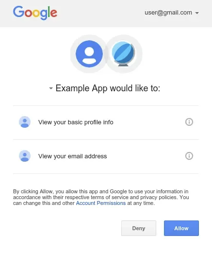

In this blog, I want to summarize whatever I learned from `the nuts and bolts of OAuth 2.0` by Aaron Parecki's Udemy course. This was one of the nicest things I have done when starting to learn OAuth myself (and I surely recommend this).

 <!--more-->

In this part, I will go through OAuth concepts in the comprehensive way, mainly discussing Introduction to OAuth, API security concepts, and OAuth flows for different types of applications.

# Intro

### 1. <u>history of OAuth  (OpenAuthentication)</u>

**Situation before OAuth came into existence:** when it comes to securing APIs, before OAuth it was common for APIs to use Basic Auth everywhere, which is not secure. Also, third-party apps (like Twitter clients) used to ask users for their Google credentials in order to authenticate with Google.

Also, in case a third-party app wanted to use Twitter or Google authentication, they needed to ask the user for their Google credentials and call the Google auth endpoint with the user's credentials.

These approaches are not secure and credentials are open shared with random application clients, many companies around 2000’s(who started exposing public api’s) realised this and started solving the problem in different ways, like

- **Flickr (FlickrAuth)**: Used a custom flow with made-up terms like *frob* and *token* to handle user authentication for API access.
- **Google (AuthSub)**: Implemented a token-based system similar to OAuth, allowing users to grant limited access to their data.
- **Facebook (MD5 Signed Requests)**: Relied on MD5-hashed request signing with secret keys, without a formal user consent mechanism.
- **Yahoo! (BBAuth)**: Created a browser-based login flow where users approved access, returning a token to third-party apps.

Later they standardised, this and released OAuth1 (in 2007).

Over the years, when mobile apps are booming, the standards of oauth1 is reaching limitations when it comes to mobile apps, SPA’s and couldn’t handle wide variety of senarios. Also there is no separation b/w OAuth server and API server OAuth1 . 

Then comes OAuth2.0 (in 2012) to solve such problems (even for nativeApps, smart TV’s etc..)

### 2. <u>How OAuth improve application security</u>

Imagine in your company, you are not using OAuth and multiple applications are depending on shared user DB. All applications handle user authentication by calling an API to authenticate with the auth server using Basic Auth. Its fine upto certain extent atleast for first-party, but when you want to also integrate third party apps to authenticate you have to somehow restrict sharing the credentials. also it quickly became problematic as systems scaled. 

**Problems with Direct Credential Handling:**

<u>User-side issues</u>:

- Apps directly receiving passwords introduces trust and security risks.
- No fine-grained access: handing over a password gives full account access.
- Revoking access = resetting password → disrupts all sessions.

<u>API-side issues</u>:

- No way to verify which app made the request, all traffic looks the same.
- Vulnerable to credential stuffing from leaked passwords.
- Adding MFA requires every client to implement support.

Here is where OAuth shines by decoupling authentication from applications:

- Users authenticate via a centralised OAuth server (means apps never see passwords)
- Scopes allow limited access per app (least privilege rule).
- MFA and policy changes apply platform-wide, no app updates needed.
- Tokens (not credentials) are passed to APIs, improving traceability and revocation.

### 3. <u>OAuth vs OpenID Connect</u>

OAuth itself was originally designed for applications to get access to APIs. and application doesn't actually need to know who the user is that's using that application.

For example, like when checking into a hotel, You show ID and a credit card at the front desk, which gives you a key card for room access. The key card, like an OAuth token, grants access to specific resources (rooms, gym, pool), but doesn’t store personal details about you.

The front desk is the OAuth authorization server, verifying your identity. The door (resource server) only checks if the key card (access token) is valid, **not who you are**. The card simply lists which resources you can access, with an expiration date, just like an OAuth token grants limited access to specific data until it expires. 

If you see in the above example even without app does’t know the exact user in question, app can still do things.

But if there are cases where application wants to know the user in question, oauth doesn’t provide such info(out of oauth’s scope). Here where OpenId connect comes in, which takes Oauth as foundation and adds user identity info on top. OpenId connect is just an extension of Oauth and the main way it does that is with a new kind of token called **ID token**.

https://openid.net/specs/openid-connect-core-1_0.html

>Note: OAuth issues **access tokens** and OpenID Connect issues **ID tokens** to apps.

---

# API security concepts

### 1. <u>Roles in OAuth</u>
In typical API scenarios we have four components

- User (end user with the account)
- Device (Mobile and browser running or accessing the app)
- Application (The app that makes request to)
- and the API

And when it comes to OAuth they are called roles and name will be changed like

- User → Resource Owner
- Device → User Agent
- Application → OAuth Client
- API → Resource server


Along with above roles OAuth also introduces Role5 called `Authorisation server`.  Its job is to manage the API that it’s protecting from OAuth clients, So user can only login at auth server by entering the credentials and get access token to access the API. Depending on system architecture your software can combine Resource server and Auth server or can also depend on external auth server and whole bunch of micro-services that make various API’s.

### 2. <u>Application Types</u>
There are mainly two types of OAuth client define in OAuth2.0 → **confidential clients** and **public clients**. confidential client are client that are able manage secrets and send them to Auth server to authenticate themselves, While public clients(running on user controls) don’t have such mechanism of handling secrets (client like mobile Apps, or SPA’s where they run on device can’t able to manage credentials secretly).

And OAuth server can behave differently depends on type of client, like for it can show consent screen or giving less life time on access token, or restrict scopes , or whether to include refresh tokens etc.

So it is important when registering client on OAuth server, we need to provide type of application.

And coming to client Authentication for confidential clients, preferred is Client ID and Client secret but it’s not more secure OAuth but it’s enough. When tight security is needed it’s better to look out for Mutual TLS, or using private key to sign a JWT.

### 3. <u>User Consent</u>
In typical OAuth Flow you might have seen below kind of screen, well this is called consent screen that interrupts the flow, and asks user for permission (consent). But why we need this step.



If you see, in OAuth 2.0 there is `password grant` flow where application directly present user credentials to exchange for access_token like below.

```shell
POST https://authz-server/token
   grant_type=password&
   username=USERNAME&
   password=PASSWORD&
   client_id=CLIENT_ID
```

This is a serious problem in terms of security especially for third party apps.

In case of first party app it might be allowed, but there also problems like when introducing MFA’s. So, its always preferred to use redirect flow (where we can add consent scree).

Also OAuth sever cannot really know whether the actual user is involved in the flow or not. So this screens are introduced to get explicit consent from user for whatever the scope the OAuth client is requesting for. But this typically skips for first part apps or confidential clients.

### 4. <u>Front Channel vs Back channel</u>
These two types on how data flows b/w systems → front channel and back channel

Back channel Flow: (BCF)
- As most of us know, its https request which is made by application server.
- Since it is encrypted connection and all certificate are validated, and we get trusted response it’s considered as more secured.

Front channel Flow:(FCF)
- using address bar to deliver the data
- Here its hard to verifying whether receiver side received data or not
- and also can’t sure we received data from the expected server.

`password grant` flow uses BCF in both calling the access token endpoint and receiving the access, but we cannot use this flow because we are not sure user actually consented to the req and other cons listed above.

That’s we use `Redirect flow` by inserting user in between Auth server and Auth client introducing front channel.

But in this flow, first application need to tell Auth server what it’s need to do, i.e, redirect to Auth Server for authentication and authorising scope and we use **front channel** and its completely fine, because noting in this req is sensitive. 

But we are also sending **access token** back via front channel and its very risky since Auth server cannot guarantee whether application received the token or not. This flow is called `Implict Flow` OAuth2.0 specs. Even though its not recommended, its listed in OAuth spec for browsers had no other option (no CORS supported).

We have `Authorization code flow` to deliver access token in backchannel, we will discuss more about this later on.

> Note: back channel req → doesn’t necessarily needs to be from backend server, it’s just that all we need is certificated verification and encrypted connection

### 5. <u>Application Identity</u>
Application or OAuth client have `ClientID`, which represent particular client in the scope of OAuth server. 

In the case of Authorization code flow, the OAuth client first build URLrequest (with `clientID` to identify which app is making the req, `scope` to check what the app is request, `redirectURI` to tell where to send user back to, etc etc) to initiate the flow and send the request to Auth server via FCF. and user is required to consent and login. After that Auth server instead of sending access token (like in case of `implicit flow`) it send a temporary code called `Authentication code` in FCF. And then the client can exchange this code for `access token` in the BCF.

But if an attacker get this code, he can also use this to call token endpoint for access token. So to prevent it, application also send `clientID` and `secret` to prove authenticate itself when getting access token. 

But what about public client who cannot have `secret` ? well, here comes the PKCE (proof of key change) a unique secret that is generate before the start of OAuth flow, this ensures that client that initiated OAuth flow is the only client that is requesting the access token. And note that this doesn’t stop attacker to impersonate the Application.

And coming to `RedirectURI`, https scheme one’s are globally unique and its kind of part of app’s identity and at OAuth server apps register specific URI to redirect the user for particular `client ID` and https scheme redirect uri really helps for applications that doesn’t have `secret` .

But incase of mobile APPs or SPA, custom URL schemes may not be globally unique and PKCE is the only option for now. So we need to make strict policies and scopes in such cases.

---

# OAuth Flows

## 1. OAuth for Server-side Applications

#### a. <u>Registrating an application</u>
The first step in the OAuth flow is to register your application with the OAuth server. Which is basically providing the basic app infomation like 
- App name
- Description 
- Logo
- Terms of services/privacy policy URL's
- Application Type (e.g., web, mobile, SPA)
- Redirect URI

The exact requirements depends on OAuth server provider, but basically above is the info you needs to enter.

The `Redirect URI` is particularly important, it tells OAuth server where to send code after user grant consent. This will enure security, you should also avoid using wildcards or parital matchings as these open the door to redirect attacks and token leakage. 

Also in case of public client we know that specifying redirectURI is very crutical and helps us a lot, if you had read part1.

Once you register the app, OAuth server will issue `ClientID` and `ClientSecret` for your app (depending on the type of app).

#### b. <u>Authorization Code Flow for Web Applications (with PKCE)</u>
Ok, let's see how OAuth flow goes in case of server side web-apps, Once you register your application at the Oauth server you will get Client ID and Client Secret to start the flow. (see part1 of this series)

**Overview**

Below is overview of the flow: 


1. The user initiates the flow. The application server generates a secret called a `code verifier`, hashes it into a `code challenge`, and redirects the user to the Auth Server with this challenge and metadata (client ID, redirect URI, etc.).
2. The user authenticates at the Auth Server and provide consent to share data with application. The Auth Server then returns an `authorization code` to the application via the front channel.
3. The application exchanges the authorization code through a back channel to token endpoint. This request includes:
   - Authorization code
   - Client ID
   - Client secret
   - Code verifier, etc
4. The Auth Server validates that the `code verifier` matches the original code challenge, confirming the request originates from same client that initiated the flow.
5. Upon successful verification, Auth Server issues an `access token` (and optionally a refresh token).

> Note: `PKCE(Proof Key for Code Exchange) code flow` is recommend even for server-side applications to avoid risks like `Authorization code injection` (where attacker sneaks their own login authorization code into the process, so the app ends up logging in the attacker instead of the real user)

#### c. <u>Flow with Example</u>

Step 1. Authorization Request
The client generates: 
- `code_verifier`: high-entropy random string (43–128 chars).
```sh
4A6hBupTkatbaSq29ReSERtinDeiownvV1safdla
```
- `code_challenge`

```sh
base64url(sha256(code_verifier))
ipSPt30y47140NGbljo26cdwlEQWqkjslereiE323
```

Client redirects the user to the Auth Server:
```sh
GET https://authorization-server.com/auth?
    response_type=code&
    client_id=CLIENT_ID&
    redirect_uri=https://example-app.com/redirect&
    scope=photos&
    state=xyz123&
    code_challenge=ipSPt30y47140NGbljo26cdwlEQWqkjslereiE323&
    code_challenge_method=S256
```
- response_type => authorization code flow
- state =>  originally used for PKCE, but can you for app state, if no PKCE support make it a random value, this also protects CSRF attacks

Step 2. User Authentication & Consent
- The user signs in and approves access.
- On success, the Auth Server redirects:
```sh
https://example-app.com/redirect?
    code=AUTH_CODE_HERE&
    state=xyz123
```
- On error:
```sh
https://example-app.com/redirect?
    error=access_denied&
    state=xyz123
```
The client must verify the returned state to prevent CSRF.

Step 3. Token Exchange
The client exchanges the authorization code for tokens via back-channel:

```sh
POST https://authorization-server.com/token
Content-Type: application/x-www-form-urlencoded

grant_type=authorization_code&
code=AUTH_CODE_HERE&
redirect_uri=https://example-app.com/redirect&
client_id=CLIENT_ID&
client_secret=CLIENT_SECRET&
code_verifier=4A6hBupTkatbaSq29ReSERtinDeiownvV1safdla

```

Step 4. Token Response
If valid, the Auth Server responds:

```sh
{
  "token_type": "Bearer",
  "access_token": "RsTdsajkl354985",
  "expires_in": 3600,
  "scope": "photos",
  "refresh_token": "H4HADSABVC2408"
}
```

Step 5. Refresh Token Flow
```sh
POST https://authorization-server.com/token
Content-Type: application/x-www-form-urlencoded

grant_type=refresh_token&
refresh_token=H4HADSABVC2408&
client_id=CLIENT_ID&
client_secret=CLIENT_SECRET

```

If the refresh token is invalid or user revoked access, account deleted, app removed, the client must restart the full OAuth flow.

> Note: Even if the Auth Server doesn’t enforce PKCE, clients can still send `code_challenge` and `code_verifier`. Non-supporting servers will simply ignore them.
 
---

## 2. Authorization Code Flow for Native Apps

#### a. <u>Security Concerns in Native Apps</u>
In mobile apps, OAuth flows come with some extra headaches along no way to deploy client secret problems. For ex, apps don’t usually have a proper redirect URI with a verified domain, so they often rely on `custom URL schemes`. The problem is, these aren’t unique that means any app can register same scheme and potentially intercept the redirect. `Deep linking` with HTTPS (like `iOS Universal Links` or `Android App Links`) is a step up since it ties back to a real domain, but it’s still not bulletproof. All of this makes the attack surface larger, which is why PKCE becomes super important in mobile OAuth flows. Even if an attacker somehow gets authorization code, they can’t exchange it without the original code_verifier

#### b. <u>User Experience Trade-offs</u>
The UX side isn’t perfect either. The classic flow requires an app switch: your app switches user to system browser, they log in, then comes back safe but not good. Some apps try to “fix” this with `embedded web views`, but that’s risky. These aren’t real browsers (no address bar, no clear identity of the auth server, no cookie sharing), and in the worst case the host app could sniff credentials. This adds both security risks and friction (users have to log in again even if they’re already signed in on the real browser). A better way is using system browser components like `iOS SFSafariViewController` or `Android Chrome Custom Tabs`. With these, users stay inside the app context, cookies are shared with the actual browser, and the app itself never gets direct access to passwords typed. Still, OAuth on native apps always needs extra carefulness to balance security and UX.

#### c. <u>Flow with Example</u>

1. App generates `code_verifier` → derives `code_challenge`.
2. User redirected to system browser with:
    
    ```sh
    GET https://authorization-server.com/auth?
    response_type=code&
    client_id=CLIENT_ID&
    redirect_uri=myapp://callback&
    code_challenge=XXXX&
    code_challenge_method=S256
    
    ```
    
3. User logs in on the Authorization Server → on `iOS SFSafariViewController` or `Android Chrome Custom Tabs` 
4. App exchanges the authorization code for tokens:
    
    ```sh
    POST https://authorization-server.com/token?
      grant_type=authorization_code
      code=AUTH_CODE
      redirect_uri=myapp://callback
      code_verifier=ORIGINAL_CODE_VERIFIER
      client_id=CLIENT_ID
    
    ```
    
    *(no client_secret, since it’s a public client)*
    
5. Auth server verifies `code_verifier` → returns access token (and refresh token).

> Note: PKCE replaces the client secret in native apps, and secure redirect handling (deep links + system browsers) is what makes the flow safe.


#### d. <u>Refresh Tokens in Native Apps</u>

In mobile apps, the OAuth flow is more expensive than on web, you have to switch apps, open the browser, log in, and then come back. To reduce this friction, refresh tokens are extremely helpful. If the Authorization Server issues them, app can silently get a new access token without forcing the user through the whole login flow again. This enables a much smoother UX, app can simply check for refresh token (after unlocking `secure storage` with FaceID/TouchID) and exchange it in the background, making the login feel seamless.

But refresh tokens are also sensitive assets. If a refresh token leaks, an attacker can directly get new access tokens as app is public client. That’s why mobile apps must store them in secure storage (e.g., `iOS Keychain` or `Android Keystore`). Never keep them in plain storage or local files. With proper handling, refresh tokens helps a lot.

---

## 3. Authorization Code Flow for Single Page apps

#### a. <u>Limitations in SPAs</u>

SPAs (browser-based apps) face challenges very similar to native apps because they’re also considered public clients(so PKCE helps here too) as it’s not safe to embed or store a client secret. On top of that, browsers are naturally more vulnerable to attacks. For ex: a successful XSS attack lets malicious code run inside the app just like the real app code, giving the attacker access to tokens. Developers can mitigate this with Content Security Policies (CSP) that is only allow javascript run from verified domains, but that often means blocking or restricting third-party js, which is hard since most apps rely heavily on external libraries. Even if developers are careful, browser extensions installed by users can inject scripts too, making the attack surface bigger.

Another problem browsers don’t provide a true secure storage API like mobile platforms do. Tokens stored in localStorage, sessionStorage, or cookies are all vulnerable to theft. Because of this, most OAuth Servers apply tight policies for SPAs, such as issuing short-lived access tokens, not providing long-lived refresh tokens, or allowing one-time tokens etc etc.

-> <i>Auth flow is exactly same with native apps as both are public clients.</i>

#### b. <u>Challenges of storing token sefely in browser</u>

Browsers don’t give us a truly secure storage option. Common approaches all have drawbacks:

- **LocalStorage** → persists across sessions, but any JS running on your domain (including injected scripts via XSS) can read it.
- **SessionStorage** → scoped per tab, but still exposed to XSS.
- **Cookies** → good for automatic sending, but risky if not `HttpOnly`/`Secure`/`SameSite`, and still vulnerable to XSS/CSRF depending on config.

**Possible Approaches**

1. In-Memory Storage
    - Store tokens in JS memory only.
    - Pros: Not persisted → safer against XSS.
    - Cons: Lost on refresh or tab switch → no persistence across sessions.
2. Service Worker as a Token Holder
    - Keep tokens inside a Service Worker.
    - App JS asks the Service Worker to make API calls, instead of handling tokens directly.
    - Pros: Tokens are out of reach from page JS → reduced XSS exposure.
    - Cons: If an attacker can talk to the Service Worker, they can also trigger requests on their behalf.
3. WebCrypto API (Encrypted Storage)
    - Generate a private key via WebCrypto, encrypt tokens before storing.
    - Private key cannot be directly extracted.
    - Pros: Even if storage is dumped, attacker only sees ciphertext.
    - Cons: A sophisticated attacker can still ask the browser to decrypt using the key (so it protects against passive theft, not active attacks).

So, the only way tokens to ensure token's can't be stolen from Js apps, is to not give them in the first place.
Let's see how

#### c. <u>Don’t Give Tokens to the Browser</u>

Instead of the SPA handling OAuth tokens directly:

1. Flow in backend
    - The browser delegates the OAuth flow to a **backend service** (your app’s server).
    - The backend (e.g., .NET, Java, Node) acts as the OAuth client, exchanges codes, and stores tokens securely on the server.
2. HttpOnly Session Cookie
    - The backend establishes a session with the browser using an **HttpOnly, Secure cookie**.
    - Since JS cannot access HttpOnly cookies, tokens can’t be stolen by XSS.
3. API Calls via Backend Proxy
    - The SPA never talks to the external API directly.
    - Instead, it calls its own backend, which injects the access token server-side.
4. Public → Confidential Client
    - With this setup, your SPA is no longer a **public client** (which can’t safely store secrets).
    - The backend effectively makes it a **confidential client**, fully aligned with OAuth specs.

>Note: If you’re serving a static SPA from something like AWS S3 + CloudFront, you’d need to add a backend service (e.g., API Gateway + Lambda) to support this model.


---

## 4. Authorization Code Flow for Internet of Things

Ever tried logging in on a TV, game console, or some IoT device with just a remote or limited keyboard? Typing usernames and passwords there is painful. That’s where the `OAuth Device Flow` comes in, it lets the device authenticate without requiring direct credential entry.

#### Flow Overview

1. Device asks for login → The IoT device shows a screen like:
    
    ```shell
    Go to https://auth.example.com/device
    and enter code: ABCD-1234
    
    ```
    
2. User authenticates elsewhere → On their phone or laptop, the user visits the URL, logs in, and enters the code.
3. Meanwhile, the IoT device keeps **polling the Authorization Server** with the device code, waiting for success.
4. Once the user approves on their phone, the Authorization Server returns tokens to the device, allowing it to access APIs on behalf of the user.

>Notes:
>1. Not all OAuth servers support Device Flow and you can still support it by running a **proxy OAuth server**, which implements Device Flow and bridges to a standard OAuth server behind the scenes.
>2. `Device Flow` is part of the [OAuth 2.0 spec RFC 8628](https://datatracker.ietf.org/doc/html/rfc8628).
