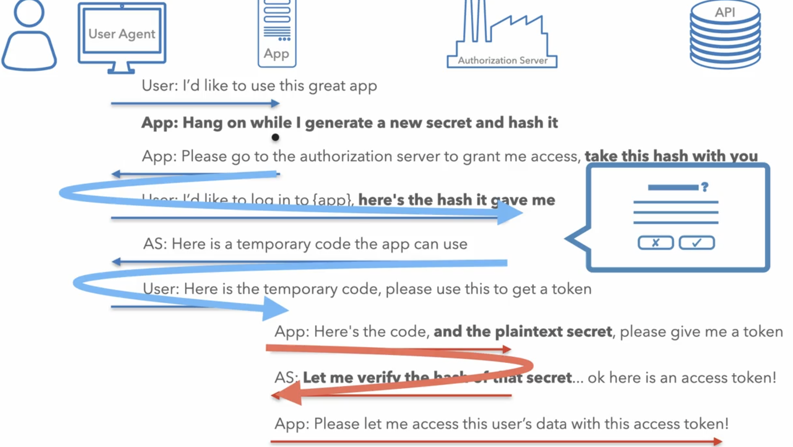

This is part2 of The nuts and bolts of oauth2.0, continuing [part1](https://balashekhar-blog.netlify.app/blogs/oauth2-nuts-and-bolts/oauth2-nuts-and-bolts-p1/). In this section we will OAuth for server-side apps, native apps, single-page apps and Internet of Things.

Ok! let'z go..

 <!--more-->

## OAuth for Server-side Applications

#### 1. <u>Registrating an application</u>
The first step in the OAuth flow is to register your application with the OAuth server. Which is basically providing the basic app infomation like 
- App name
- Description 
- Logo
- Terms of services/privacy policy URL's
- Application Type (e.g., web, mobile, SPA)
- Redirect URI

The exact requirements depends on OAuth server provider, but basically above is the info you needs to enter.

The `Redirect URI` is particularly important, it tells OAuth server where to send code after user grant consent. This will enure security, you should also avoid using wildcards or parital matchings as these open the door to redirect attacks and token leakage. 

Also in case of public client we know that specifying redirectURI is very crutical and helps us a lot, if you had read part1.

Once you register the app, OAuth server will issue `ClientID` and `ClientSecret` for your app (depending on the type of app).

#### 2. <u>Authorization Code Flow for Web Applications (with PKCE)</u>
Ok, let's see how OAuth flow goes in case of server side web-apps, Once you register your application at the Oauth server you will get Client ID and Client Secret to start the flow. (see part1 of this series)

**Overview**

Below is overview of the flow: 


1. The user initiates the flow. The application server generates a secret called a `code verifier`, hashes it into a `code challenge`, and redirects the user to the Auth Server with this challenge and metadata (client ID, redirect URI, etc.).
2. The user authenticates at the Auth Server and provide consent to share data with application. The Auth Server then returns an `authorization code` to the application via the front channel.
3. The application exchanges the authorization code through a back channel to token endpoint. This request includes:
   - Authorization code
   - Client ID
   - Client secret
   - Code verifier, etc
4. The Auth Server validates that the `code verifier` matches the original code challenge, confirming the request originates from same client that initiated the flow.
5. Upon successful verification, Auth Server issues an `access token` (and optionally a refresh token).

note: `PKCE(Proof Key for Code Exchange) code flow` is recommend even for server-side applications to avoid risks like `Authorization code injection` (where attacker sneaks their own login authorization code into the process, so the app ends up logging in the attacker instead of the real user)

**Flow with Example**

Step 1. Authorization Request
The client generates: 
- `code_verifier`: high-entropy random string (43–128 chars).
```sh
4A6hBupTkatbaSq29ReSERtinDeiownvV1safdla
```
- `code_challenge`

```sh
base64url(sha256(code_verifier))
ipSPt30y47140NGbljo26cdwlEQWqkjslereiE323
```

Client redirects the user to the Auth Server:
```sh
GET https://authorization-server.com/auth?
    response_type=code&
    client_id=CLIENT_ID&
    redirect_uri=https://example-app.com/redirect&
    scope=photos&
    state=xyz123&
    code_challenge=ipSPt30y47140NGbljo26cdwlEQWqkjslereiE323&
    code_challenge_method=S256
```
- response_type => authorization code flow
- state =>  originally used for PKCE, but can you for app state, if no PKCE support make it a random value, this also protects CSRF attacks

Step 2. User Authentication & Consent
- The user signs in and approves access.
- On success, the Auth Server redirects:
```sh
https://example-app.com/redirect?
    code=AUTH_CODE_HERE&
    state=xyz123
```
- On error:
```sh
https://example-app.com/redirect?
    error=access_denied&
    state=xyz123
```
The client must verify the returned state to prevent CSRF.

Step 3. Token Exchange
The client exchanges the authorization code for tokens via back-channel:

```sh
POST https://authorization-server.com/token
Content-Type: application/x-www-form-urlencoded

grant_type=authorization_code&
code=AUTH_CODE_HERE&
redirect_uri=https://example-app.com/redirect&
client_id=CLIENT_ID&
client_secret=CLIENT_SECRET&
code_verifier=4A6hBupTkatbaSq29ReSERtinDeiownvV1safdla

```

Step 4. Token Response
If valid, the Auth Server responds:

```sh
{
  "token_type": "Bearer",
  "access_token": "RsTdsajkl354985",
  "expires_in": 3600,
  "scope": "photos",
  "refresh_token": "H4HADSABVC2408"
}
```

Step 5. Refresh Token Flow
```sh
POST https://authorization-server.com/token
Content-Type: application/x-www-form-urlencoded

grant_type=refresh_token&
refresh_token=H4HADSABVC2408&
client_id=CLIENT_ID&
client_secret=CLIENT_SECRET

```

If the refresh token is invalid or user revoked access, account deleted, app removed, the client must restart the full OAuth flow.

note: Even if the Auth Server doesn’t enforce PKCE, clients can still send `code_challenge` and `code_verifier`. Non-supporting servers will simply ignore them.
 
---

## Authorization Code Flow for Native Apps

#### 1. <u>Security Concerns in Native Apps</u>
In mobile apps, OAuth flows come with some extra headaches along no way to deploy client secret problems. For ex, apps don’t usually have a proper redirect URI with a verified domain, so they often rely on `custom URL schemes`. The problem is, these aren’t unique that means any app can register same scheme and potentially intercept the redirect. `Deep linking` with HTTPS (like `iOS Universal Links` or `Android App Links`) is a step up since it ties back to a real domain, but it’s still not bulletproof. All of this makes the attack surface larger, which is why PKCE becomes super important in mobile OAuth flows. Even if an attacker somehow gets authorization code, they can’t exchange it without the original code_verifier

#### 2. <u>User Experience Trade-offs</u>
The UX side isn’t perfect either. The classic flow requires an app switch: your app switches user to system browser, they log in, then comes back safe but not good. Some apps try to “fix” this with `embedded web views`, but that’s risky. These aren’t real browsers (no address bar, no clear identity of the auth server, no cookie sharing), and in the worst case the host app could sniff credentials. This adds both security risks and friction (users have to log in again even if they’re already signed in on the real browser). A better way is using system browser components like `iOS SFSafariViewController` or `Android Chrome Custom Tabs`. With these, users stay inside the app context, cookies are shared with the actual browser, and the app itself never gets direct access to passwords typed. Still, OAuth on native apps always needs extra carefulness to balance security and UX.

#### 3. <u>Flow with Example</u>

1. App generates `code_verifier` → derives `code_challenge`.
2. User redirected to system browser with:
    
    ```sh
    GET https://authorization-server.com/auth?
    response_type=code&
    client_id=CLIENT_ID&
    redirect_uri=myapp://callback&
    code_challenge=XXXX&
    code_challenge_method=S256
    
    ```
    
3. User logs in on the Authorization Server → on `iOS SFSafariViewController` or `Android Chrome Custom Tabs` 
4. App exchanges the authorization code for tokens:
    
    ```sh
    POST https://authorization-server.com/token?
      grant_type=authorization_code
      code=AUTH_CODE
      redirect_uri=myapp://callback
      code_verifier=ORIGINAL_CODE_VERIFIER
      client_id=CLIENT_ID
    
    ```
    
    *(no client_secret, since it’s a public client)*
    
5. Auth server verifies `code_verifier` → returns access token (and refresh token).

note: PKCE replaces the client secret in native apps, and secure redirect handling (deep links + system browsers) is what makes the flow safe.


#### 4. <u>Refresh Tokens in Native Apps</u>

In mobile apps, the OAuth flow is more expensive than on web, you have to switch apps, open the browser, log in, and then come back. To reduce this friction, refresh tokens are extremely helpful. If the Authorization Server issues them, app can silently get a new access token without forcing the user through the whole login flow again. This enables a much smoother UX, app can simply check for refresh token (after unlocking `secure storage` with FaceID/TouchID) and exchange it in the background, making the login feel seamless.

But refresh tokens are also sensitive assets. If a refresh token leaks, an attacker can directly get new access tokens as app is public client. That’s why mobile apps must store them in secure storage (e.g., `iOS Keychain` or `Android Keystore`). Never keep them in plain storage or local files. With proper handling, refresh tokens helps a lot.

---

## Authorization Code Flow for Single Page apps

#### 1. <u>Limitations in SPAs</u>

SPAs (browser-based apps) face challenges very similar to native apps because they’re also considered public clients(so PKCE helps here too) as it’s not safe to embed or store a client secret. On top of that, browsers are naturally more vulnerable to attacks. For ex: a successful XSS attack lets malicious code run inside the app just like the real app code, giving the attacker access to tokens. Developers can mitigate this with Content Security Policies (CSP) that is only allow javascript run from verified domains, but that often means blocking or restricting third-party js, which is hard since most apps rely heavily on external libraries. Even if developers are careful, browser extensions installed by users can inject scripts too, making the attack surface bigger.

Another problem browsers don’t provide a true secure storage API like mobile platforms do. Tokens stored in localStorage, sessionStorage, or cookies are all vulnerable to theft. Because of this, most OAuth Servers apply tight policies for SPAs, such as issuing short-lived access tokens, not providing long-lived refresh tokens, or allowing one-time tokens etc etc.

-> <i>Auth flow is exactly same with native apps as both are public clients.</i>

#### 2. <u>Challenges of storing token sefely in browser</u>

Browsers don’t give us a truly secure storage option. Common approaches all have drawbacks:

- **LocalStorage** → persists across sessions, but any JS running on your domain (including injected scripts via XSS) can read it.
- **SessionStorage** → scoped per tab, but still exposed to XSS.
- **Cookies** → good for automatic sending, but risky if not `HttpOnly`/`Secure`/`SameSite`, and still vulnerable to XSS/CSRF depending on config.

**Possible Approaches**

1. In-Memory Storage
    - Store tokens in JS memory only.
    - Pros: Not persisted → safer against XSS.
    - Cons: Lost on refresh or tab switch → no persistence across sessions.
2. Service Worker as a Token Holder
    - Keep tokens inside a Service Worker.
    - App JS asks the Service Worker to make API calls, instead of handling tokens directly.
    - Pros: Tokens are out of reach from page JS → reduced XSS exposure.
    - Cons: If an attacker can talk to the Service Worker, they can also trigger requests on their behalf.
3. WebCrypto API (Encrypted Storage)
    - Generate a private key via WebCrypto, encrypt tokens before storing.
    - Private key cannot be directly extracted.
    - Pros: Even if storage is dumped, attacker only sees ciphertext.
    - Cons: A sophisticated attacker can still ask the browser to decrypt using the key (so it protects against passive theft, not active attacks).

So, the only way tokens to ensure token's can't be stolen from Js apps, is to not give them in the first place.
Let's see how

#### 3. <u>Don’t Give Tokens to the Browser</u>

Instead of the SPA handling OAuth tokens directly:

1. Flow in backend
    - The browser delegates the OAuth flow to a **backend service** (your app’s server).
    - The backend (e.g., .NET, Java, Node) acts as the OAuth client, exchanges codes, and stores tokens securely on the server.
2. HttpOnly Session Cookie
    - The backend establishes a session with the browser using an **HttpOnly, Secure cookie**.
    - Since JS cannot access HttpOnly cookies, tokens can’t be stolen by XSS.
3. API Calls via Backend Proxy
    - The SPA never talks to the external API directly.
    - Instead, it calls its own backend, which injects the access token server-side.
4. Public → Confidential Client
    - With this setup, your SPA is no longer a **public client** (which can’t safely store secrets).
    - The backend effectively makes it a **confidential client**, fully aligned with OAuth specs.

 note: If you’re serving a static SPA from something like AWS S3 + CloudFront, you’d need to add a backend service (e.g., API Gateway + Lambda) to support this model.


---

## Authorization Code Flow for Internet of Things

Ever tried logging in on a TV, game console, or some IoT device with just a remote or limited keyboard? Typing usernames and passwords there is painful. That’s where the `OAuth Device Flow` comes in, it lets the device authenticate without requiring direct credential entry.

#### 1. <u>Flow Overview</u>

1. Device asks for login → The IoT device shows a screen like:
    
    ```shell
    Go to https://auth.example.com/device
    and enter code: ABCD-1234
    
    ```
    
2. User authenticates elsewhere → On their phone or laptop, the user visits the URL, logs in, and enters the code.
3. Meanwhile, the IoT device keeps **polling the Authorization Server** with the device code, waiting for success.
4. Once the user approves on their phone, the Authorization Server returns tokens to the device, allowing it to access APIs on behalf of the user.

notes:
- Not all OAuth servers support Device Flow and you can still support it by running a **proxy OAuth server**, which implements Device Flow and bridges to a standard OAuth server behind the scenes.
- `Device Flow` is part of the OAuth 2.0 spec (RFC 8628).

#### 2. <u>Flow with Example</u>

1. Device make /auth request:
    - Sends `client_id` (+ optional scopes) to `/device_authorization` endpoint.
    - Gets back:
        - `device_code` → long code, used by device to poll.
        - `user_code` → short code, user enters on another device.
        - `verification_uri` → URL user should visit.
        - `interval`, `expires_in` → polling info.
2. Device displays message:
    - “Go to `example.com/device` and enter code `ABCD-1234`.”
3. User login and approve:
    - Opens `example.com/device`, enters **user_code**.
    - Proceeds with normal login (password, MFA, etc.).
    - Approves device access request.
4. Device Polling:
    - Repeatedly calls token endpoint with **device_code**.
    - Waits until user finishes login + approves.
5. Device gets access token:
    - Returns **access_token** (and usually **refresh_token**).
    - Device now calls APIs without needing user credentials.

---

That’s all from part2… see yaa 👋
