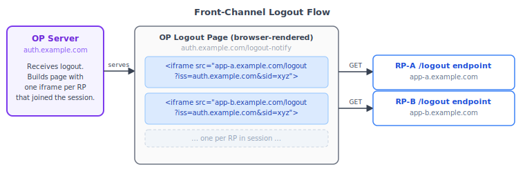
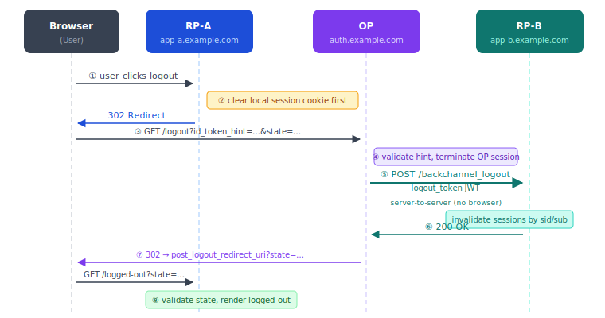
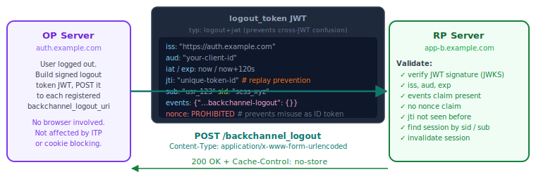

Everyone mostly understands the OIDC login flow correct. It's simple and staight-forward, you do the authorization code flow, validate the ID Token, set a session cookie, and done. Logout is where things becomes a bit complex and they usually happen silently.<!--more-->

The problem isn't that logout is conceptually hard. It's that OIDC login is a single redirect flow with one spec governing it. But Logout is distributed state invalidation problem spreaded across *four separate specs*, each with different transport mechanisms, different reliability profiles, and different ways to fail quietly in production.

Most engineers implement one logout flow, test it, deploy it, and move on. In testing, everything appears to work. In production, things can look different. Users may remain logged in to applications they believe they exited. Sometimes these problems only surface during security review or audit.

# Three Sessions, One Logout

Before looking at the specs, it helps to understand what "logout" actually means in OIDC. There are three distinct layers of session state, and clearing one doesn't clear the others.

**RP local session**: the cookie or token your app issued after login. Clearing this logs the user out of your app, but the OP still considers them authenticated.

**OP session**: the browser session at the OpenID Provider (Google, Okta, your corporate IdP). This is what `prompt=none` checks, if this session is alive, any RP can silently get fresh tokens without the user doing anything.

**Federated SSO session**: This is conceptual link across all RPs that participated in the same login event. When user logs out of App A, apps B and C in the same SSO environment should also log them out. This is the hardest part.

A logout button that only clears the RP local session is incomplete. The user clicks logout, gets redirected to a login page, and is immediately authenticated again through prompt=none. They land back in the app they just left.

From the user’s perspective, the logout button did nothing. `:(`

<div style="text-align: center;">
<pre>
┌─────────────────────────────────────────────────────────┐
│                  Federated SSO Session                  │
│  ┌──────────────────────────────────────────────────┐   │
│  │                   OP Session                     │   │
│  │  ┌─────────────┐   ┌─────────────┐               │   │
│  │  │  RP-A Local │   │  RP-B Local │  ...          │   │
│  │  │   Session   │   │   Session   │               │   │
│  │  └─────────────┘   └─────────────┘               │   │
│  └──────────────────────────────────────────────────┘   │
└─────────────────────────────────────────────────────────┘
</pre>
</div>

Complete logout means clearing all three layers. That's why there are four specs.

# The Four Specs

[OIDC Core](https://openid.net/specs/openid-connect-core-1_0.html) doesn't define logout. It gives you `auth_time`, `prompt=none`, and the `sub` claim. Everything else is in separate documents that most OIDC libraries treat as optional:

| Spec | Mechanism | Transport | Reliable in modern browsers? |
|------|-----------|-----------|------------------------------|
| [Session Management 1.0](https://openid.net/specs/openid-connect-session-1_0.html) | iframe polling via `postMessage` | Browser (third-party iframe) | No |
| [Front-Channel Logout 1.0](https://openid.net/specs/openid-connect-frontchannel-1_0.html) | OP renders logout iframes | Browser (third-party iframe) | Unreliable |
| [RP-Initiated Logout 1.0](https://openid.net/specs/openid-connect-rpinitiated-1_0.html) | Redirect to OP logout endpoint | Browser redirect | Yes |
| [Back-Channel Logout 1.0](https://openid.net/specs/openid-connect-backchannel-1_0.html) | OP posts signed JWT to RP | Server-to-server | Yes |

The two browser based mechanisms (session management and front-channel) are unreliable by browser privacy changes over the past few years. 

Back-channel logout avoids this entirely by using server-to-server communication, which is why it tends to work more reliably in practice. We'll look at each mechanism in detail.

---

## 1. Session Management (The Iframe way)

The session management specs was designed to answer a specific question: how can an RP know when the user's OP session ends, without polling the OP server constantly?

The answer: `iframes` and `postMessage`.

**Steps**:
1. The OP publishes a `check_session_iframe` endpoint (via OIDC discovery). The RP embeds this endpoint in a hidden iframe. On some intervals, the RP's own iframe sends a message to the OP iframe:

```
postMessage("client_id session_state", op_origin)
```

2. The OP iframe responds with one of three strings: `"unchanged"`, `"changed"`, or `"error"`.
    - `session_state` is an opaque value the OP included in the original authentication response. It's a salted hash of the client ID, the RP's origin URL, and the OP's current browser state (typically a cookie or localStorage entry).
    - The OP iframe recalculates this hash from its own storage and compares it to what the RP sent. If the OP's browser state has changed (logout, different user, re-authentication), the hash won't match and it returns `"changed"`.

3. When the RP receives `"changed"`, it sends a silent authorization request using `prompt=none` in another hidden iframe. If the OP session is gone, the OP returns `login_required`, and the RP can clear its local session.

On paper, this is looks good. In practice, it's broken for a large portion of your users.

### a. Why this Fails ?

Session Management relies on OP iframe reading browser storage (cookies or `localStorage`) to compute `session_state`. This storage **cannot be `HttpOnly`** because JavaScript inside the iframe must access it.

Modern browsers treat the OP iframe as **third-party content** when it is embedded inside an RP page.

* [Firefox 103+](https://developer.mozilla.org/en-US/docs/Web/Privacy/State_Partitioning) enables **Total Cookie Protection**, which partitions storage by both the resource origin and the top-level site.
* Safari has similar protections through Intelligent Tracking Prevention.

Because of this, the OP iframe running in `app1.example.com` sees a **different storage bucket** than the same iframe inside `app2.example.com`. It cannot see the OP’s real session state.

So, the OP often returns `"changed"` on every poll. The RP triggers `prompt=none`, gets new tokens, updates `session_state`, and then the cycle repeats. This can create an **infinite loop**.

>note: the spec itself notes that browser tracking protections may break this. In practice, if you implement polling, you should detect repeated `"changed"` responses and **stop polling**.

### b. 'prompt=none' and the Silent Auth Loop

`prompt=none` tells the OP: complete this authorization request without showing any UI. If you can't do that, return an error.

You'll use this it in two places. 
- First, when RP wants to know "what actually changed?" after session management polling returns `"changed"`. 
- Second, when RP wants to silently extend sessions or check authentication state without forcing the user to interact.

The error codes the OP can return:

- `login_required`: the OP session is gone, user must authenticate
- `interaction_required`: the OP needs user interaction for something (step-up, re-consent)
- `consent_required`: the user hasn't consented to the requested scopes
- `account_selection_required`: the user has multiple accounts and must pick one

The most common implementation bug happens when an app receives `login_required` and immediately redirects the user back to login page while the local app session is still active. This often results in "ping-pong" effect between the app and the provider.

The correct way of handling `login_required` is:

1. Clear the RP local session
2. Decide whether to redirect to login proactively or just render a "session ended" state
3. Do not immediately redirect to `prompt=none` again.

---

## 2. Front-Channel Logout: Silent Failures at Scale

Front-channel logout is how the OP notifies other RPs after an RP-initiated (or OP-initiated) logout.

The OP renders a page containing a set of iframes, one per RP that participated in the session, and each RP's logout endpoint receives this GET request and clears its local session.

```html
<iframe src="https://app-a.example.com/logout?iss=https://op.example.com&sid=abc123"></iframe>
<iframe src="https://app-b.example.com/logout?iss=https://op.example.com&sid=abc123"></iframe>
```

The `iss` and `sid` query parameters are optional but linked: if either one is present, both must be present. The RP can use them to validate the request against the `sid` stored at login time.

But the problem is what "clear the session" means. If the session is tracked by server-side session ID in a cookie, clearing it requires the RP's endpoint to `Set-Cookie` with an expired or empty value in the response. That will works, the browser processes `Set-Cookie` headers regardless of third-party context.

But if your RP stores any session state in `localStorage`, `sessionStorage`, or any JavaScript accessible storage, clearing it requires JavaScript to run in iframe context. That's where **third-party storage partitioning** bites you again.(i.e, JS in iframe can't see the same storage bucket with actual tab user using). In this case, the failure is silent and RP endpoint responds 200 but user is still logged in their own tab.



The spec's guides: "include defensive code to detect this situation, and if possible, notify the End-User that the requested RP logouts could not be performed." (but mostly nobody does this).

**When front-channel is acceptable:** server rendered applications that manage session state purely through server-side sessions and HttpOnly cookies. The `Set-Cookie: session_id=; Max-Age=0` response in the iframe header is enough.

**When it's not acceptable:** SPAs or any app that manages session state in JavaScript-accessible storage. Treat front-channel as a best-effort notification, not a reliable logout mechanism.

---

## 3. RP-Initiated Logout (redirect to OP via frontchannel)

This one works and reliable in modern browsers. In this Flow RP redirects the user's browser to the OP's `end_session_endpoint` (published in the OIDC discovery document at `/.well-known/openid-configuration`).

```
GET https://op.example.com/logout
  ?id_token_hint=eyJ...
  &post_logout_redirect_uri=https://app.example.com/logged-out
  &state=opaque_value
  &client_id=your-client-id
```

The OP logs out the user, by notifying the other RPs (via front or back channel, if configured), and redirects to `post_logout_redirect_uri`.

Here are some edge cases:

- **`id_token_hint` is RECOMMENDED, not required.** the spec says that if it's absent, the OP "should obtain explicit confirmation from the End-User before acting upon" the request (like confirmation dialog). It also opens a denial-of-service vector: anyone can hit your OP's logout endpoint and prompt users to confirm a logout they didn't initiate. Always include `id_token_hint`. But to acheive this RP should also need to store ID tokens.

- **Expired ID Tokens are fine here.** The OP must accept them as hint even if `exp` has passed. The token is just identifying the user and session, not authorizing anything.

- **`post_logout_redirect_uri` must exactly match pre-registered URI.** The OP will not perform the redirect if it doesn't. No prefix matching, no wildcard. Register every URI you need at client registration time.

- **Include `state`.** The OP passes it back as a query parameter when redirecting to `post_logout_redirect_uri`. Use it to verify the response came from the logout request you initiated, not from a cross-site redirect.

- **Clear your local session before redirecting to the OP.** Don't wait for the redirect to complete. If anything goes wrong mid-flow, you don't want the user's local session still alive.

The sequence matters:



Steps ⑤ and ⑥ happen before the user sees anything at the RP's logged-out page. By the time the redirect lands, other RPs should already have been notified.

---

## 4. Back-Channel Logout (server-to-server)

Back-channel logout is server-to-server communication. The OP sends HTTP POST to your RP's registered `backchannel_logout_uri` with a signed JWT called a **logout token**. No browser involved, no third-party cookie problems, just a simple system call!.



### Logout Token claims

The logout token is a JWT. It must be signed (using the same keys as ID Tokens), and the OP should include a `typ: logout+jwt` header to prevent cross-JWT confusion attacks.

Required claims:

| Claim | Description |
|-------|-------------|
| `iss` | Issuer — must match the OP's issuer identifier |
| `aud` | Audience — must include your client ID |
| `iat` | Issued at |
| `exp` | Expiration — spec recommends ≤ 2 minutes |
| `jti` | Unique token ID — required for replay prevention |
| `events` | JSON object containing the key `http://schemas.openid.net/event/backchannel-logout` |
| `sub` or `sid` | At least one must be present; both may be present |

One explicit exceptiion is that **`nonce` must not be present** in logout tokens. This is to prevent logout token being misused as ID Token in replay attack.

The `events` claim looks like this:

```json
{
  "events": {
    "http://schemas.openid.net/event/backchannel-logout": {}
  }
}
```

The value is an empty JSON object. Its presence is what matters.

### The `sid` claim

`sid` is a unique identifier for the user’s session at the OP. It is issued in the ID Token during login, and the RP should store it together with the user's local session.

```json
{
  "iss": "https://op.example.com",
  "sub": "248289761001",
  "aud": "client123",
  "sid": "08a5019c-17e1-4977-8f42-65a12843ea02"
}
```

When user log-out at the OP, the OP sends logout token to each RP with backchannel request, RP finds the session with that `sid` and terminates it. But if your RP never stored `sid` at login time, you have no way to find which local session to terminate.

`sid` is not in OIDC Core. It's defined in the [logout specs](https://openid.net/specs/openid-connect-backchannel-1_0.html). An RP that was built without thinking about back-channel logout never asked the OP for it, and even if the OP included it in the ID Token, the RP probably discarded it.

Fix this at login time:

```ruby
# When you create the local session after validating the ID token:
session = Session.create!(
  user_id:    id_token.sub,
  issuer:     id_token.iss,
  op_sid:     id_token.sid,      # store this — you'll need it for back-channel logout
  created_at: Time.now
)
```

Then index on `(iss, sid)` so the lookup is fast when the logout token arrives.

### Logout Token Validation

Your `backchannel_logout_uri` endpoint needs to do all of this before touching session state:

```ruby
def handle_backchannel_logout
  raw_token = request.body.read

  # 1. Parse and verify signature against OP's JWKS
  token = JWT.decode(raw_token, jwks: op_jwks, algorithms: ["RS256"])
  claims = token.first

  # 2. Validate standard claims
  raise "wrong issuer"   unless claims["iss"] == EXPECTED_ISSUER
  raise "wrong audience" unless Array(claims["aud"]).include?(CLIENT_ID)
  raise "token expired"  if Time.now.to_i > claims["exp"]

  # 3. Check the events claim
  events = claims["events"] || {}
  unless events.key?("http://schemas.openid.net/event/backchannel-logout")
    raise "not a logout token"
  end

  # 4. nonce must not be present
  raise "invalid logout token" if claims.key?("nonce")

  # 5. Replay prevention — jti must not have been seen before
  jti = claims["jti"]
  raise "replayed token" if JtiStore.seen?(jti)
  JtiStore.mark_seen(jti, ttl: claims["exp"] - claims["iat"])

  # 6. Find and terminate the session
  sid = claims["sid"]
  sub = claims["sub"]

  sessions = if sid
    Session.where(issuer: claims["iss"], op_sid: sid)
  else
    Session.where(issuer: claims["iss"], user_id: sub)
  end

  sessions.each(&:invalidate!)

  render status: 200, json: {}
rescue => e
  render status: 400, json: { error: e.message }
end
```

The return response is also strict: **HTTP 200** on success, **HTTP 400** on failure. Always include `Cache-Control: no-store`.

For replay prevention, a Redis key with TTL works well. The minimum TTL you need to cache a `jti` is the token's lifetime (`exp - iat`, spec recommends ≤ 2 minutes).

---

# What a Production Logout Flow Looks Like

The minimum logout implementation:

1. **RP-Initiated Logout**: always. Clear local session first, then redirect to `end_session_endpoint` with `id_token_hint` and `state`.
2. **Back-Channel Logout handler**: always. Register a `backchannel_logout_uri` and implement the validation above. This is how the OP notifies you when someone else initiates the logout.

Front-channel and session management polling are optional and not reliable in modern browsers. Add them if your OP supports them, but treat them as best-effort supplements, not the primary mechanism.

### At Login: What to Store

Before anything else works, you need to capture the right claims when you receive the ID Token:

```
sub   - user identifier (in OIDC Core, you already store this)
iss   - issuer (needed to scope sid lookups correctly)
sid   - session ID (NOT in OIDC Core — from the logout specs)
```

If your OP doesn't include `sid` in the ID Token, check whether it supports back-channel logout and whether it includes `sid` in logout tokens only via `sub`. If the OP always sends `sub` in logout tokens, you can match on that alone. But the spec permits `sid` only tokens, so the safest approach is to store both.

### The Order of Operations

When the user clicks logout in your app:

1. Clear the local session immediately (before the redirect, not after)
2. Redirect to `end_session_endpoint` with `id_token_hint`, `post_logout_redirect_uri`, and `state`
3. OP terminates its session and notifies other RPs
4. OP redirects back to your `post_logout_redirect_uri`
5. Validate the returned `state`, render the logged-out page

For incoming back-channel logout (another RP or the OP initiated logout):

1. Receive POST to `backchannel_logout_uri`
2. Validate the logout token (sig, aud, iss, exp, jti replay, events claim)
3. Look up local session(s) by `sid` and/or `sub`
4. Invalidate them
5. Respond 200 with `Cache-Control: no-store`

Don't do anything else in that endpoint. Don't send emails, don't kick off background jobs that take more than a few hundred milliseconds. The OP is waiting on your 200 before it continues its logout sequence.

---

# Conclusion

Logout is annoying to implement correct, because the failure modes are invisible. A user who stays logged in after clicking logout rarely files a bug report. The session management iframe quietly loops. The front-channel iframe fires and returns 200 while leaving session state intact. Back-channel requests fail with 400 and the OP retries or gives up silently.

Beign said that backchannel logout is straightforward once you understand it, and it's the only mechanism that respects the browser privacy issues entirely. Build your logout stack around it, treat everything else as a supplement, and store `sid` at login. Everything else follows from there. 

Good luck!! Logging out here!!!
