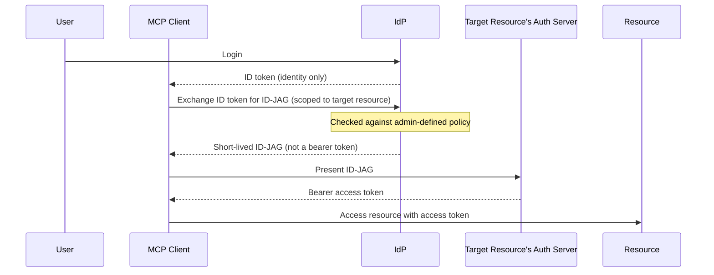

Enterprise IAM assumes whoever's on the other end of a login is a human. AI agents break that assumption, not with some clever new attack, but by walking straight through shortcuts we've always taken: screen-level permissions instead of API-level ones, one consent prompt per app, identity lifecycles tied to HR events instead of agent lifecycles.<!--more-->

**[OpenID TechNight vol.23 ~ AI x API x Enterprise](https://openid.connpass.com/event/391821/)**, organized by [nov-san](https://x.com/nov) of OpenID Foundation Japan, spent three talks on exactly that gap, and what different company teams are doing about it.

<iframe width="100%" height="400" src="https://www.youtube.com/embed/ZU6-lUxLtWU" title="OpenID TechNight vol.23 live recording" frameborder="0" allow="accelerometer; autoplay; clipboard-write; encrypted-media; gyroscope; picture-in-picture; web-share" referrerpolicy="strict-origin-when-cross-origin" allowfullscreen></iframe>

**Speakers:** Takayuki Komatsu (SoftBank), Terara (freee), Keiko Itakura (Okta Japan)

---

## Talk 1: The authorization cliff when enterprise IT rolls out MCP

slides: https://speakerdeck.com/oidfj/20260525-openid-technight-vol23-01 · Komatsu-san (SoftBank)

OAuth-based authorization landed in [MCP](https://modelcontextprotocol.io/) in March 2025 and has already been revised twice; the next release (targeting **July 28, 2026**) pushes toward a more stateless design. Worth flagging: [RFC 9207](https://datatracker.ietf.org/doc/html/rfc9207) (Authorization Server Issuer Identification) is now recommended, since MCP clients talk to many servers and IdPs at once and can otherwise get tricked into sending a token meant for server A to server B.

The OpenID Foundation's whitepaper (Oct 2025) recommends:

- Give AI agents their own identities, not human impersonation
- Model agent access as **delegation** of a person's authority
- Deprovision agent identities the moment they stop being used
- Keep it governed and auditable

Easy to agree with, harder to build: most enterprise permissions are still tied to screens, not APIs:

```text
Sales User
   ✓ Customer Screen        (legacy: UI-level grant)

vs.

read:customer
create:invoice             (needed: API-level grant)
```

A single screen bundles several data fields together, so mapping that to MCP scopes means breaking resources down far smaller than the system was built for. Building this in practice hits four blockers:

1. **Protocol compliance.** Most enterprise IdPs speak SAML or plain OIDC, not OAuth 2.1. [DCR](/blogs/oauth2-dynamic-client-registration) and metadata endpoints help, but you still choose between a dedicated AI authorization server or reusing the corporate one, while AI tooling moves in weeks and enterprise identity moves in quarters.
2. **Workload identity per agent.** Every agent needs its own identity. Same shadow-SaaS problem as before, just with agents instead of apps: build governance, win departments over, absorb shadow usage gradually.
3. **Permission detail.** Screen-based permissions don't map to API scopes. The target is a Policy Decision Point (a PDP, checked at call time), moving coarse to fine-grained over time.
4. **Local vs. hosted MCP servers.** Local keeps credentials on-device: low risk, low reach. Shared use needs a hosted server, which brings governance questions back. No universal answer.

Komatsu's fix: a dedicated AI-facing authorization server, federated with (not replacing) the existing IdPs. Mirror today's screen-based permissions as the PDP's starting data, begin read-only, expand from there. Shadow AI tools get handled case by case.

---

## Talk 2: Local MCP → Remote MCP - the reality of authorization

slides: https://speakerdeck.com/terara/freee-mcpwo-local-remote-dechu-sitewakatuta-mcpren-ke-shi-zhuang-noriaru · Terara-san (freee)

Talk 1 looked at MCP from inside an enterprise adopting it. Talk 2 is about building a remote MCP server for other companies to connect to, so every governance question Komatsu raised is one Terara has to actually ship. freee-mcp started local for fast validation, then went remote once proven. His framing: local vs. remote isn't a maturity ladder, it's a trade-off in *where responsibility sits*.

```text
Local MCP:   User's machine → Local MCP server → API      (credentials stay local)
Remote MCP:  AI platform / many clients → Vendor-hosted MCP server → Vendor's APIs
```

Going remote doesn't change where the server runs, it changes who owns client trust, redirect URI validation, token boundaries, consent, and audit. Since freee is multi-tenant B2B SaaS, that's another layer of complexity on top.

Five problems came up:

1. **Client trust.** Trusting unknown or dynamically-registered clients, validating redirect URIs, deciding what the consent screen shows, and whether MCP auth shares freee's existing third-party auth platform.
2. **Scope detail.** Cut scopes at business-action level, not per-endpoint: `invoice.create` translates internally into `read:customer`, `read:tax`, `write:invoice`. Too fine and you get prompt fatigue; too coarse and you get over-broad grants.
3. **Reuse the existing permission model.** Don't build a parallel MCP system, extend the one that already handles multi-tenant, contract, and billing state.
4. **Keep token boundaries separate.** Missing MCP scope means the user steps up. Missing API scope but within the granted MCP scope means a silent, short-lived token exchange. A clearly higher-risk action (his example: a money transfer) always forces fresh, explicit re-authorization.
5. **Consent UX through the AI intermediary.** How does a remote server tell a human, through the agent, that it needs consent? Still unsolved industry-wide.

The design checklist Terara actually uses:

- What capability is visible to the end user?
- What's the API's minimum required permission?
- Who's responsible when a scope turns out to be insufficient?
- Is audience restriction or token exchange happening at each hop?
- Can this be explained and audited after the fact?

---

## Talk 3: Cross App Access / ID-JAG - killing consent fatigue at the IdP

Terara's talk ended on an open problem: one global scope model can't fit clients who each want different AI policies. Keiko Itakura (Regional CSO, Okta Japan) picked up a bigger version of it: how do you handle consent once one user is connected to dozens of AI tools? Her answer is [Cross App Access](https://datatracker.ietf.org/doc/draft-ietf-oauth-identity-assertion-authz-grant/), an IETF draft co-authored by Okta and Ping Identity.

Classic OAuth assumes a human reviews one consent screen at a time, an assumption that breaks once agents start doing the connecting:

- **Usability collapses.** Twenty tools means twenty prompts, so fatigue sets in and users click "Allow" without reading, the same failure mode behind MFA-fatigue attacks.
- **Governance disappears.** Every app issuing its own tokens means IT loses visibility into which AI has which data, and forgotten long-lived tokens pile up, especially dangerous during offboarding.

Okta's telemetry backs this up: attacks have shifted from login itself to what happens *after*, session hijacking and **device code phishing**. Register a fake internal-looking app, get someone to approve its consent screen (rendered on the real IdP login page, so nothing looks off), and walk away with delegated access. At the scale of thousands of apps, no user can realistically spot the malicious one. That's a design problem, not a training one.

So the fix is to drop the per-app consent screen. An IT admin sets policy at the IdP, and access is granted automatically once a request clears it. Enterprise data belongs to the company, not the employee, so making the employee "consent" per app was arguably the wrong model to begin with. The user only interacts once, at login; everything after that is policy.

---

## A bit more into ID-JAG

Three terms, cleanly separated:

- **Cross App Access** - the overall framework
- **ID-JAG** (Identity Assertion Authorization Grant) - the grant type, extending existing OAuth token-exchange rather than inventing something new
- **Enterprise Managed Authorization** - the same concept, as an official MCP spec extension

The flow:



### A few things worth knowing

Cross App Access isn't an Okta-only thing, it's an open spec. It uses three separate tokens on purpose (ID token, ID-JAG, access token), which keeps the ID-JAG short-lived and safe to pass around, so resource servers need no new code to support it.

Compared to classic OAuth: no consent screen per request, signed [federation assertions](/blogs/nist-sp-800-63c-4-federation) instead of authorization codes, and a different refresh-token model.

---

## Takeaway

Same fault line runs through all three talks: AI agents force enterprise identity systems to separate concerns that used to be fused together, screen access vs. data access, authentication vs. delegation, "who's allowed" vs. "who's responsible."

- **Talk 1** - rolling out MCP internally means rebuilding workload identity, delegation modeling, and screen-based permissions from scratch
- **Talk 2** - hosting a remote MCP server shifts client trust, token boundaries, and consent design onto you
- **Talk 3** - Cross App Access / ID-JAG replaces per-app consent with IdP-defined policy, aimed at making delegation manageable at agent scale

None of this is fully solved. But the direction holds: design for delegation and granular permissions first, and treat the human login flow as one input to that, not the whole model.
