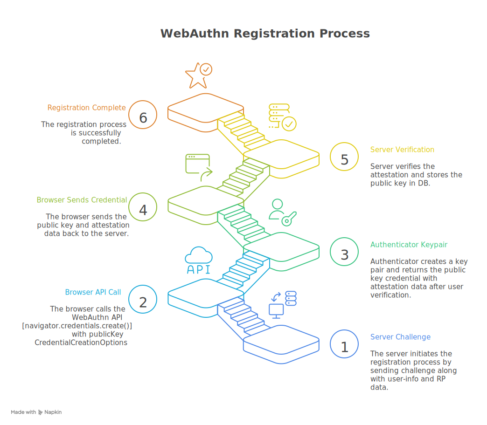
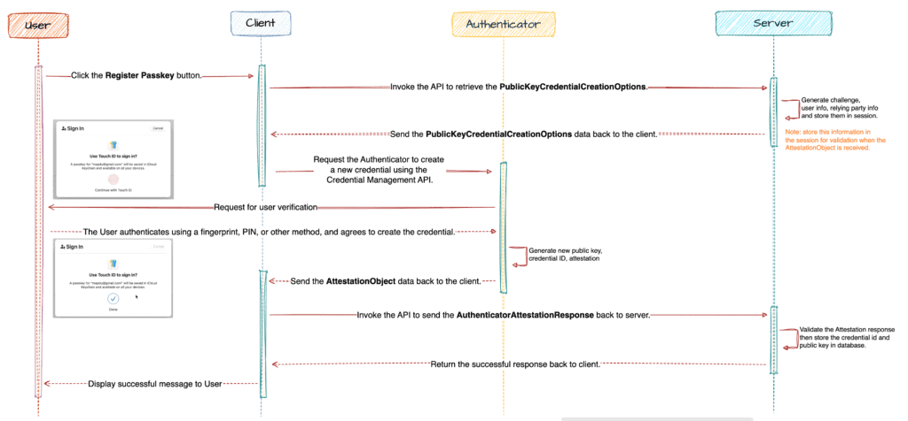
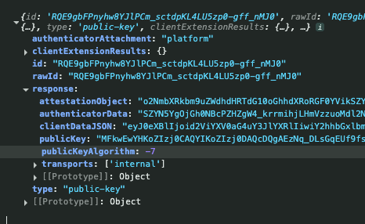
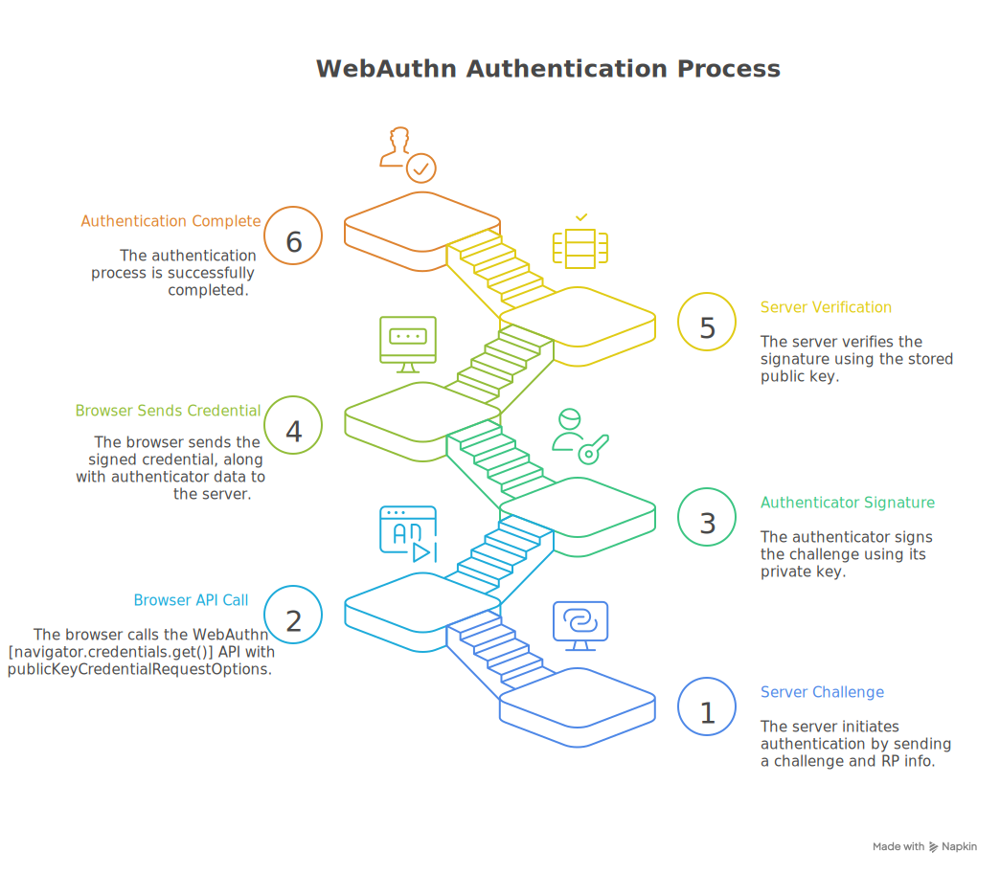
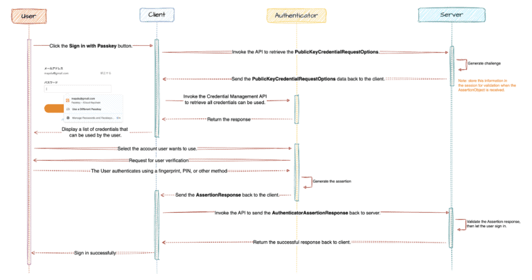
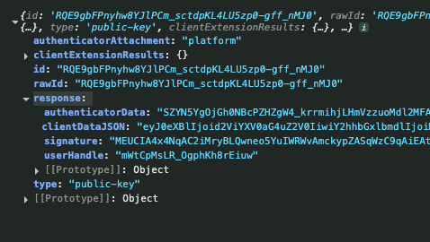
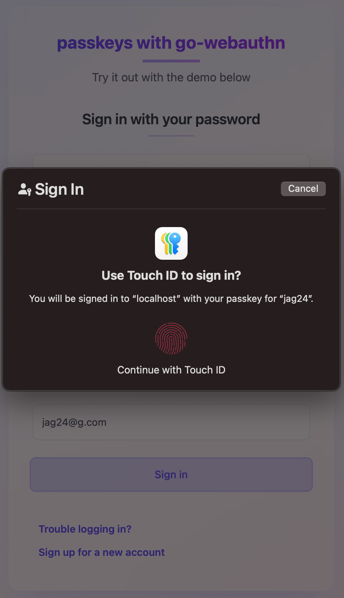
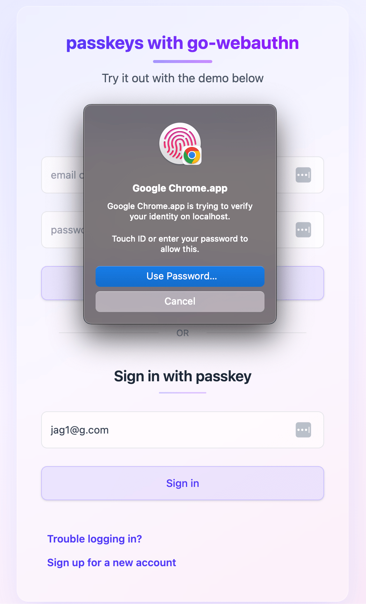
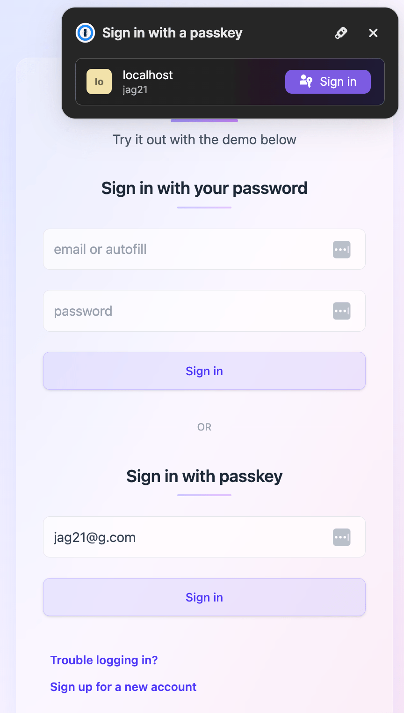
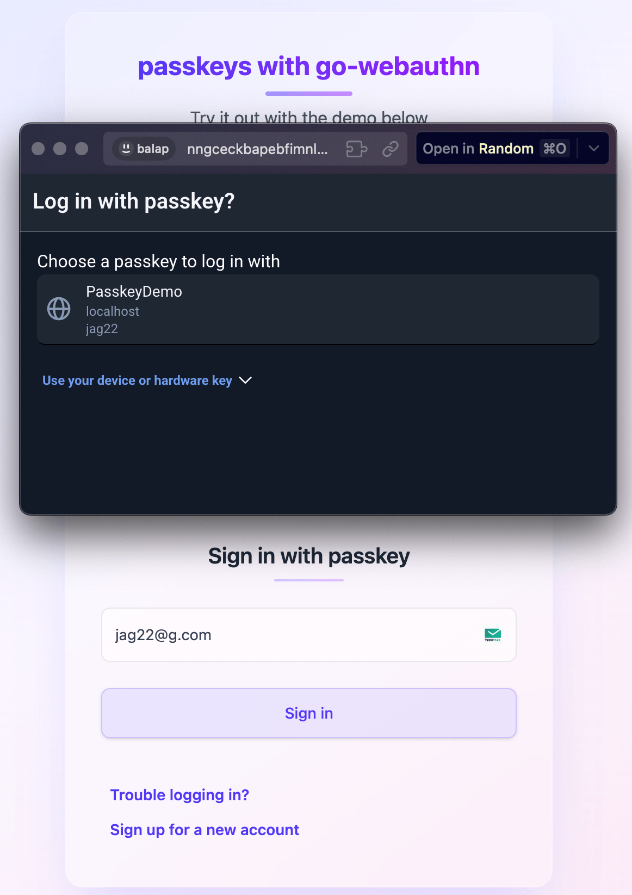

# Intro

In this blog, I’m going to explain what passkeys are and how they came into picture in modern authentication and basic flow of passkey registration and authentication.

Since many services like Apple, Google, GitHub and others have started deploying passkeys, <!--more--> It’s important to understand **what they are, why they exist, and whether you should use them**.


A **passkey** is basically credential (like a password) which you can use to authenticate into server. which is much faster, more secure, and more user-friendly than traditional password authentication.

When I joined **MFID** (an identity service at MoneyForward), one of the milestones on my team’s roadmap was `passwordless authentication`.

And my first reaction was like..

> “Passwordless auth? How can I log in to web server without typing my credentials? Is this magic? Or is the authentication happening somewhere else?”
> 

These questions got me curious, and I had into learning more about passkeys. Eventually, I got hands on experience with integrating and deploying passkeys to production during my early days of my work.

So This blog is to just cover higher level topics of passkeys and things that i learned in this about them.
What i'm gonna cover is:

- What & Why Are Passkeys?
- Why Passkeys Are More Secure Than Passwords
- WebAuth flows (creation and authentication ceremonies)
- Drawbacks of using passkeys
- Conclusion

Ok, let's dive in passkeys...

---

# What & Why Are Passkeys?

A **passkey** (in simple terms, a credential) is a way to authenticate to your account without using password. It uses public-key cryptography to enable secure and seamless login. 

We know the pain points of using password auth both from end-user and server POV.

**From the user’s POV:**
- You need to remember or store them somewhere safe.
- You’re expected to create a *strong* password, but not forget it.
- When logging in, you might not remember whether you signed up with a password or a third-party provider (e.g., “Did I use Google sign-in here?”).
- etc, etc.

**From the server’s POV:**
- Securely hashing and storing passwords in a database.
- Blocking common or leaked credentials.
- Enforcing extra authentication factors (like 2FA) based on risk.
- Implementing rate limiting to prevent brute-force attacks.
- Handling password leakage incidents.
- Adding friction: email → password → 2FA → success.

Passkeys address many of these problems and provide stronger security. Instead of sending a shared secret (like a password) to server, they use **asymmetric cryptography** meaning no plain secrets leave your device to internet and no more worrying of storing passwords securely on DB. (this also makes network and database layers less attractive targets for attackers).

Also with passkeys you no longer need to worry about weak passwords, password resets, remebering type of authencation you used before, no worries of password leakages etc.

---

**Note:**

- The term **"passkey"** is mostly a marketing term popularized by Apple, Google, and other big tech companies. The technical term is **FIDO2/WebAuthn credential** since it’s implemented via the [WebAuthn standard](https://fidoalliance.org/specifications/). So, I sometime switch bw passkeys and webauth credential.
- **WebAuthn** is a web standard that lets websites use public key cryptography for secure, passwordless authentication. It’s part of the **FIDO2 Project**, created by the W3C and the FIDO Alliance. (& with the participation of Google, Apple, Mozilla, Microsoft, Yubico, and others, servers can register and authenticate users using public key cryptography instead of a password).

---

# Why Passkeys Are More Secure Than Passwords

security when it comes to authentication can generally be categorized into three factors:

- **Something you know** → like a password 
- **Something you have** → like an MFA token or your phone
- **Something you are** → like a fingerprint or Face ID

When using a password combined with MFA, you're relying on both "Something you know" (the password) and "Something you have" (the MFA token or device).

Passkeys work differently. They involve a device bound private key (something you have), and access is granted using either a local PIN, fingerprint, or facial recognition (something you know or something you are).

Therefore, you can say that passkeys are much more secure that combined password + 2FA auth (_if implemented correctly_), since it uses **asymmetric cryptography**, private key always stays secure in your device’s secure enclave or TPM and Authentication is done by signing a server challenge locally. The public key stored on the server verifies the signature.

Possible attack scenarios (in case of passkeys):
1. Stealing your private key:
Since the private key never leaves your device, an attacker cannot access it without having your physical device and your unlock method (PIN, fingerprint, etc.).

2. Using intercepted challenges or responses:
Even if an attacker captures the authentication challenge or response, they can’t reuse or forge a valid login because each challenge is unique and only your device’s private key can sign it correctly.

3. Pretending to be the server:
Attackers can’t impersonate the server because your device verifies the server’s identity and the challenge’s legitimacy before signing. Without a valid server challenge, your device won’t respond.

---
**Notes:**
Passkeys stored in the cloud are less secure than device-only passkeys:
- Cloud storage can be targeted if the provider is hacked.
- Data could be intercepted during sync.
- Remote accessibility means more attack surfaces.

---

# WebAuth flows
Password based Authentication flows are simple, The browser collects data via form or some other means and submits to server. And server validates and stores credentials to inititate user session. But in WebAuthn Browser and Authenticator1 plays a crucial role in credential creation and on-device user verification.
Ok with that said let's start with webauthn credential creation and authentication ceremonies.

I will explain both creation and authentication ceremonies using my demo project, so please ref:
https://github.com/baala3/passkeys

## 1. Registering a WebAuthn Credential


### _Typical flow chart_


### a. Init webauthn credential registration
1. User start webauthn credential registration process by submiting the details via sign-up page
   - https://github.com/baala3/passkeys/blob/main/client/src/pages/register.tsx
   - https://github.com/baala3/passkeys/blob/main/client/src/components/form/PasskeySignUp.tsx

### b. Browser calls Backend to get `publicKey` Options 
The browser calls BeginRegistration endpoint for getting the options required to create new credentials with the authenticator.
PublicKey options precisely `publicKeyCredentialCreationOptions` basically an object containing required and optional fields that server specifies to create new credentials with authenticator.

I will explain this object in more detail shortly.

### c. Server responds with `publicKeyCredentialCreationOptions`
Here is how our backend issues publicKey Options.

```go
func (pc *WebAuthnCredentialController) BeginRegistration() echo.HandlerFunc {
	return func(ctx echo.Context) error {
		// step 1: Get the current user (e.g., from session or request context)
		user := pc.getContextBasedUser(ctx)

		// step 2: Define what kind of authenticators we want:
		// - Resident key required (for passwordless login)
		// - User verification required (e.g., biometric/PIN)
		authSelect := protocol.AuthenticatorSelection{
			RequireResidentKey: protocol.ResidentKeyRequired(),
			ResidentKey:        protocol.ResidentKeyRequirementRequired,
			UserVerification:   protocol.VerificationRequired,
		}

		// step 3: Generate the WebAuthn public key options to send to frontend
		// This also creates internal session data used to validate the future response
		options, sessionData := pc.WebAuthnAPI.BeginRegistration(
			user,
			webauthn.WithAuthenticatorSelection(authSelect),
			webauthn.WithExclusions(user.CredentialExcludeList()),
		)

		// step 4:  Save session data so we can validate the response in "FinishRegistration"
		pc.WebAuthnSession.Create(ctx, "registration", sessionData)

		// step 5: Return the public key creation options to the frontend
		// Frontend will use this in navigator.credentials.create()
		return ctx.JSON(http.StatusOK, options)
	}
}
```

This public key object that we receicved from backend should follow
https://developer.mozilla.org/en-US/docs/Web/API/PublicKeyCredentialCreationOptions specifications.

```js
const publicKeyCredentialCreationOptions = {
    challenge: Uint8Array.from(
        randomStringFromServer, c => c.charCodeAt(0)),
    rp: {
        name: "PasskeyDemo",
        id: "localhost",
    },
    user: {
        id: Uint8Array.from(
            "UZSL85T9AFC", c => c.charCodeAt(0)),
        name: "Bala",
        displayName: "Bala",
    },
    pubKeyCredParams: [{alg: -7, type: "public-key"}],
    authenticatorSelection: {
        requireResidentKey: true,
        residentKey: "required"
        userVerification: "required"
    },
    timeout: 60000,
    attestation: "direct"
};

```

I will go through some main key values here, but for details refer the docs
- **attestation**: This tells the browser how the Relying Party wants to get proof that the authenticator is real and trustworthy.
- **authenticatorSelection**:  This lets the RP choose what kind of authenticators (like platform vs cross-platform) are allowed.
   - **residentKey**: If set to "required", the credential must be stored on the authenticator (e.g., security key or device). This enables passwordless login because the device remembers which account it’s for.
   - **userVerification**: Tells whether user verification (e.g., fingerprint, PIN, Face ID) is required.
- **excludeCredentials**: A list of credentials that should be excluded (e.g., already registered). Prevents registering the same device again for the same user.
- **pubKeyCredParams**: Defines which cryptographic algorithms the RP accepts. 
- **rp**: Information about the Relying Party (your service)
- **timeout**: How long the browser should wait for user to complete the operation before it fails.
- **user**: Details about the user registering the credential.

### d. Browser calls `navigator.credentials.create(...)`

```js
const credential = await navigator.credentials.create({
    publicKey: publicKeyCredentialCreationOptions
});
```

This is the core part in our webauthn registraion.

After the frontend receives the `publicKeyCredentialCreationOptions`, it passes this object to the browser's WebAuthn API using [navigator.credentials.create(...)](https://developer.mozilla.org/en-US/docs/Web/API/CredentialsContainer/create)

This triggers the creation of a new credential registration process on authenticator. 

Here's what happens behind the scenes:
- The browser prompts the user to interact with the authenticator (e.g., touch security key, scan fingerprint).
- The authenticator generates a new asymmetric key pair (public-private).
- The public key, along with other data (like attestation, credential ID, and client data), is packaged into a PublicKeyCredential object.
- This PublicKeyCredential is sent to backend to complete registration.



### e. Backend Validates PublicKeyCredential

Once the backend receives the PublicKeyCredential (basically on `FinishRegistration` endpoint)
- First, the server checks `clientDataJSON` to confirm that the credential was created in response to the server’s request, on the correct site, and by the user.
-  It ensures the challenge matches, the origin is correct, and the type is "webauthn.create". Next, it validates the attestationObject, which comes from the authenticator and proves that a real device generated the key.
-  Next, it validates the `attestationObject`, which comes from the authenticator and proves that a real device generated the key. This includes checking the RP ID hash, flags like user presence and verification, the credential ID, the public key, and optionally verifying the attestation signature.
- Finally, after all checks are passed, the server extracts the credential ID & public key to stores them in DB for that user, completing registration. 

All the above verification is handled by [Go Webauth Library](https://github.com/go-webauthn/webauthn) in our case.

Below is the `FinishRegistration` endpoint implementation

```go
func (pc *WebAuthnCredentialController) FinishRegistration() echo.HandlerFunc {
	return func(ctx echo.Context) error {

		// Step 1: Load previously saved session data (contains challenge, etc.)
		sessionId, sessionData, _ := pc.WebAuthnSession.Get(ctx, "registration")

		// Step 2: Fetch user using ID stored in session
		user, _ := pc.UserRepository.FindUserById(ctx.Request().Context(), sessionData.UserID)

		// Step 3: Validate the credential returned by the client
		// This handles parsing clientDataJSON, attestationObject, verifying challenge, origin, etc.
		credential, _ := pc.WebAuthnAPI.FinishRegistration(user, *sessionData, ctx.Request())

		// Step 4: Ensure user was present and verified during credential creation
		// (e.g., biometric or PIN was used successfully)
		if !credential.Flags.UserPresent || !credential.Flags.UserVerified {
			return pkg.SendError(ctx, errors.New("user verification failed"), http.StatusBadRequest)
		}

		// Step 5: Persist the new credential to the database, linked to the user
		// Includes credential ID, public key, etc.
		_ = pc.UserRepository.AddWebauthnCredential(ctx.Request().Context(), user.ID, credential)

		// Step 6: Delete the registration session from storage
		_ = pc.WebAuthnSession.Delete(ctx, sessionId)

		// Step 7: Log the user in or issue a session token
		_ = pc.UserSession.Create(ctx, user.ID)

		// Step 8: Return a successful response
		return pkg.SendOK(ctx)
	}
}
```

### f. Completes Registration
Frontend confirms account creation and behave accordingly (like storing session keys etc..)

---

## 2. Authenitcating a WebAuthn Credential


### _Typical flow chart_


### a. Init WebAuthn Authentication Request

1. User starts webauthn credential authentication authentication via the login form that support webauth authentication.
    - https://github.com/baala3/passkeys/blob/main/client/src/pages/login.tsx
    - https://github.com/baala3/passkeys/blob/main/client/src/components/form/PasskeyLogin.tsx

This action initiates the WebAuthn login process by calling the backend to begin authentication.

### b. Browser Calls Backend to Get `publicKey` Options

The browser calls the `BeginLogin` endpoint to get a `publicKeyCredentialRequestOptions` object.

This object tells the browser which credentials are allowed, provides a challenge from the server, and defines how the authentication process should done.

I will explain this object in more detail shortly.

### c. Server Responds with `publicKeyCredentialRequestOptions`

Here's how the backend serves the publicKey options.

```go
func (pc *WebAuthnCredentialController) BeginLogin() echo.HandlerFunc {
	return func(ctx echo.Context) error {
		// Step 1: Find user from request context (e.g., using email or username)
		user := pc.getContextBasedUser(ctx)

		// Step 2: Generate WebAuthn options for authentication
		options, sessionData := pc.WebAuthnAPI.BeginLogin(user)

		// Step 3: Store session data for validating login later
		pc.WebAuthnSession.Create(ctx, "login", sessionData)

		// Step 4: Return public key request options to the frontend
		// Frontend will use this in navigator.credentials.get()
		return ctx.JSON(http.StatusOK, options)
	}
}

```

The returned `publicKeyCredentialRequestOptions` object must follow:
https://developer.mozilla.org/en-US/docs/Web/API/PublicKeyCredentialRequestOptions

```jsx
const publicKeyCredentialRequestOptions = {
    challenge: Uint8Array.from(
        challengeFromServer, c => c.charCodeAt(0)),
    allowCredentials: [
        {
            id: Uint8Array.from(
                credentialIdFromServer, c => c.charCodeAt(0)),
            type: "public-key",
            transports: ["internal"]
        }
    ],
    timeout: 60000,
    userVerification: "required",
    rpId: "localhost"
};
```

I will go through some main key values here, but for details refer the [docs](https://developer.mozilla.org/en-US/docs/Web/API/PublicKeyCredentialRequestOptions)
- **challenge**: Random value to ensure this is a real-time request from your app.
- **allowCredentials**: Restricts authentication to only known credentials for the user (prevents others from trying).
- **userVerification**: `"required"` means biometric or PIN must be used.
- **rpId**: Must match your relying party (e.g., your domain).
- **timeout**: How long the browser should wait for the user to respond.

### d. Browser Calls `navigator.credentials.get(...)`

After receiving the `publicKeyCredentialRequestOptions`, the frontend passes them to the browser using:

```jsx
const assertion = await navigator.credentials.get({
    publicKey: publicKeyCredentialRequestOptions
});
```

This triggers the browser to:

- Prompt the user to interact with the authenticator (e.g., Face ID, fingerprint).
- Use the stored private key to **sign the challenge**.
- Return a `PublicKeyCredential` object containing:
    - Authenticator data
    - Client data JSON
    - Signature
    - Credential ID



This is sent to the server to validate authentication.

### e. Backend Validates `PublicKeyCredential`

Once the backend receives the PublicKeyCredential (basically on `FinishLogin` endpoint) 
- It first extracts the main fields like the `credential ID`, `clientDataJSON`, `authenticatorData`, and `signature`. 
- Then parses the `clientDataJSON` and checks that the challenge matches the one the server sent, the `type` is "webauthn.get", and the `origin` matches.
- Next, it parses the `authenticatorData` to verify the RP ID hash, ensure the user was present (and verified if required), and check the signature counter.
- and then uses the stored public key for that credential to verify the signature over `authenticatorData` concatenated with the hash of `clientDataJSON`. 
- Finally, it updates the counter and, if all checks pass, makes user authentication successfull.

All the above verification is handled by [Go Webauth Library](https://github.com/go-webauthn/webauthn) in our case.

Below is the `FinishLogin` endpoint implementation

```go
func (pc *WebAuthnCredentialController) FinishLogin() echo.HandlerFunc {
	return func(ctx echo.Context) error {

		// Step 1: Load previously stored login session data (contains challenge, etc.)
		sessionId, sessionData, _ := pc.WebAuthnSession.Get(ctx, "login")

		// Step 2: Get user using sessionData (e.g., user ID or username)
		user, _ := pc.UserRepository.FindUserById(ctx.Request().Context(), sessionData.UserID)

		// Step 3: Parse and validate the returned PublicKeyCredential (assertion)
		credential, err := pc.WebAuthnAPI.FinishLogin(user, *sessionData, ctx.Request())
		if err != nil {
			return pkg.SendError(ctx, err, http.StatusUnauthorized)
		}

		// Step 4: Confirm user presence & verification (e.g., biometric was used)
		if !credential.Flags.UserPresent || !credential.Flags.UserVerified || credential.Authenticator.CloneWarning {
			return pkg.SendError(ctx, errors.New("user verification failed"), http.StatusBadRequest)
		}

		// Step 5: Delete session from storage
		_ = pc.WebAuthnSession.Delete(ctx, sessionId)

		// Step 6: Create a session or issue a login token
		_ = pc.UserSession.Create(ctx, user.ID)

		// Step 7: Return success response
		return pkg.SendOK(ctx)
	}
}

```

### f. Completes Authentication

Frontend confirms authentication and behave accordingly (like storing session keys etc..)

# Drawbacks of using passkeys
Every choice has both pros and cons, and it's the same case with passkeys. Below are some drawbacks introduced by passkeys.

### Limited Adoption and UX inconsistancies
Passkeys are harder to adopt, User are unfamiliar with passkeys might find the setup and concept confusing, lead to lockouts if not done carefully. So, it's not easy to adapt, it may takes some years or a generation. At moneyforward we conduct many promotion strategies to make user know about passkey authentication. Even so we didn't get enough increase in passkey registrations. And the UI for passkey Sign is also not consistence, If you see below there are different UI prompt screen depends on authenticator this introudces lot of inconsistence in UX especially if user has multiple passkeys associated with same account.

| iCloud Keychain | Google Password Manager | onePassword | BitWarden |
|--------|--------|--------|--------|
|  |  |  |  |

### Device and Platform Limitations
Many passkey implementations are tied to vendor's ecosystem, so it's very hard to switch platforms or hard to migrate passkeys from one authenticator to another. Ofcourse password managers like `one password` solves such problems, but such cloud based authenticators are less secured compared to device bound ones.

While major platforms like Apple, Google, and Microsoft have adopted them, some older devices or less popular software may not be compatible. This can create a fragmented experience for users who rely on multiple devices or software ecosystems.

### Recovery and Management Issues
Unlike password, users need to put more effort on managing their passkeys. For ex: deleting passkey from the server doesn't automatically deletes passkeys from the password manager, user has to delete manually.
Recovering a lost or forgotten passkey can be more complicated, there isn't a single, standardized recovery method that works across all services. This means users might have to follow different recovery procedures for each account, which can be confusing and inconvenient.

# conclusion

Passkeys change the way we log in by using public-key cryptography instead of passwords. They cut out common risks like phishing and stolen passwords, and once set up, they’re faster to use. We still need to think about things like how users move keys between devices and what happens if they lose them, but big platforms already support them, and the WebAuthn standard makes them secure to build with. And i hope in future most of such drawbacks will have some solution. As developers, it’s worth adding passkey support, even as an optional login, so we can give users a safer and smoother way to sign in.
