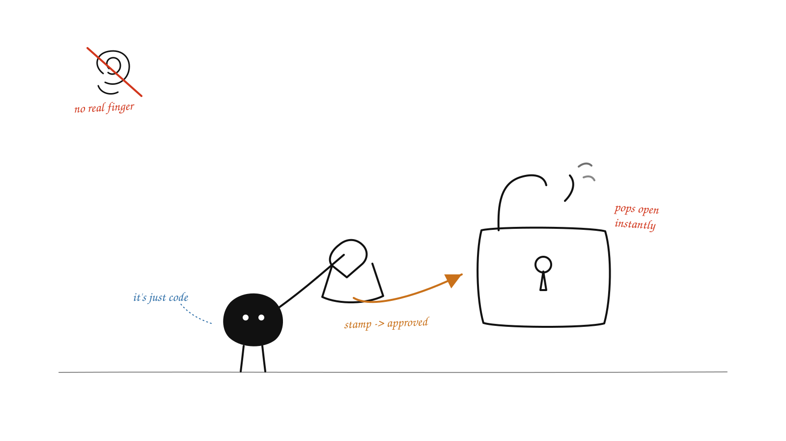

> Also published on the [Money Forward Engineering Blog](https://global.moneyforward-dev.jp/2026/09/09/testing-passkeys-with-a-virtual-authenticator/).

If you've signed in to Moneyforward-ID you might have seen we support passkeys. A passkey is basically a private key sitting inside your device, and it only gets used with your consent when you log into a site. That's great for security: clean sign-in, and no credential ever leaks onto the internet.
<!--more-->

But nothing comes for free. Passkeys also make test automation harder, since QA engineers and their tools now have to get through a login that was built to resist exactly that. And the usual workarounds (sharing real credentials, or bypassing auth for tests) are the kind of thing that leads to security incidents later.

So I went looking for a better option, and found something called **virtual authenticators**.

## So what is a virtual authenticator?

Google/Chromium introduced WebAuthn virtual authenticator around 2020, exposed through the [Chrome DevTools Protocol (CDP)](developer.chrome.com/docs/devtools/webauthn) `WebAuthn` domain. It behaves like a real authenticator but lives entirely in the browser and is controlled by your test. So you can register and use passkeys with no hardware, no biometrics, and no user tapping anything.



A lot of testing tools already support it:

- Playwright and Puppeteer (via CDP)
- Selenium (via the WebDriver virtual-authenticator API)
- Cypress (via plugins)

It's also in the [W3C spec's testing section](w3.org/TR/webauthn-2#…), so it's not a Chrome-only hack. Testing passkeys this way is getting more common, and I guess it only grows as passkeys spread across services.

In this blog I'll walk through how I tested it with Playwright, though I'm not primarily a QA engineer.

## How I set it up

I'm using Playwright to drive real Chromium and add a virtual authenticator over CDP. One thing to know up front: this is **Chromium only**. The CDP `WebAuthn` domain doesn't exist in Firefox or WebKit.

Full sample code is here: github.com/baala3/passkey-e2e

This test runs in three stages:

1. **Sign in once** with the normal password login, and save the session.
2. **Passkey Setup:** using saved session, register a passkey and export it.
3. **Feature tests:** inject that passkey into a fresh authenticator and sign in for your feature tests. (You register once and reuse it in every test.)

Here is a recording of the flow on Moneyforward-ID: it registers a passkey, logs out, and signs in with the passkey. One thing you'll notice: Moneyforward-ID has no "sign in with passkey" button and uses conditional mediation, and sign-in still happens. How? I'll get to that in stage 3 below.

<iframe width="100%" height="400" src="https://www.youtube.com/embed/s0PlvbBkIEY" title="YouTube video player" frameborder="0" allow="accelerometer; autoplay; clipboard-write; encrypted-media; gyroscope; picture-in-picture; web-share" referrerpolicy="strict-origin-when-cross-origin" allowfullscreen></iframe>

## Stage 1: a signed-in session (once)

To register a passkey you have to be logged in first. On Moneyforward-ID that login has an email OTP, which I can't script. So I sign in by hand once, and Playwright saves that logged-in session to a file. Our next tests load this session to register a passkey, so later runs skip login.

And next are the interesting parts.

## Stage 2: register a passkey (and wait for it)

Now that we're signed in, this stage registers and exports a passkey for future use.

Before that, we first need to add a virtual authenticator:

```js
const client = await page.context().newCDPSession(page);
await client.send('WebAuthn.enable');
const { authenticatorId } = await client.send('WebAuthn.addVirtualAuthenticator', {
  options: {
    protocol: 'ctap2',
    transport: 'internal',
    hasResidentKey: true,
    hasUserVerification: true,
    isUserVerified: true,
    automaticPresenceSimulation: true,
  },
});
```

Each option maps to something your IdP expects, so set them to match your config:

- `transport: 'internal'`: a platform authenticator, like Touch ID or Windows Hello.
- `hasResidentKey: true`: allow discoverable credentials. Usernameless sign-in needs this, since the authenticator has to find and offer a credential on its own.
- `isUserVerified: true`: set the user-verification (UV) flag. Needed when the server requires user verification.
- `automaticPresenceSimulation: true`: auto-approve the user-presence check, so no prompt blocks the test.

Once that's done, click register and check the authenticator actually stored a credential:

```js
const added = waitForCdpEvent(client, 'WebAuthn.credentialAdded');
await page.getByRole('button', { name: 'Register a passkey' }).click();
await added;
const { credentials } = await client.send('WebAuthn.getCredentials', { authenticatorId });
expect(credentials.length).toBe(1);
```

Here are two key CDP events happening:

- [`WebAuthn.credentialAdded`](chromedevtools.github.io/devtools-protocol/tot/WebAuthn#…) fires when a credential is added to the authenticator.
- [`WebAuthn.getCredentials`](chromedevtools.github.io/devtools-protocol/tot/WebAuthn#…) returns all credentials stored in the authenticator.

But wait, why do we need these events at all? Why not wait for the app's registration request? We could, but then the test depends on the app's specific API URL. The CDP event fires on the passkey ceremony itself, so the same wait works against any app, which is cleaner.

Our `waitForCdpEvent` helper is small. It resolves when the event arrives, or rejects after a timeout so a stuck ceremony doesn't hang the test:

```js
function waitForCdpEvent(client, event, timeout = 15000) {
  return new Promise((resolve, reject) => {
    const timer = setTimeout(() => {
      cleanup();
      reject(new Error(`timeout: ${event}`));
    }, timeout);
    const handler = (p) => {
      cleanup();
      resolve(p);
    };
    const cleanup = () => {
      clearTimeout(timer);
      client.off(event, handler);
    };
    client.on(event, handler);
  });
}
```

**Note:** These are CDP testing features only. Real authenticators don't expose credential lists or usage information, that would defeat their security purpose.

Next is **Saving the passkey for later:** The server keeps the public key after registration, but the virtual authenticator keeps the private key only in memory. Once the authenticator is gone, so is the credential. To reuse the same credential later, we export it (including its private key) with `getCredentials` and save it:

```js
const credential = await exportCredential(client, authenticatorId);
fs.writeFileSync('credential.json', JSON.stringify(credential));

async function exportCredential(client, authenticatorId) {
  const { credentials } = await client.send('WebAuthn.getCredentials', {
    authenticatorId,
  });
  return credentials[0];
}
```

Since we now have the credential saved in a JSON file, we can also avoid registering again if the file already exists. The setup simply reuses it (delete the file to force a fresh registration).

check github.com/baala3/passkey-e2e/blob/…/passkey.setup.js

## Stage 3: sign in with the passkey

Now at this stage our feature tests run with the stored credential. Each test runs fresh, so it adds a new authenticator and injects the saved credential with `WebAuthn.addCredential`:

```js
await injectCredential(client, authenticatorId, credential);
```

One thing to note: if feature tests use the saved signed-in session, they already start logged in. This means the passkey sign-in flow is skipped because the user is already authenticated. So, for feature tests, I use an empty `storageState` and start logged out. This way, the injected passkey is the only way to sign in.

```js
// playwright.config.js (feature project)
use: {
  storageState: { cookies: [], origins: [] }, // logged out
},
```

And now comes the sign-in. This is where Moneyforward-ID differs from a typical "click the passkey button" flow. Moneyforward-ID uses autofill (conditional UI), so there's no button to click. As soon as you land on `/sign_in`, the browser starts a conditional passkey request:

```js
navigator.credentials.get({
  publicKey,
  mediation: 'conditional',
});
```

Normally the passkey shows up in the username field's autofill dropdown and the user picks it. That dropdown is native browser UI, which Playwright can't click. So I had a question: does a virtual authenticator resolve *conditional mediation* with no click?

And it does. Given a resident credential and `automaticPresenceSimulation: true`, the virtual authenticator answers the conditional request on its own, no dropdown and no click. Just landing on the page signs you in.

One thing here is to listen for the `credentialAsserted` event before navigating, since the request fires when the page loads.

```js
const asserted = waitForCdpEvent(client, 'WebAuthn.credentialAsserted');
await page.goto('/sign_in');
await asserted;
await page.waitForURL(url => !url.pathname.startsWith('/sign_in'));
```

That's all for the Playwright setup.

Before I wrap up, let me share one more thing which I tried with Datadog.

## Datadog Synthetics with a virtual authenticator

[Datadog Synthetics](docs.datadoghq.com/synthetics/guide/browser-tests-passkeys) also supports passkey testing with a virtual authenticator, so I gave it a try, but the registration failed with:

```text
TypeError: t.toJSON is not a function
```

Why? Moneyforward-ID's frontend calls the native `credential.toJSON()` to serialize the WebAuthn credential. But Datadog's virtual authenticator returns a plain `Object`, not a real `PublicKeyCredential`:

```js
credential.constructor.name                 // "Object"
credential instanceof PublicKeyCredential   // false
typeof credential.toJSON                    // "undefined"
```

`toJSON()` lives on the `PublicKeyCredential` prototype, so a plain object doesn't have it. It's part of [WebAuthn Level 3 serialization](developer.mozilla.org/en-US/…/toJSON), which recent Chrome, Firefox, and Safari support and modern apps call directly. So a test authenticator that doesn't return a spec credential breaks the flow the moment the app touches it. In Playwright's case, it returned a real credential, which is why it worked there.

## And to wrap things up

Virtual authenticators give you a practical way to automate real passkey flows without real devices, biometrics, or bypassing authentication. With Playwright and CDP, we can register and reuse passkeys across tests, including conditional UI flows.

The main thing to watch out for is tool support. This approach is Chromium-only, and as the Datadog example shows, not every virtual authenticator returns a spec-compliant credential. So make sure the tool you choose supports the parts of WebAuthn your application relies on.

Hopefully this gives you a starting point for testing passkeys.

Thanks for reading till here, and happy testing!!
