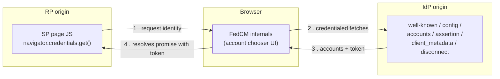
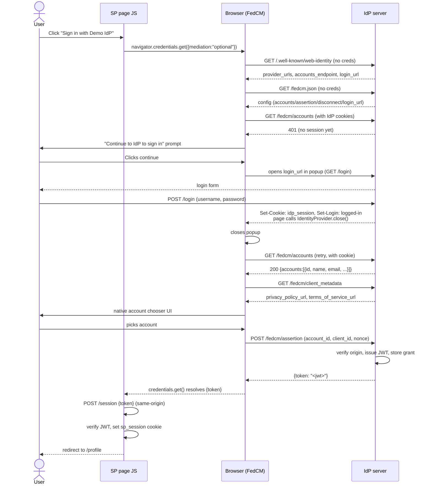
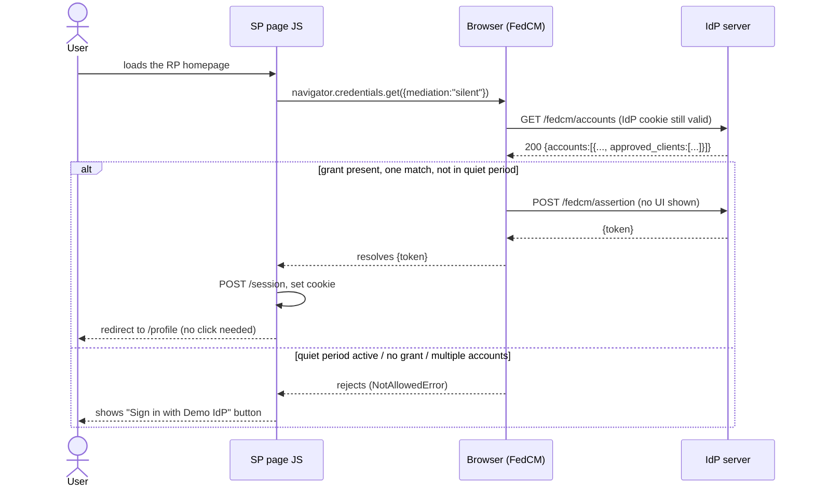
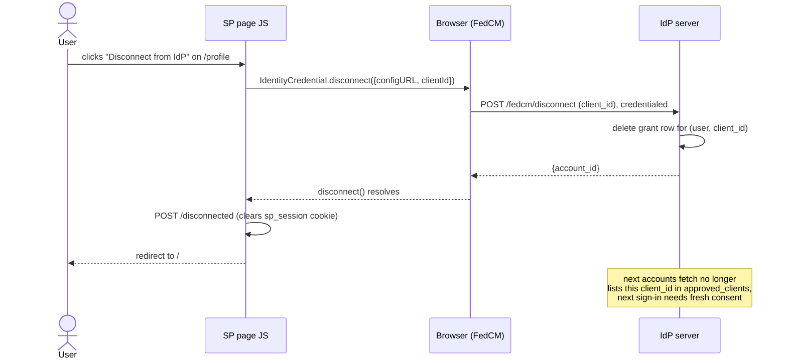
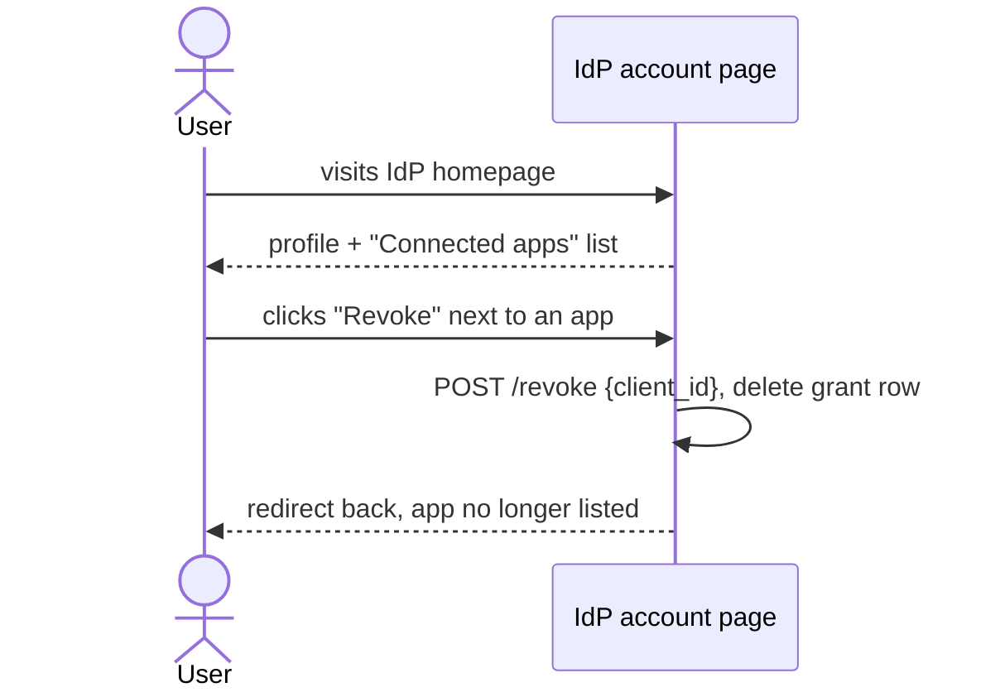

Third-party cookies are disappearing, and many "Sign in with X" flows built on embedded IdP iframes depended on them. [FedCM](https://developers.google.com/privacy-sandbox/fedcm) (Federated Credential Management) is browser's replacement: instead of the RP embedding the IdP and reading its cookies, the browser handles the identity flow and returns an identity token. <!--more-->

From user's perspective, FedCM looks like a replacement for traditional OAuth/OIDC sign-in. But under the hood it's very different. There's no `PKCE`, no `state`, no `refresh tokens`, and no authorization code flow. FedCM solves a real privacy problem, but it doesn't replace OAuth/OIDC's security model. Adopting it without understanding those differences can weaken your authentication flow.

In this post, I'll explain how FedCM works, what the IdP and RP need to implement, and where it differs from OAuth/OIDC.

>I'm using [fedcm-101](https://github.com/baala3/fedcm-101), a reference implementation with a Go-based IdP and RP.

---

## Why FedCM exists

Before FedCM, federated sign-in relied on OAuth/OIDC redirects or IdP iframes embedded on the RP's page. Those iframes needed to read the IdP's first-party cookie from a third-party context to determine whether the user was already signed in.

As browsers phase out third-party cookies to prevent cross-site tracking, this approach breaks. But simply removing third-party cookies isn't an option because federated sign-in is still a legitimate use case.

FedCM solves this by moving the identity handshake into the browser. The browser mediates the sign-in flow, keeping the RP and IdP isolated from each other's cookies while preserving a seamless sign-in experience.

---

## The three parties, and what each one is allowed to see

FedCM has three actors, and the motto is: **the RP and the IdP never talk to each other directly.** Everything routes through the browser.

- **RP (Relying Party)**: the site the user is signing into. It calls `navigator.credentials.get()` and never talks to the IdP.
- **IdP (Identity Provider)**: the account authority. It exposes a fixed set of well-known JSON endpoints and never talks to the RP.
- **The browser**: does the actual fetching (attaching the IdP's own first-party cookies, since from the browser's point of view this is a first-party request), and renders the account chooser natively, outside either page's DOM. Neither page can style it, script it, or screenshot it.



## vocabulary

FedCM reuses some OAuth/OIDC-sounding words, but assigns them slightly different meanings.

| Term | Meaning |
|---|---|
| `client_id` | How the IdP identifies the RP. Some IdPs issue real client IDs; |
| Config URL | The IdP's single JSON document (`/fedcm.json`) listing all its other endpoint URLs. |
| Well-known file | `/.well-known/web-identity`, fetched without credentials, must not redirect. Proves the IdP origin actually owns the config URL. |
| Mediation | How much the browser can do without a user action. `"optional"` (default) shows UI if needed; `"silent"` fails instead of showing UI, which is what auto re-authentication on return visits depends on. |
| Grant / consent | The record that a specific user agreed to share their profile with a specific RP. Decides whether browser can skip the "Continue as ___" screen, and whether silent mediation can succeed at all. |
| Login Status API | A signal the IdP sends the browser (via the `Set-Login` response header) meaning "a user is/isn't signed in to me right now." Lets the browser skip the accounts fetch entirely when it already knows. |
| Quiet period | An anti-abuse cooldown after any sign-in. Silent mediation keeps failing for a while afterward even with a valid grant, so a site can't chain silent `get()` calls to repeatedly probe "is this user still logged in." |
| `IdentityCredential.disconnect()` | The RP-initiated API for revoking its own grant. Similar to an OAuth app revoking its own token. |

## Why so many separate endpoints

At first, five endpoints for single sign-in flow feels excessive. But each endpoint has different trust level and access to different information, allowing the browser to enforce different security and privacy rules.

- **Uncredentialed, no RP context** (well-known, config): Safe to fetch before the browser knows which RP is requesting them. They simply answer, "Does this IdP exist, and how is it configured?"
- **Uncredentialed, RP-aware** (client metadata): The response isn't sensitive, but the request includes the RP's identity. That's why newer Chrome and Edge versions require the well-known file to pin `accounts_endpoint` and `login_url`, preventing an IdP from quietly serving RP-specific account endpoints as a tracking mechanism.
- **Credentialed, not RP-aware** (accounts): This request includes the IdP's session cookie but deliberately hides which RP is asking. That prevents the IdP from tailoring the account list per RP in a way that could be used for fingerprinting.
- **Credentialed, RP-aware, mutating** (assertion, disconnect): These endpoints need to know the RP so the IdP can issue or revoke a grant. Both are `POST` requests and only run after explicit user action—either selecting an account or disconnecting the RP.

---

## Building the IdP: endpoint by endpoint

An IdP under FedCM is really just a normal web app (login form, sessions, user table) plus a some JSON endpoints the browser calls on RP's behalf. Here's the order the browser actually calls them in.

- **`/.well-known/web-identity`**, proving ownership of config URL. An RP could point `navigator.credentials.get()` at any configURL, including one it doesn't own, to trick the browser into treating some other site as an IdP. The well-known file (fetched from the IdP's own origin, no credentials, must not redirect) is the IdP saying "yes, this config URL is mine." Newer Chrome/Edge also require `accounts_endpoint` and `login_url` here, not just inside the config JSON, whenever the IdP serves a `client_metadata_endpoint` too:

```json
{
  "provider_urls": ["http://localhost:8080/fedcm.json"],
  "accounts_endpoint": "http://localhost:8080/fedcm/accounts",
  "login_url": "http://localhost:8080/login"
}
```

- **`/fedcm.json`**, the config document. One place listing every other endpoint plus the branding shown in the account chooser (background color, icon). Fetched without credentials.

```json
{
  "accounts_endpoint": "http://localhost:8080/fedcm/accounts",
  "client_metadata_endpoint": "http://localhost:8080/fedcm/client_metadata",
  "id_assertion_endpoint": "http://localhost:8080/fedcm/assertion",
  "disconnect_endpoint": "http://localhost:8080/fedcm/disconnect",
  "login_url": "http://localhost:8080/login",
  "branding": { "background_color": "#1a73e8", "color": "#ffffff" }
}
```

- **`/fedcm/client_metadata`**, per-RP disclosure links. The account chooser shows a privacy policy / terms link so user knows what they're agreeing to. Fetched uncredentialed, but with knowledge of which `client_id` is asking, which is exactly why the well-known file's stricter pinning requirement exists (see above). This one also needs `Access-Control-Allow-Origin` since, unlike the other FedCM endpoints, it's subject to normal CORS.

- **`/fedcm/accounts`**, who's signed in, credentialed. This is the one request where the browser attaches the IdP's session cookie, so the IdP answers "which account(s) does this browser currently have a session for." Deliberately not RP-aware, as seen above. No session cookie means a plain 401, and that matters more than it looks: it's what makes the Login Status API's mismatch handling work. If the IdP claimed "logged-in" but accounts says otherwise, the browser corrects itself.
   - With a session, the response includes `approved_clients`: every `client_id` this user has an active grant for. That list is what lets a returning user skip the "Continue as ___" consent screen, since the browser checks whether the requesting RP is already in it.

```json
{
  "accounts": [
    {
      "id": "1",
      "name": "Alice Adams",
      "email": "alice@example.com",
      "approved_clients": [
        "http://localhost:8081"
      ]
    }
  ]
}
```

- **`/fedcm/assertion`**, issuing the token. Once the user picks an account in the native chooser, the browser POSTs here (credentialed, form-encoded) to get a token back. The handler needs to:
  1. Validate `Sec-Fetch-Dest: webidentity` and check `Origin` against the RP it expects. A real multi-tenant IdP would look this up per `client_id` instead of hardcoding a single origin.
  2. Re-check the session cookie, since the user still has to be signed in.
  3. Read `account_id`, `client_id`, `nonce` from the form, and cross-check `account_id` against the signed-in user, so a client can't assert a token for an account it didn't actually pick.
  4. Issue a JWT: `iss` is the IdP origin, `sub` is the account id, `aud` is the `client_id`, plus profile claims and the nonce.
  5. Record a grant, so future `accounts` responses include this RP in `approved_clients`.
  6. Return `{"token": "<jwt>"}`.
  
  Error responses use the FedCM-specified shape, `{"error": {"code": "access_denied", "url": ""}}`, so the browser can surface something meaningful instead of a bare network failure.

- **The login page and the Login Status API.** The browser needs to know, before it even tries the accounts endpoint, whether the IdP thinks anyone is signed in. Otherwise every page load on every site would need to speculatively hit every known IdP's accounts endpoint, which doesn't scale. The Login Status API is the IdP proactively telling the browser "a user just signed in / signed out here," through the `Set-Login` response header.

   - `GET /login` is a normal HTML form, opened by the browser in a popup when it wants a sign-in but has no session yet. `POST /login`, on success, creates a session, sets the session cookie, and sets `Set-Login: logged-in`. The response body is a tiny page whose script calls `IdentityProvider.close()`, telling the browser "the popup's done, close it and retry the accounts fetch." `window.IdentityProvider` exists on every page, not just the popup, so calling `close()` from a normal top-level navigation just silently no-ops. `POST /logout` clears the session and sends `Set-Login: logged-out`.

- **`/fedcm/disconnect`**, RP-initiated revocation. Lets an RP call `IdentityCredential.disconnect()` to unlink itself from a user's IdP account (an "unlink your Google account" button) without a separate settings UI on the IdP side. Same origin and `Sec-Fetch-Dest` checks as assertion, then it deletes the grant row and returns `{"account_id": "..."}`.

  - There's a second way to reach the same grant: a plain account home page on the IdP itself, listing every RP the user granted access to, with its own "Revoke" button. That's ordinary form-based self-service, not part of the FedCM API at all, just a normal UI over the same grants table.

  - **CORS is the part that's easy to get wrong.** Even though the credentialed endpoints (`accounts`, `assertion`, `disconnect`) and client metadata are invoked internally by the browser, not by a page's `fetch()`, they're still subject to real CORS checks in current Chrome/Edge. Every one of them, including error responses, needs:

```
Access-Control-Allow-Origin: http://localhost:8081   (the exact RP origin, not *)
Access-Control-Allow-Credentials: true               (only on the credentialed ones)
```

## Building the RP: what's actually needed

The RP side is much simpler. From the IdP's perspective, the RP is just a `client_id`, and there are no FedCM-specific server endpoints the RP has to implement. Everything FedCM-related happens in the browser. The backend only needs to verify the token it receives and create a normal cookie session.

Requesting a credential is just:

```js
navigator.credentials.get({
  identity: {
    providers: [{
      configURL: "http://localhost:8080/fedcm.json",
      clientId: "http://localhost:8081",
      params: { nonce: crypto.randomUUID() },
    }],
  },
  mediation, // "optional" or "silent"
});
```

The RP only needs to know the IdP's `configURL` and its own `clientId`. Everything else comes from the IdP's config document. The `nonce` passed via `params`, and this single call triggers the entire browser-managed FedCM flow.

>note: Only one **navigator.credentials.get()** request can be active per page. Starting another before the first finishes throws NotAllowedError. The usual fix is to use an AbortController and cancel the previous request before starting a new one.

**Silent auto re-authentication:** Using `mediation: "silent"` lets the browser sign the user in without showing any UI. This only succeeds when:

- the user has already granted access to the RP,
- exactly one matching account exists, and
- the browser isn't in its post-sign-in quiet period.

If any of these conditions fail, the promise simply rejects. The expected behavior is to catch the error and fall back to showing the sign-in button.

**Exchanging the token for a session:** When `navigator.credentials.get()` resolves, it returns an `IdentityCredential whose` `.token` is whatever the IdP's `id_assertion_endpoint` returned. The RP sends this token to its backend, verifies the JWT signature, checks that the `aud` claim matches the RP's origin, and then creates a normal session cookie. From that point on, authentication works like any other cookie-based session.

**Disconnecting:** To revoke access, call `IdentityCredential.disconnect({ configURL, clientId })`. Unlike sign-in, this is a static method, not part of `navigator.credentials`. The browser sends a credentialed request to the IdP's `disconnect_endpoint`. After that succeeds, the RP should also clear its own session cookie, since disconnecting only revokes the FedCM grant, it does not log the user out of the RP.

**What the RP doesn't need:** The RP doesn't need any FedCM-specific server APIs, CORS configuration, knowledge of the IdP's cookies or user database, or a revocation webhook. If the user revokes access at the IdP, future `navigator.credentials.get()` calls simply stop returning a token. The RP detects this naturally during the next sign-in attempt.

## The four flows, end to end

With both sides ready, here's how the pieces binds across the flow. "Browser (FedCM)" below is browser's internal machinery: the account chooser and the fetches it makes on the RP's behalf.

**First-time sign-in** (no existing IdP session, no prior grant):



**Returning user, silent auto re-authentication:**



**Disconnect, RP-initiated:**



**IdP-side self-service revoke** (not a FedCM API, plain HTML form):



This last one is the mirror image of the disconnect flow: the same grant row can be deleted either by the RP calling `disconnect()`, or by user acting directly on IdP's own account page. The second path matters when user doesn't want to visit every RP individually to pull access.

---

## FedCM vs. OAuth/OIDC: the actual gap

**FedCM is not a replacement for OAuth/OIDC.** It solves a browser privacy problem caused by the removal of third-party cookies. OAuth/OIDC authorization flows remain the same, FedCM simply replaces cookie-dependent browser interactions around them, such as front-channel logout, personalized sign-in buttons ("Continue as Alice"), and silent session refresh.

Here's the diff:

| OAuth/OIDC concept | FedCM equivalent |
|---|---|
| Authorization code + backend token exchange | None. `id_assertion_endpoint` returns a token directly to the browser in one shot. |
| PKCE / `state` (binds the token response to *this specific* request) | None. Nothing ties an assertion response back to a specific `get()` call beyond a nonce the RP has to choose to check itself. |
| Refresh tokens | None. Every re-authentication is a fresh `get()` call. |
| Scoped access tokens for calling back into the IdP's APIs | None. FedCM only produces an identity token, not an authorization grant for anything else. |
| Standardized revocation/introspection | Only `disconnect_endpoint`, and it revokes the FedCM grant, not any access token a real OIDC flow might have issued separately. |

The demo repo makes this clear: `id_assertion_endpoint` returns a JWT directly to browser, and although the RP generates a nonce, nothing in protocol requires the assertion to be bound to it. That's not just limitation of the demo it's a gap in FedCM itself.

When designing an assertion endpoint, there are two approaches, and neither maps cleanly to OAuth/OIDC:

- **Return an ID token directly.** This is what the demo does. It's similar to OAuth's implicit flow, where a token is exposed to browser JavaScript—a pattern the OAuth ecosystem has largely moved away from.

- **Return an opaque code for backend exchang.** This resembles the authorization code flow, but FedCM provides no `PKCE` or `state` equivalent to bind the code to the original get() request. The RP must build its own request-binding mechanism.

In both cases, you end up reimplementing protections that OAuth/OIDC already standardized with `PKCE` and `state`. FedCM doesn't provide those guarantees, so every IdP has to solve the problem independently. If you're evaluating FedCM for production, this is one of the most important security trade-offs to consider.

---

## So when is it actually worth adopting?

The decision is simple: does your RP and IdP already share cookies? If they're same-site or under the same parent domain, FedCM adds little value. A first-party cookie already tells you whether the user is signed in, so FedCM mostly introduces extra complexity.

FedCM is most useful for true third-party identity providers, where third-party cookies are unavailable. It works best when the RP only needs to verify the user's identity, not obtain long-lived API access. In that case, FedCM replaces cookie-dependent iframes with a browser-managed sign-in flow while still relying on OAuth/OIDC underneath.

The key takeaway is that FedCM solves specific problem—third-party cookies breaking federated signin and it solves it well. But it doesn't include the request binding and replay protections that OAuth/OIDC has refined over the years, so if you're building an IdP, those security guarantees are your responsibility.
